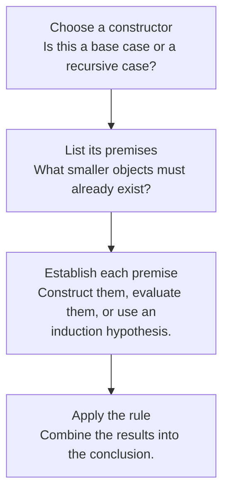
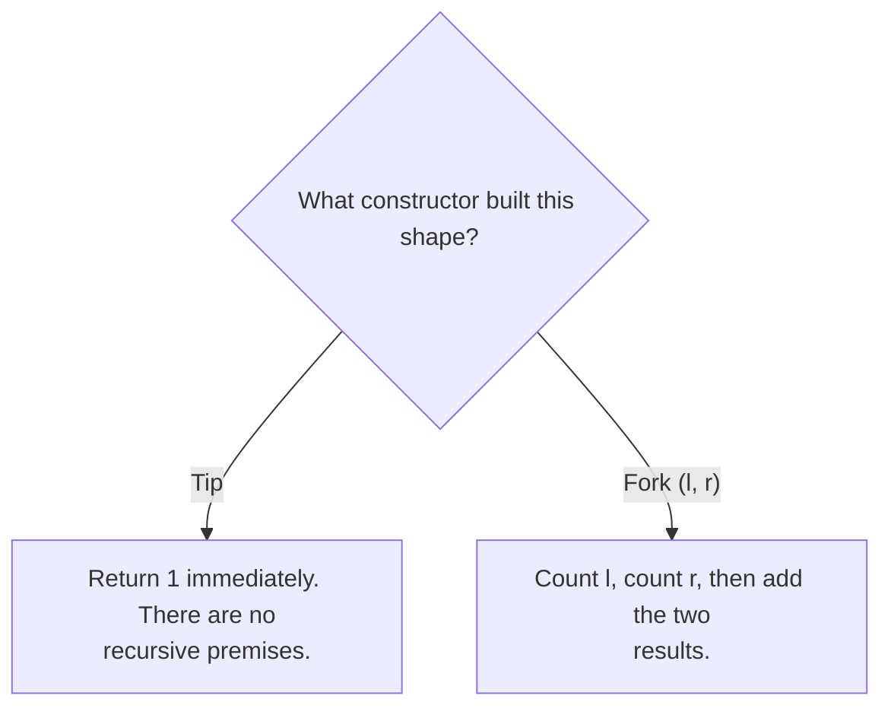

## A definition that builds its own members

An **inductive definition** specifies base elements, ways to construct larger elements from already constructed ones, and the smallest set closed under those rules. “Smallest” prevents unrelated objects from slipping into the definition.

For example, start with `Tip` and allow `Fork(left, right)` whenever both children are trees. Every finite tree has a finite construction history. This history also tells you how to consume the tree: handle `Tip` directly and recursively handle each child of `Fork`.

```ocaml
type shape = Tip | Fork of shape * shape

let rec tips t =
  match t with
  | Tip -> 1
  | Fork (left, right) -> tips left + tips right
```

This is an original teaching type. HW1 uses other tree types; their constructor meanings must be read separately.

## Read a rule in two directions

An inference rule places premises above a horizontal line and a conclusion below it. Forward reading constructs an object or proves a judgment. Backward reading asks what must be established to justify a proposed conclusion.



For `Fork(Tip, Fork(Tip, Tip))`, construction proceeds from three tips to the inner fork, then to the outer fork. Evaluation of `tips` reverses this dependency: the outer fork asks for the counts of its children, which ask for the counts of their children. The result is `1 + (1 + 1) = 3`.



## Structural induction is the matching proof method

To prove a property for every tree, prove it for `Tip` and show that it is preserved by `Fork`, assuming it holds for both children. You do not assume the result for the whole tree you are trying to prove.

Consider the statement **tips(t) = forks(t) + 1**, where `forks` counts internal fork nodes.

1. Base: a tip has one tip and zero forks, so `1 = 0 + 1`.
2. Induction hypotheses: `tips(l) = forks(l) + 1` and `tips(r) = forks(r) + 1`.
3. Step: `tips(Fork(l,r)) = tips(l) + tips(r) = forks(l) + forks(r) + 2`. The larger tree has `1 + forks(l) + forks(r)` forks, so the equation holds.

The proof branches exactly where the recursive function branches. This correspondence is more useful than memorizing a proof template independently of the data.

## From grammar to OCaml

| Mathematical idea | OCaml representation | What to check |
|---|---|---|
| A choice of forms | A variant type with several constructors | One case per permitted form |
| A constructor with two subtrees | `Fork of shape * shape` | Recurse on both children |
| A constructor without premises | `Tip` | A direct answer, no recursion |
| A semantic relation | A function, when deterministic and executable | Preserve the rule’s conditions |
| Structural induction | A proof with a hypothesis for each recursive child | Do not assume the whole conclusion |

Not every inductively defined relation is automatically a terminating function. A syntax tree is finite, but a language interpreter can loop when a program recursively calls itself. Separate recursion over the *input structure* from recursion in the *program being interpreted*.

## The homework connection

[HW1 P9–P11](hw1.html#p9-tree-membership) make the connection direct: tree membership, mirroring, and Peano arithmetic. P12 and P13 apply the same strategy to formula and algebraic-expression trees. Later, each constructor in the HW2 interpreter gets a semantic branch; in HW4 it gets a typing branch.

**Common trap:** importing an ordering invariant into an arbitrary tree. HW1’s membership tree is not declared to be a binary search tree. A node’s value cannot tell you which subtree may contain a target.

## Check your understanding

Why does a rule that only says “if a tree exists, wrap it in a new node” generate no finite trees when it has no base rule?

<details><summary>Reveal the reasoning</summary><p>Every finite derivation must eventually reach a rule with no recursive premises. Without a base rule, there is no starting member. Under the least-set interpretation, the generated set is empty.</p></details>

**Read alongside:** [lecture 1, PDF pp. 3–8](https://prl.korea.ac.kr/courses/cose212/2026/slides/lec1.pdf#page=3), [lecture 2, pp. 8–19](https://prl.korea.ac.kr/courses/cose212/2026/slides/lec2.pdf#page=8), [English book, chapter 1](https://prl.korea.ac.kr/courses/cose212/2026/pl-book-eng.pdf#page=11).
