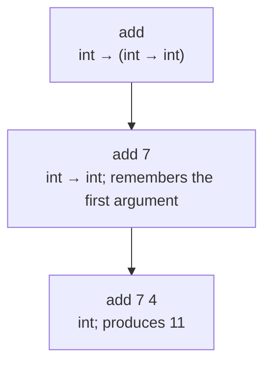

## Start with expressions and types

An expression computes a value. In OCaml, `if`, function application, and local `let` bindings are expressions too. A type describes the kind of result and constrains how it may be used. The compiler checks those constraints before evaluation.

```ocaml
let adjustment n =
  let delta = if n < 0 then -1 else 1 in
  n + delta
```

Both branches of `if` have type `int`, so `delta` is an integer. The whole function has type `int -> int`. A function returning an integer in one branch and a string in the other does not receive a union type automatically.

## Bindings are not assignments

`let x = e1 in e2` computes `e1`, introduces a name for the resulting value, and evaluates `e2` in the extended scope. A later `let x = ...` shadows an earlier binding. It does not mutate the earlier value.

```ocaml
let answer =
  let x = 7 in
  let y = x + 1 in
  let x = 100 in
  x + y
```

`y` remains `8`; the answer is `108`. This is the same binding discipline you will implement in HW2.

## Read function types with parentheses

The arrow associates to the right: `int -> int -> int` means `int -> (int -> int)`. Function application associates to the left: `f x y` means `(f x) y`.

```ocaml
let add x y = x + y
let add_seven = add 7
let add_pair (x, y) = x + y
```

`add` is curried: it takes an integer and returns a function. `add_pair` accepts one argument that is a pair. Their types and calls are different. Partial application works naturally for `add` because a function is a value.

| Definition | Type | Valid call | What is supplied first? |
|---|---|---|---|
| `add` | `int -> int -> int` | `add 7 4` | One integer |
| `add_pair` | `int * int -> int` | `add_pair (7, 4)` | One pair |

`add (7, 4)` is a type error, not another spelling of `add 7 4`. Follow this distinction when comparing textbook `iter : int * (int -> int) -> (int -> int)` with HW1's curried `double`.



## Pattern matching follows data construction

An OCaml list is either `[]` or `head :: tail`. The tail is itself a list. Pattern matching exposes exactly that structure.

```ocaml
let describe xs =
  match xs with
  | [] -> "empty"
  | [_] -> "one element"
  | _ :: _ :: _ -> "at least two elements"
```

The final wildcard is the remaining list, not necessarily one element. Patterns are tried in order. An earlier catch-all would make later cases unreachable.

| Syntax | Meaning | Typical mistake |
|---|---|---|
| `[a; b]` | A list containing two elements | Using commas, which construct a pair |
| `(a, b)` | One pair | Passing it to a curried function |
| `x :: xs` | An element followed by a list | Giving another element as the tail |
| `xs @ ys` | Concatenation of two lists | Assuming it is constant time |
| `=` | Structural equality where supported | Using physical equality as a general replacement |
| `'a` | A type variable | Treating it as a runtime variable |

## Invent the representation before the algorithm

```ocaml
type measurement =
  | Exact of int
  | Between of int * int
  | Missing

let lower_bound = function
  | Exact n -> Some n
  | Between (lo, _) -> Some lo
  | Missing -> None
```

The `option` return type makes absence explicit. This is a useful teaching design, but preserve the exact return type required by homework. For example, HW1 `max` returns `int`, not `int option`; its PDF leaves the empty-list policy unstated.

## The homework connection

Before moving on, use [§2.1's module/queue trace](textbook-02.html#depth-2-1) for `Module.member`, persistent data, and exception handling. A declaration `type t = int list` inside a plain `struct` does not itself hide the list representation; abstraction requires a restricting signature. These features are useful OCaml, but a specific assignment may restrict modules.

[HW1](hw1.html) asks you to recognize `int`, polymorphic lists, curried functions, tuples, and jointly declared datatypes. P8 depends on treating functions as values. P12 has two expression categories: formulas return booleans while arithmetic expressions return integers. Use separate helpers for those result types. The formula evaluator calls the arithmetic helper for `Equal`; arithmetic expressions never contain formulas, so the helpers do not need mutual recursion merely because the types are declared with `and`.

Do not use OCaml’s convenient built-in equality to silently define your interpreted language’s equality. HW2 only specifies equality on integer pairs and boolean pairs. OCaml’s host capabilities do not expand ML−’s language rules.

## Check your understanding

What is the type of `fun f -> fun x -> f x`, and what relationship does it impose between `f` and `x`?

<details><summary>Reveal the reasoning</summary><p>Its type is <code>('a -&gt; 'b) -&gt; 'a -&gt; 'b</code>. Whatever type x has must be f’s input type, and the whole application returns f’s output type. No arithmetic or other operation forces a concrete base type.</p></details>

**Read alongside:** [lecture 3, pp. 8–44](https://prl.korea.ac.kr/courses/cose212/2026/slides/lec3.pdf#page=8), [English book, §2.1](https://prl.korea.ac.kr/courses/cose212/2026/pl-book-eng.pdf#page=34).
