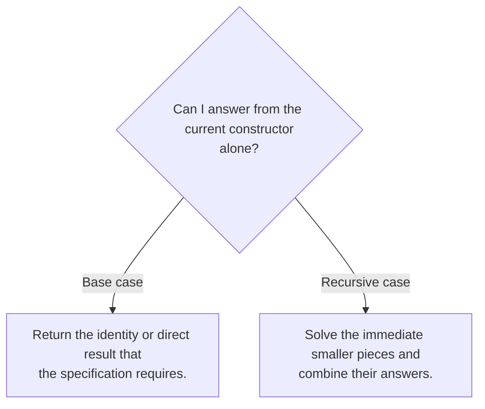

## Ask what becomes smaller

A recursive function needs a base case, a smaller problem, and a way to combine its result. Begin with the datatype rather than a loop you hope to translate. For a list, the immediate smaller structure is the tail. For a tree, it is each child. For an interval, it can be the remaining interval after advancing one endpoint.

```ocaml
let rec total_lengths words =
  match words with
  | [] -> 0
  | word :: rest -> String.length word + total_lengths rest
```

For `["ml"; "rules"]`, the computation is `2 + (5 + 0) = 7`. The recursive call answers the smaller question: how many characters occur in the remaining words? It does not need to know how many appeared before them.



## Tail recursion stores pending work explicitly

The call in `n + recursive_call` is not in tail position, because addition remains to do after the call returns. An accumulator can carry this unfinished work.

```ocaml
let total_lengths_tail words =
  let rec loop acc remaining =
    match remaining with
    | [] -> acc
    | word :: rest -> loop (acc + String.length word) rest
  in
  loop 0 words
```

The invariant is: **acc + the total length of remaining = the total length of the original input**. That sentence explains both the initial accumulator and the final answer. An accumulator without an invariant often hides off-by-one or reversal errors.

Tail recursion changes stack usage, not automatically the amount of total work. Appending a growing prefix repeatedly may still produce quadratic time. For list construction, cons onto an accumulator and reverse once when order matters.

## Higher-order functions describe a traversal pattern

| Pattern | What stays fixed | What varies |
|---|---|---|
| `List.map f xs` | Visit every element; preserve length and order | The element transformation |
| `List.filter p xs` | Traverse and retain selected elements | The predicate |
| `List.fold_left f z xs` | Move left to right with an accumulator | The update operation and initial value |
| `List.fold_right f xs z` | Replace each cons from the right | The combining operation and base value |

For subtraction, the direction matters:

```ocaml
let left = List.fold_left ( - ) 0 [8; 3; 1]
(* ((0 - 8) - 3) - 1 = -12 *)
let right = List.fold_right ( - ) [8; 3; 1] 0
(* 8 - (3 - (1 - 0)) = 6 *)
```

The fact that two folds agree for integer addition does not make them interchangeable for arbitrary operations.

## A function can be the answer

```ocaml
let compose f g x = f (g x)
let plus_two n = n + 2
let triple n = n * 3
let transform = compose triple plus_two
```

`transform 4` is `18`: first add two, then multiply by three. Before evaluating higher-order code, write the type of each intermediate expression. This is especially helpful for HW1’s nested `double` applications. A higher-order function applied to itself may operate at a different type instance; count the resulting compositions rather than counting occurrences of the word `double`.

## The homework connection

[HW1 P1–P5](hw1.html#p1-primality) cover numeric and list recursion. [P6–P8](hw1.html#p6-sigma) add predicates and functions as arguments. P9–P14 combine recursive traversal with more interesting algebra. P15 adds a context to the traversal. The same progression leads directly to an interpreter helper `eval environment expression`.

**Common trap:** confusing mathematical identities with unspecified input policies. An empty conjunction naturally returns `true`, and an empty sum naturally returns `0`. An empty list has no integer maximum. Decide based on the specification, and record an ambiguity when the specification gives no answer.

## Check your understanding

Why is a recursive call on the same list dangerous even when a separate counter decreases?

<details><summary>Reveal the reasoning</summary><p>It depends on the measure you claim decreases. A counter-based algorithm can terminate if the counter reaches a base case, but it may repeat the same element or fail the intended list traversal. State both the termination measure and the semantic invariant; termination alone does not establish correctness.</p></details>

**Read alongside:** [lecture 4, pp. 4–15 and 16–28](https://prl.korea.ac.kr/courses/cose212/2026/slides/lec4.pdf#page=4), [English book, §§2.2–2.3](https://prl.korea.ac.kr/courses/cose212/2026/pl-book-eng.pdf#page=70).
