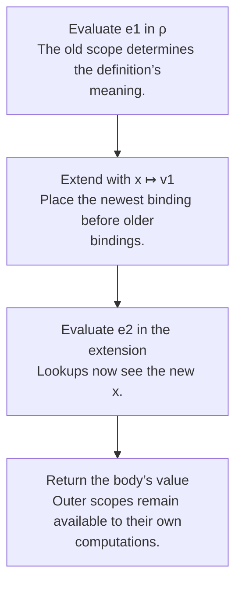

## Syntax is shape; semantics is behavior

An **abstract syntax tree (AST)** represents the structure of a program independently of surface punctuation. A grammar says which trees exist. A semantics says which results those trees produce. A syntactically valid program may still have undefined behavior in the language’s semantics.

This original tiny language contains only integers, names, addition, and local binding:

```ocaml
type expr =
  | Number of int
  | Name of string
  | Plus of expr * expr
  | Bind of string * expr * expr
```

The host language is OCaml. `Number`, `Plus`, and `Bind` are constructors representing the object language. The OCaml integer in `Number 7` is the representation of an object-language literal.

## An environment gives names meaning

Write **ρ ⊢ e ⇓ v** as: “under runtime environment ρ, expression e evaluates to value v.” The course often writes `⇒` for the same big-step evaluation relation. An environment is a mapping from names to values. An association list implements it if lookup returns the first matching name.

```ocaml
let rec lookup x = function
  | [] -> failwith ("unbound name: " ^ x)
  | (y, v) :: rest -> if x = y then v else lookup x rest

let rec evaluate env = function
  | Number n -> n
  | Name x -> lookup x env
  | Plus (a, b) ->
      let va = evaluate env a in
      let vb = evaluate env b in
      va + vb
  | Bind (x, definition, body) ->
      let value = evaluate env definition in
      evaluate ((x, value) :: env) body
```

This pedagogical evaluator has only integer values and uses `Failure` for missing names. The homework language has tagged values and requires `UndefinedSemantics`; preserve that distinction when adapting the idea.

## Derive the binding case

For `let x = e1 in e2`, the binding rule has two premises: evaluate the definition in the old environment, then evaluate the body in an extended environment. The new name is not in scope inside its own ordinary `let` definition.



Consider this object-language expression:

```text
let x = 4 in
let x = x + 3 in
x + 2
```

The second definition sees the old `x = 4`, so it produces `7`. Its body sees `x = 7` and returns `9`. Evaluating the definition in the extended environment would either create an accidental recursive binding or require a value that does not exist yet.

| Step | Expression being evaluated | Environment used | Result |
|---|---|---|---|
| 1 | First initializer `4` | `[]` | `4` |
| 2 | Second initializer `x + 3` | `[("x", 4)]` | `7` |
| 3 | Inner body `x + 2` | `[("x", 7); ("x", 4)]` | `9` |

The corresponding AST is `Bind("x", Number 4, Bind("x", Plus(Name "x", Number 3), Plus(Name "x", Number 2)))`. The extra entries model shadowing; they are not assignments to a shared variable. [Chapter 3's full derivation](textbook-03.html#depth-3-2-2) shows how the same three steps appear as premises above an inference-rule line.

## Premises become recursive calls

| Rule element | Interpreter counterpart |
|---|---|
| Literal conclusion | Wrap or return the literal value |
| A variable premise using ρ(x) | Environment lookup |
| Evaluation premise for a child | Recursive call on that child |
| Side condition such as a nonzero divisor | Explicit guard |
| Different rule for true and false | Pattern match on the condition value |
| No rule applies | Raise the specified undefined-semantics exception |

For a conditional, evaluate only the selected branch. If `if true then 8 else (1 / 0)` is allowed by the object language, it evaluates to `8`; eagerly evaluating all three children would be an interpreter bug. Evaluation order is part of the language definition. Use sequential `let` bindings in OCaml to make required order explicit rather than relying on the host’s argument-evaluation order.

## The homework connection

[HW1 P12](hw1.html#p12-formulas-and-arithmetic) already asks for a small interpreter, without an environment. [P14](hw1.html#p14-sigma-calculator) adds a changing interpretation of `X`. [HW2](hw2.html) extends the same pattern with runtime environments, tagged values, lists, and procedures.

## Check your understanding

How can an expression be a valid AST but have no evaluation derivation?

<details><summary>Reveal the reasoning</summary><p>The grammar can allow a division node whose divisor evaluates to zero, or an addition node whose child produces a boolean. The node is syntactically valid, but the relevant semantic side condition or value shape fails. Syntax recognition and semantic validity are different questions.</p></details>

**Read alongside:** [lecture 5, pp. 8–12 and 19–24](https://prl.korea.ac.kr/courses/cose212/2026/slides/lec5.pdf#page=8), [English book, chapter 3](https://prl.korea.ac.kr/courses/cose212/2026/pl-book-eng.pdf#page=97).
