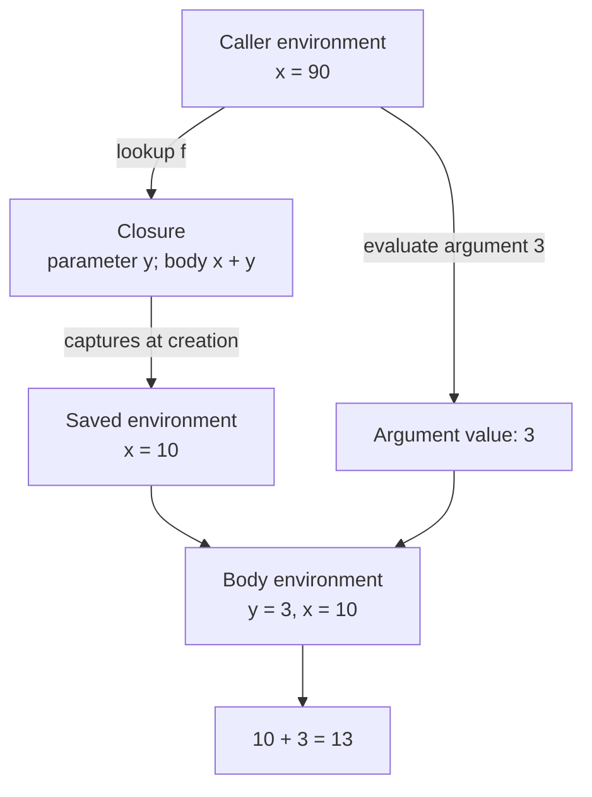

## A procedure is more than its body

A **closure** packages a function’s parameter, its body, and the environment where the function was created. The captured environment explains the meaning of free variables in that body. Creating a closure does not evaluate the body.

In lexical scope, variable references refer to the nearest enclosing declaration in the program text. The place where a function is called does not change those declarations.

```ocaml
let lexical_example =
  let x = 10 in
  let f y = x + y in
  let x = 90 in
  (f 3, x)
(* (13, 90) *)
```

The later `x` is a different binding. The result of `f 3` is `13` because the body’s free `x` refers to the earlier declaration.

## Draw creation and application separately



The call rule uses two different environments for two different jobs:

1. Evaluate the function expression in the caller’s environment to obtain a closure.
2. Evaluate the argument expression in the caller’s environment to obtain an argument value.
3. Extend the closure’s saved environment with the parameter bound to that value.
4. Evaluate the body in this new environment.

<div class="trace" data-trace="closure" data-title="Trace a captured binding"><p>The function saves x = 10. A later x = 90 changes only the caller. Calling f with 3 returns 13.</p></div>

## The OCaml representation

For a toy interpreter, the essential shape is:

```ocaml
type value =
  | Integer of int
  | Closure of string * expression * environment
and expression =
  | Literal of int
  | Variable of string
  | Function of string * expression
  | Apply of expression * expression
and environment = (string * value) list
```

These mutually recursive types reflect the model: environments contain values; a closure value contains an environment. This is not automatically a cyclic data structure. A normal closure can simply point to an already constructed environment.

## Free variables tell you what must be remembered

In `proc y (x + y)`, `y` is bound by the procedure and `x` is free relative to that procedure. The surrounding program may still bind `x`. “Free in a subexpression” and “free in the complete program” are different claims.

A correct implementation may save the entire environment for simplicity. An optimized implementation can save only the bindings for the body’s free variables. This is a representation choice; it must preserve the same lexical meaning.

## The homework connection

[HW1 P15](hw1.html#p15-free-variable-checker) asks whether every variable occurrence is bound. [HW2](hw2.html#closures-and-recursion) turns that binding structure into runtime behavior. A test with repeated names and a function created before rebinding will expose accidental dynamic scope immediately.

**Common trap:** evaluating the body using the current caller environment. That implements dynamic scope. Another trap is evaluating the argument inside the closure environment; lexical scope changes the body’s context, not the caller’s argument expression.

## Check your understanding

If `f` captures `x = 10`, what does `let x = 90 in f x` pass, and which `x` does the body use?

<details><summary>Reveal the reasoning</summary><p>The argument expression is evaluated at the call site, so the parameter receives 90. The body’s free x still resolves to 10. For f y = x + y, the result is 100.</p></details>

**Read alongside:** [lecture 6, pp. 6–14](https://prl.korea.ac.kr/courses/cose212/2026/slides/lec6.pdf#page=6), [HW2, PDF p. 3](https://prl.korea.ac.kr/courses/cose212/2026/hw/hw2.pdf#page=3), [English book, §4.2](https://prl.korea.ac.kr/courses/cose212/2026/pl-book-eng.pdf#page=123).
