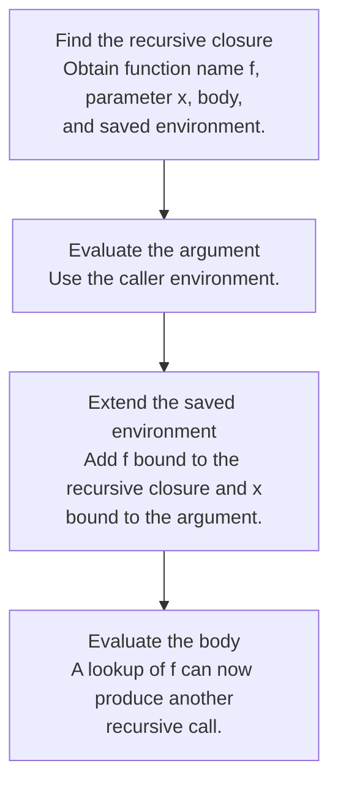

## A recursive closure remembers its own name

An ordinary closure cannot call itself through a name that was not yet in its captured environment. The course resolves this with a distinct recursive procedure value containing the function’s name, parameter, body, and definition environment.

At each recursive call, rebuild the environment the body needs:



This avoids requiring an OCaml association list to contain itself. The recursion is in the interpreter’s behavior: calling the represented function reconstructs the necessary self-binding.

## Mutual recursion needs both names

Two mutually recursive procedures must see each other as well as themselves. If one procedure calls the other, that second procedure must carry the same pair of definitions and the same lexical environment.

For an original example, imagine `is_even` and `is_odd` decreasing a nonnegative argument. The call chain for `is_even 3` is:

```text
is_even 3 → is_odd 2 → is_even 1 → is_odd 0 → false
```

At every body entry, both procedure names must be bound correctly. Merely adding the currently executing name is insufficient. The active formal parameter gets the current argument; it is not a permanent binding shared by future calls.

<details class="textbook-depth"><summary>Step by step · What changes at each mutual call?</summary>

Let `E` and `O` be the even and odd closures sharing definition environment `ρ0`. Each closure carries both definitions, with its own definition first.

| Call | Active parameter | Body environment, nearest binding first |
|---|---|---|
| `is_even 3` | `n = 3` | `[n ↦ 3, is_even ↦ E, is_odd ↦ O]ρ0` |
| `is_odd 2` | `n = 2` | `[n ↦ 2, is_odd ↦ O, is_even ↦ E]ρ0` |
| `is_even 1` | `n = 1` | `[n ↦ 1, is_even ↦ E, is_odd ↦ O]ρ0` |
| `is_odd 0` | `n = 0` | Base case returns `false` |

1. Obtain the selected closure from the caller.
2. Evaluate the new argument in the caller.
3. Restore both definitions over `ρ0`, then bind the selected parameter.
4. Return the body result to the previous call; do not overwrite `ρ0` with that call's local parameter.

Use [§5.3's seven-part closure diagram](textbook-05.html#depth-5-3) to map this table to `MRecProcedure`. Lexical addresses in the next section are a separate [Lecture 7 extension](textbook-04.html#lecture-07), not a prerequisite for implementing this representation.

</details>

## Lexical addresses remove spelling from lookup

A name can be replaced with the position of its binder in a stack of surrounding binders. The nearest binder has index `0`, the next one has index `1`, and so on in the simple one-binding-per-frame convention.

Consider the object-language term:

```text
proc x (proc y (x - y))
```

Inside the inner body the context is `[y; x]`. Therefore `x` becomes index `1` and `y` becomes index `0`. The term’s meaning does not depend on whether the original names were `x,y` or `a,b`.

| Point in the term | Name context | Lookup |
|---|---|---|
| Before outer procedure | `[]` | Neither name is bound |
| Inside outer body | `[x]` | `x` has index 0 |
| Inside inner body | `[y; x]` | `y` has index 0; `x` has index 1 |

A translator carries names while traversing syntax; the nameless evaluator carries values in matching order. Translation and execution must agree about which constructs push bindings. An ordinary `let` pushes its binder only for its body, not for its definition.

## Scope is a path, not a global collection

For an application with left and right subtrees, a binder created inside the left subtree does not become available in the right subtree. A global set of all names appearing anywhere in a program therefore cannot correctly check free variables.

This also explains **alpha-renaming**: consistently change a binder and its associated occurrences, preserving which declaration each use points to. Renaming that accidentally captures a formerly free variable changes meaning.

## The homework connection

[HW1 P15](hw1.html#p15-free-variable-checker) is a static scope traversal. [HW2](hw2.html) uses recursive and mutually recursive closures. Lexical-address translation is covered in lecture 7; it is a useful conceptual exercise but is not a separate requested constructor in HW2’s public AST.

The missing `fixpoint.pdf` supplement does not remove the fixed-point topic: HW2 pp. 7–9 and lecture 20 pp. 28–29 still discuss recursion expressed with non-recursive procedures. See [lambda calculus](15-lambda.html#recursion-as-a-fixed-point).

## Check your understanding

In `proc x ((proc y y) x)`, is `y` in scope at the final occurrence of `x`?

<details><summary>Reveal the reasoning</summary><p>No. The binder for y belongs only to the left subexpression’s procedure body. The right argument is evaluated under the outer scope, where x is bound. An immutable context passed separately to the two children models this correctly.</p></details>

**Read alongside:** [lecture 6, pp. 16–24](https://prl.korea.ac.kr/courses/cose212/2026/slides/lec6.pdf#page=16), [lecture 7, pp. 8–15](https://prl.korea.ac.kr/courses/cose212/2026/slides/lec7.pdf#page=8), [HW2, pp. 3–5](https://prl.korea.ac.kr/courses/cose212/2026/hw/hw2.pdf#page=3).
