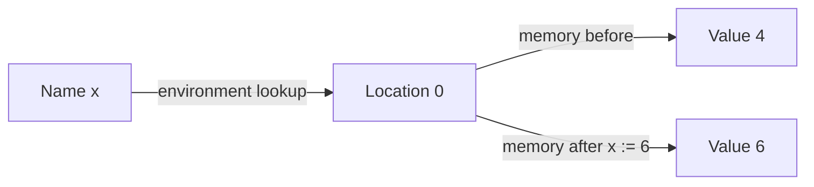
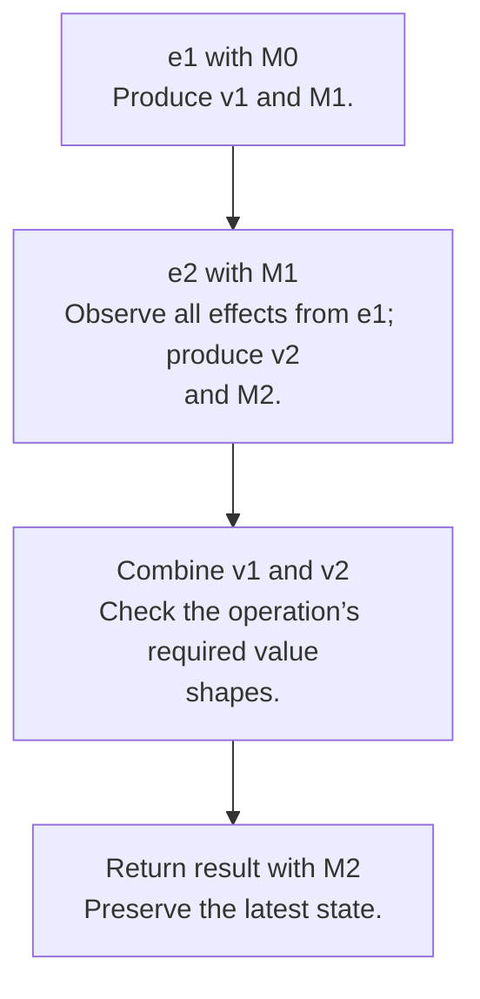

## A name and its current value are different things

To model mutation, separate the **environment**, which resolves a name to a location, from the **store**, which resolves a location to its current value. In this chapter write `ρ : Name → Location` and `M : Location → Value`. HW3 uses `σ` for its environment and `M` for memory; lecture 8 uses different letters. Follow the roles, not only the Greek symbols.



The evaluator now has the conceptual type `environment -> memory -> expression -> value * memory`. Every subexpression may change memory, so a caller needs both its value and its resulting store.

## Thread the latest memory

To evaluate `e1 + e2` left to right, evaluate `e1` with `M0`, producing `(v1, M1)`. Evaluate `e2` with **M1**, producing `(v2, M2)`. Return the arithmetic result with **M2**. Reusing `M0` loses the effects of the left expression.



The same discipline applies to sequences, conditionals, loop conditions, argument lists, and record initializers. Even a loop condition that becomes false can have changed memory; return that final condition store.

<div class="trace" data-trace="store" data-title="Trace an assignment"><p>Starting with x at location 0 containing 4, evaluate x + 2, store 6 at location 0, then read x as 6.</p></div>

## Explicit and implicit references

In explicit-reference languages, allocating a cell, reading it, and writing it have separate operations. OCaml references illustrate the idea:

```ocaml
let counter = ref 4
let () = counter := !counter + 2
let result = !counter
```

An implicit-reference language makes variable bindings allocate cells and variable lookup read them automatically. B uses this model for variable bindings. Its assignment evaluates to the assigned value; OCaml’s `:=` evaluates to `unit`. Translating syntax mechanically between these languages will miss that difference.

## Call by value and call by reference

| Question | Call by value | Call by reference |
|---|---|---|
| What is passed? | The evaluated argument value | The caller’s existing variable location |
| Parameter binding | Fresh location initialized with the value | Same location as the caller’s variable |
| Assigning to a scalar parameter | Updates the local cell | Updates the caller’s cell |
| Can two parameters alias? | Fresh scalar parameter cells do not | Yes, when passed the same variable |

If `a` initially contains `4`, calling a procedure that assigns `p := 9` by value leaves `a = 4`; by reference it leaves `a = 9`. With record values, copying the value can still copy field addresses and preserve shared mutable fields. Call by value does not promise a deep copy of reachable memory.

## The homework connection

[HW3](hw3.html) makes store threading explicit. It also has an environment containing either location bindings or procedure bindings: procedures are not general stored values in B. Calls execute under the procedure’s captured environment, while argument values or argument locations come from the caller.

## Check your understanding

Why must fresh parameter locations be pairwise distinct, not merely absent from the incoming store?

<details><summary>Reveal the reasoning</summary><p>Two newly allocated parameters could otherwise receive the same previously unused location and accidentally alias. Allocate successively, updating the allocator state, or otherwise ensure all fresh locations are distinct.</p></details>

**Read alongside:** [lecture 8, PDF pp. 14–16, 25–26, 30–38](https://prl.korea.ac.kr/courses/cose212/2026/slides/lec8.pdf#page=14), [HW3, pp. 2–4](https://prl.korea.ac.kr/courses/cose212/2026/hw/hw3.pdf#page=2), [English book, chapter 6](https://prl.korea.ac.kr/courses/cose212/2026/pl-book-eng.pdf#page=161).
