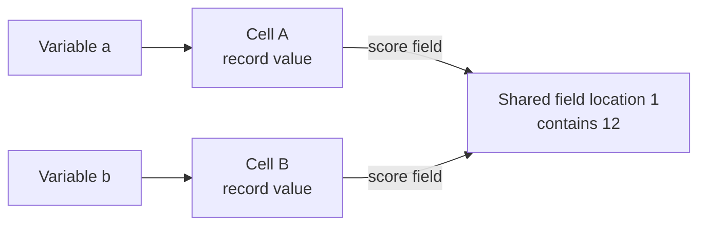
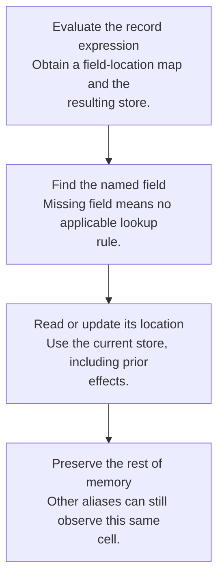
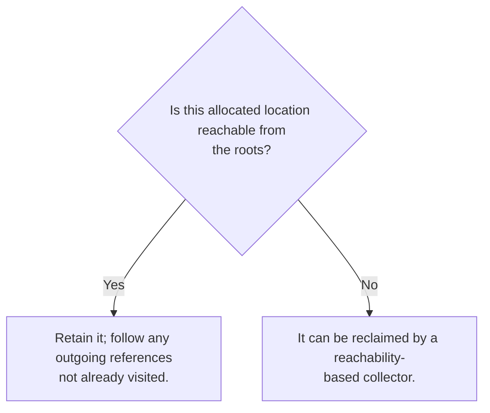

## A record is a map to field locations

In HW3, a record value maps field names to memory addresses. Looking up a field is therefore a two-stage operation: obtain the field’s location from the record, then read that location in the current store.

```text
record r = { score ↦ ℓ1, level ↦ ℓ2 }
memory M = { ℓ1 ↦ 12, ℓ2 ↦ 3 }
r.score = M(r(score)) = 12
```

Constructing a nonempty record evaluates field initializers in order and allocates fresh, distinct cells for the results. Updating a field changes one cell rather than rebuilding the entire record value.

## Copying a record value can preserve sharing

Suppose `a` contains a record with `score ↦ ℓ1`, and a second variable `b` receives that same record value. The cells holding `a` and `b` can be different while their field maps still contain the same `ℓ1`.



After `b.score := 20`, reading `a.score` returns `20`. This is aliasing through the record. By contrast, rebinding or assigning a new record to `b` changes what `ℓB` contains; it does not necessarily modify the old record still held by `a`.



## Reachability explains garbage collection

Memory is safely reclaimable when the running program can no longer reach it. Start from **roots**—live environments and other runtime references—and follow pointers through values, records, and captured environments as appropriate to the machine.

A simple tracing collector maintains a set of marked locations and a worklist. Remove one item, mark it if unseen, and add any locations reachable directly from its value. Once the worklist is empty, unmarked allocated cells can be reclaimed. Remembering visited locations handles cycles.



Reachability is conservative relative to whether a program will actually use a value in the future. A reachable cell may never be read again, but retaining it avoids incorrectly freeing live memory. The lecture’s undecidability discussion concerns perfect prediction of future usefulness, not the finite graph traversal used by a tracing collector.

<details class="textbook-depth"><summary>Step by step · Decide which heap edges must be followed</summary>

In the [PDF p.216 example](https://prl.korea.ac.kr/courses/cose212/2026/pl-book-eng.pdf#page=216), the roots are `ℓ1` and `ℓ2`:

1. The record at `ℓ2` points to `ℓ3` and `ℓ1`.
2. The pointer at `ℓ3` leads to `ℓ4`.
3. The closure at `ℓ4` saves an environment that reaches `ℓ5`.
4. No root reaches the separate `ℓ6 ↔ ℓ7` cycle. Marking retains `ℓ1` through `ℓ5` and can reclaim `ℓ6, ℓ7`.

Open the [full diagram and marking table](textbook-07.html#depth-7-3-2) to follow these steps. This is the textbook's pointer/closure language; B does not store those same value forms.

At an arbitrary point inside an interpreter, roots must also include values and environments saved by pending computations. For example, the already evaluated left operand of a call may hold a closure while the right operand allocates. Collecting from only the currently visited expression's environment could incorrectly free that closure's cells. The chapter download therefore exposes a marking exercise and explains its collection-point limits.

</details>

## Pointers and lifetime errors

| Problem | What happens | Mental model |
|---|---|---|
| Dangling reference | A live reference points to reclaimed storage | The graph still contains an edge to a deleted node |
| Memory leak | Unneeded storage remains allocated | Storage outlives its useful role |
| Double free | A cell is manually reclaimed more than once | Ownership/lifetime bookkeeping is inconsistent |
| Cyclic garbage | A group of cells points internally but has no path from roots | Internal edges do not create root reachability |

A simple reference-counting collector cannot reclaim an isolated cycle solely by waiting for all reference counts to reach zero. A tracing collector can identify that cycle as unreachable from roots.

## The homework connection

[HW3](hw3.html#records-and-aliasing) requires records, field lookup, and field assignment. It does not request a garbage collector. Use reachability diagrams to understand sharing, while keeping the actual assignment implementation scoped to its AST and rules.

The empty-record rule in HW3 is unusual: `{}` evaluates to `Unit`, not a record with zero fields. Follow the specific RECF rule rather than importing the behavior of another language.

## Check your understanding

Two variables contain equal field maps. Must their own variable cells be the same location?

<details><summary>Reveal the reasoning</summary><p>No. Variable-cell identity and field-cell identity are different levels. Distinct variable cells can contain record values that point to the same field cells, so mutation through a field may be shared even when assigning a new value to one variable is not.</p></details>

**Read alongside:** [lecture 9, pp. 5–10 and 15–20](https://prl.korea.ac.kr/courses/cose212/2026/slides/lec9.pdf#page=5), [HW3, pp. 2–3](https://prl.korea.ac.kr/courses/cose212/2026/hw/hw3.pdf#page=2), [English book, chapter 7](https://prl.korea.ac.kr/courses/cose212/2026/pl-book-eng.pdf#page=193).
