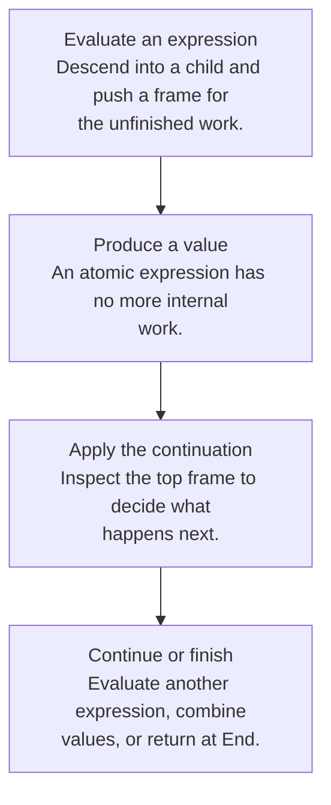
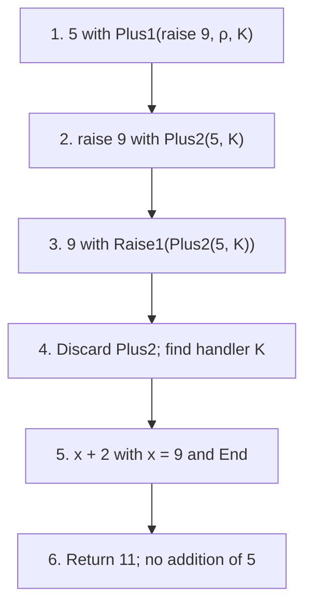
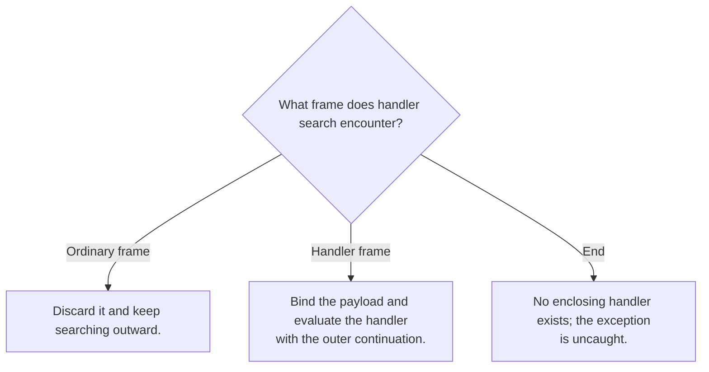

## A continuation records pending work

When evaluating the right child of `5 + e`, the machine remembers that it must add `5` after `e` returns. That remembered work is a **continuation**. A direct recursive interpreter stores much of it implicitly in the host call stack. A continuation-based interpreter turns it into explicit data.

For a left-to-right addition, one frame remembers the unevaluated right expression and its environment. After the left side returns, another frame remembers the left value while the right side is evaluated.

```text
Plus1(right_expression, saved_environment, rest)
Plus2(left_value, rest)
End
```

The environment answers “what do these names mean?” The continuation answers “what should happen to the next value?” They solve different problems and must not be confused.

## Evaluation and resumption cooperate



For `(3 + 4) + 8`, evaluate the inner literals, combine them to `7`, resume the outer addition, then combine `7` and `8`. An explicit continuation makes each return point inspectable.

## Raising is a change of control

An exception is not an ordinary return value flowing through every pending operation. Raising abandons intervening work until it finds an appropriate handler. The course’s toy language uses `try e1 catch(x) e2`; this is not OCaml’s concrete exception syntax.

<div class="trace" data-trace="exception" data-title="Watch a handler discard pending work"><p>In try (5 + raise 9) catch x (x + 2), raising discards the addition of 5. The handler returns 11.</p></div>

The handler frame stores the handler parameter, handler expression, environment at the `try`, and the continuation outside the `try`. When a value is raised, walk through frames until reaching that handler. Evaluate the handler in its saved environment extended by the payload binding, then continue outside the handler.

<details class="textbook-depth"><summary>Step by step · Follow the actual frames</summary>

For `try (5 + raise 9) catch(x) (x + 2)`, let `K = Try(x, x+2, ρ, End)`.



`Raise1` first evaluates the expression producing the payload; `find-handler` then traverses the surrounding continuation. The new body runs outside `K`, so it cannot catch its own later exception with that same handler. This makes the [Lecture 10 rules, pp.18–20](https://prl.korea.ac.kr/courses/cose212/2026/slides/lec10.pdf#page=18) concrete.

</details>



## A normal result does not invoke the handler

If the protected expression evaluates normally, the handler frame forwards the value to its outer continuation. The handler is not a function that always transforms results. Also, a handler is removed before its body executes: an exception raised within that body needs an outer handler unless a new inner handler has been installed.

For comparison, an OCaml example uses an exception constructor:

```ocaml
exception Stop of int
let result =
  try 5 + (raise (Stop 9)) with
  | Stop x -> x + 2
(* result = 11 *)
```

## The homework connection

Lectures 10 and 11 extend the course’s language-design method beyond the four posted assignments. HW2 and HW3 require raising the host exception `UndefinedSemantics` for undefined operations, but their ASTs do not include object-language `try` and `raise` constructors. HW4 similarly uses a host `TypeError`. These error-reporting interfaces are related to exceptions, but implementing a full continuation machine is not required by those homework specifications.

## Check your understanding

Why does exception handling need information absent from a bare expression tree and lexical environment?

<details><summary>Reveal the reasoning</summary><p>It needs the dynamic control context: the computations waiting for the current result and the enclosing handlers active along the evaluation path. Lexical bindings alone do not identify which pending operations must be abandoned.</p></details>

**Read alongside:** [lecture 10, pp. 7–20](https://prl.korea.ac.kr/courses/cose212/2026/slides/lec10.pdf#page=7).
