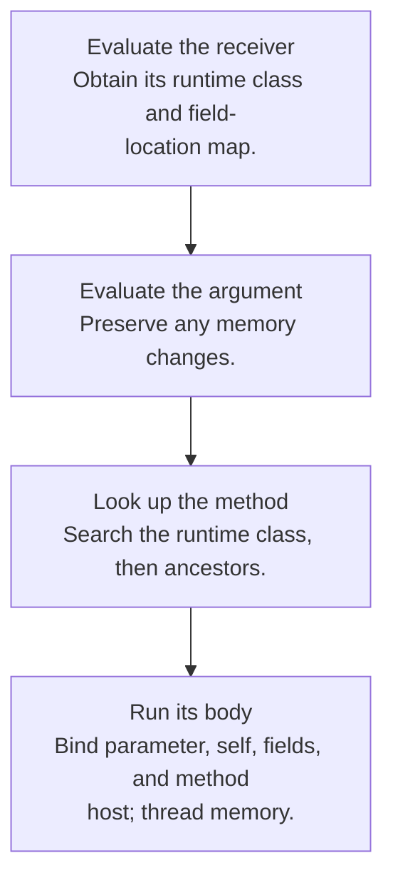
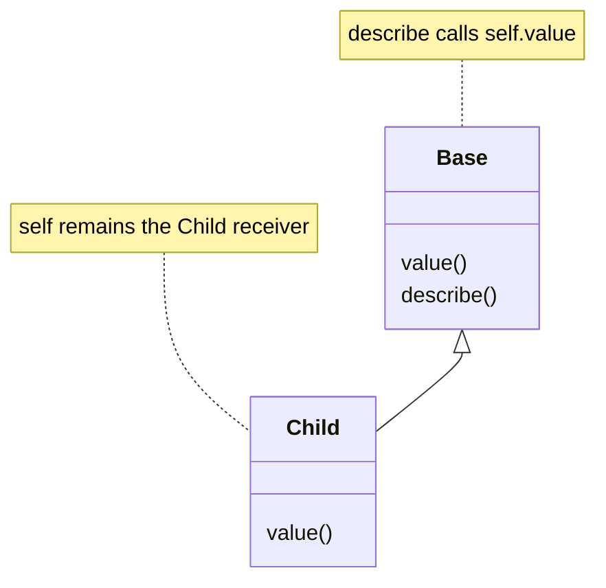

## An object combines identity, fields, and a class

In the lecture’s model, an object value contains its class name and a map from field names to locations. The store holds the mutable contents of those fields. A separate **class environment** records each class’s parent, fields, and method definitions.

This builds directly on records and stores. What objects add is a disciplined way to choose behavior based on the receiver’s class.

```text
object value: (ColoredCounter, field_locations)
class environment:
  ColoredCounter → parent Counter, fields, methods
  Counter        → parent object, fields, methods
```

## Method lookup starts at the actual receiver

**Dynamic dispatch** searches for a method starting at the receiver’s runtime class. If that class does not define the method, lookup continues at its parent. The first matching definition wins.



A method also records the **host class**, the class where that method was declared. The receiver’s runtime class and the method’s host class may be different because methods can be inherited.

## Self and super choose different lookup starts

`self` is the current receiver object. A call through `self` uses the receiver’s actual class and can dispatch to an override in a subclass. A `super` call starts lookup at the parent of the current method’s host class, while retaining the same receiver object.

Suppose class `Base` defines methods `value` and `describe`, and `describe` calls `self.value`. Class `Child` overrides `value`. Calling inherited `describe` on a `Child` still calls the child’s `value`. The inherited method is hosted by `Base`, but `self` is a `Child`.



| Call inside a method | Where lookup starts | Which object supplies fields? |
|---|---|---|
| `self.m(...)` | Runtime class of self | The existing receiver |
| `super.m(...)` | Parent of the current method’s host | The same existing receiver |

If a method inherited from `Base` runs on a much deeper subclass, `super` still uses the parent of `Base`. Using the parent of the runtime receiver would choose the wrong method chain.

## Field shadowing is different from method overriding

The lecture renames fields to unique internal identifiers when different classes declare the same source name. The parent’s field and the child’s field can both exist in the same object. Method bodies are renamed consistently to retain their intended field access.

By contrast, an overridden method changes lookup behavior: the subclass’s method is selected first during ordinary dynamic dispatch. Treating fields exactly like method slots can accidentally make a parent method read a different field.

## Object creation has a sequence

The [formal rule on Lecture 11 p.24](https://prl.korea.ac.kr/courses/cose212/2026/slides/lec11.pdf#page=24) requires freshness against the memory **after argument evaluation**. A direct implementation can follow this order:

1. Collect inherited and local field names.
2. Evaluate the initializer argument, obtaining its value and updated store `M1`.
3. Choose pairwise distinct field locations and a parameter location, all fresh relative to `M1`.
4. Find `initialize` and its host class. Bind fields, the parameter, `self`, and `host`; store the argument in its parameter cell.
5. Run the initializer with that store. Return the new object and final store, discarding the initializer's result.

The slide's prose lists allocation before argument evaluation. An allocator that reserves globally distinct addresses can support that order, but choosing unused addresses from the old store without reserving them can collide with allocations performed by the argument. The order above directly respects the displayed freshness premise.

The rule does not install default values for every field: the initializer must write a field before reading it. Do not assume an unstated zero-initialization policy. This is a lecture extension built on [Chapter 6 allocation](textbook-06.html#depth-6-3), not OCaml's object syntax.

## The homework connection

There is no posted object-interpreter homework among HW1–HW4. However, [HW3](hw3.html) supplies the prerequisite store and record reasoning. [Typed objects](14-subtyping.html) adds static checks to method lookup and overriding. Studying this chapter shows how the earlier representations can grow without replacing the whole evaluator.

## Check your understanding

Does `super` create a separate parent object?

<details><summary>Reveal the reasoning</summary><p>No. It changes where method lookup begins. The receiver and its field storage remain the same object, and the selected method receives an updated host-class marker.</p></details>

**Read alongside:** [lecture 11, pp. 16–26](https://prl.korea.ac.kr/courses/cose212/2026/slides/lec11.pdf#page=16). The website also lists this PDF under static types; its actual topic is classes and objects.
