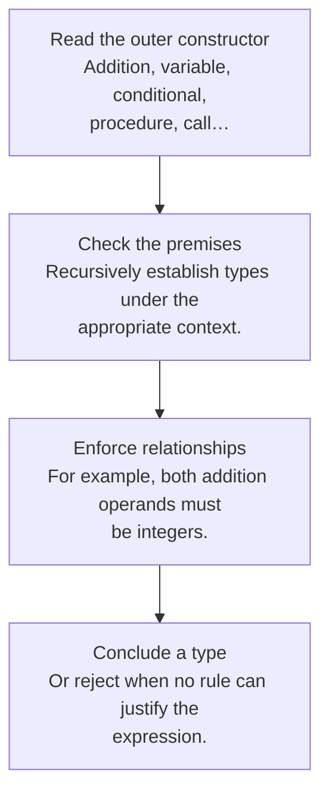

## A type judgment predicts a category of result

Write **Γ ⊢ e : τ** as: “under type environment Γ, expression e has type τ.” Γ maps names to types, while runtime environment ρ maps names to values or locations. A type checker follows syntax without executing the program to discover its values.

For a simple function language, types include integers, booleans, and function types. A function type `A → B` describes a value that accepts an A and produces a B when it returns normally.



## Typing rules mirror semantic rules

| Expression | Required premises | Result type |
|---|---|---|
| Integer literal | None | `int` |
| Variable x | x has a binding in Γ | Γ(x) |
| `a + b` | a : int and b : int | `int` |
| `if c then a else b` | c : bool; a and b have a common type T | `T` |
| `proc x body` | Under x : A, body : B | `A → B` |
| `f argument` | f : A → B and argument : A | `B` |

Typing both branches of a conditional is useful even though evaluation chooses only one. A simple syntax-directed type system conservatively checks all branches. It may reject `if true then 4 else false` even though the bad branch is unreachable in that particular expression.

## A worked derivation

For `proc x (if iszero x then 7 else x + 2)`, the use of `iszero` requires `x : int`. Both branch expressions have type `int`, so the conditional has type `int`. The procedure therefore has type `int → int`.

```text
Γ, x:int ⊢ x : int
Γ, x:int ⊢ iszero x : bool
Γ, x:int ⊢ 7 : int
Γ, x:int ⊢ x + 2 : int
----------------------------------------------
Γ, x:int ⊢ if iszero x then 7 else x + 2 : int
-----------------------------------------------------
Γ ⊢ proc x (if iszero x then 7 else x + 2) : int → int
```

The diagram is a dependency tree: the conclusion rests on all of its premises. In an annotated language, the parameter type may be supplied. In an unannotated language, the checker must infer it, which motivates [constraint generation](12-inference.html).

## Soundness is a one-way guarantee

For a specified language and notion of error, a sound type system does not accept programs that can go wrong in the prohibited way. This is often formalized with **preservation** (steps preserve typing) and **progress** (a well-typed term is a value or can take an allowed step). These statements depend on the exact operational semantics.

Soundness does not automatically mean termination, correct business logic, no resource exhaustion, or no division by zero. A language can treat some failures as explicit exceptions or specified outcomes. If a course definition treats those failures as stuck, the theorem must exclude them or strengthen its premises.

**Completeness**, in the course’s safety discussion, would mean accepting every program that is safe under the chosen notion. Practical computable type systems for expressive languages cannot generally give a perfect decision procedure for all semantic safety properties. They conservatively reject some safe programs.

## The homework connection

[HW4](hw4.html) requests a sound checker for ML− but gives only an AST, a type datatype, and a public interface. It does not spell out all extended typing rules or its treatment of partial operations. The guide separates standard type safety from stronger claims about the absence of `UndefinedSemantics`, and identifies the equality restriction that a checker must respect.

## Check your understanding

Why can a program have a function type and still run forever?

<details><summary>Reveal the reasoning</summary><p>The type constrains acceptable inputs and the kind of result if evaluation produces one. Ordinary typing rules for recursion do not supply a decreasing measure or a termination proof. A recursively self-calling function can therefore be well typed.</p></details>

**Read alongside:** [lecture 12, pp. 5–9](https://prl.korea.ac.kr/courses/cose212/2026/slides/lec12.pdf#page=5), [lecture 13, pp. 4–15](https://prl.korea.ac.kr/courses/cose212/2026/slides/lec13.pdf#page=4), [lecture 14, pp. 5–8](https://prl.korea.ac.kr/courses/cose212/2026/slides/lec14.pdf#page=5), [English book, §§8.1–8.5](https://prl.korea.ac.kr/courses/cose212/2026/pl-book-eng.pdf#page=225).
