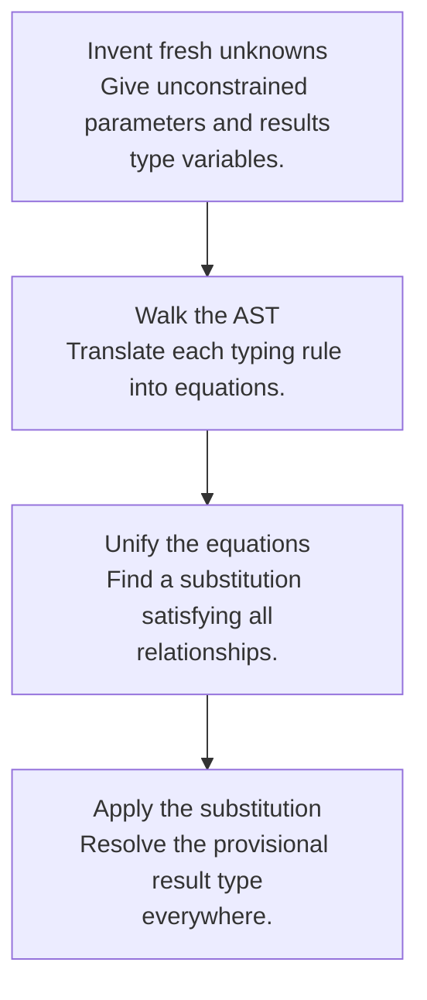
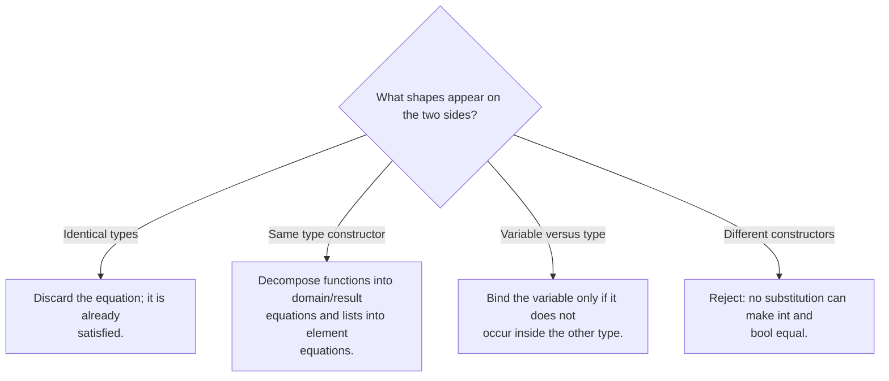

## Unknown types can be solved

In an unannotated procedure, the parameter type is not initially known. Assign a fresh type variable, inspect how the parameter is used, and collect equations describing what must be true. This separates **constraint generation** from **constraint solving**.

For example, `proc x (x + 1)` begins with `x : α`. Addition generates `α = int`; the result is `int`, so the whole procedure is `int → int`.



## A complete worked example

Consider `proc f (proc x (f (x + 1)))`. Give `f` type α, `x` type β, and the call result type γ.

| Source of constraint | Equation | Reason |
|---|---|---|
| `x + 1` | β = int | Addition consumes integers |
| `f (x + 1)` | α = int → γ | f accepts the addition result |
| Outer structure | provisional type α → β → γ | Two nested procedures |

Substituting the solved equations gives **(int → γ) → int → γ**. γ remains free because no operation constrains f’s result. Different fresh variable names denote the same type structure.

<div class="trace" data-trace="unify" data-title="Solve the type equations"><p>Assign α to f and β to x. Addition forces β = int. The call forces α = int → γ. The result is (int → γ) → int → γ.</p></div>

## Unification is a worklist algorithm

At each step inspect one equation after applying substitutions already learned.



For function types, `(A → B) = (C → D)` creates two equations, `A = C` and `B = D`. For list types, `List A = List B` creates `A = B`. Do not confuse type equations with subtyping; this chapter’s unification requires equality.

## The occurs check prevents infinite simple types

Trying to solve `α = α → β` would make α contain itself. No finite type in the course’s simple type grammar can satisfy this equation. The **occurs check** detects the occurrence of α inside the proposed replacement and rejects it.

The expression `proc x (x x)` produces exactly this kind of problem: x must be both an argument and a function accepting that same argument type. Untyped lambda calculus can represent the expression; this simple type system rejects it.

## Substitution must reach inside types

If `S1 = {α ↦ β}` and `S2 = {β ↦ int}`, applying S2 after S1 maps α to int. Merely concatenating maps and looking up α once may leave β unresolved. Define substitution application recursively through function and list constructors, and define composition consistently.

```text
apply S (A → B) = apply S A → apply S B
apply S (List A) = List (apply S A)
apply (S2 after S1) T = apply S2 (apply S1 T)
```

Choose one direction for composition and document it in helper names. The final type must receive the fully composed substitution, not just the last binding discovered.

## The homework connection

[HW4](hw4.html) needs fresh variables, equations for every AST constructor, and a unifier over unit, integers, booleans, arrows, lists, and variables. Recursive procedures require assuming provisional function types while checking their bodies; mutual recursion requires both provisional bindings at once.

**Useful tests:** a valid higher-order call, a mismatched function argument, an inconsistent branch pair, a list with incompatible element types, a substitution chain, and self-application. The assignment’s equality operator also needs an admissible-type check beyond ordinary unification.

## Check your understanding

Why must you apply the current substitution before performing a later occurs check?

<details><summary>Reveal the reasoning</summary><p>A variable may already expand to a type containing another variable. For example, after α = β → int, the proposed binding β = α contains β indirectly. Looking only at the unreplaced name α would miss the cycle.</p></details>

**Read alongside:** [lecture 15, pp. 4–10](https://prl.korea.ac.kr/courses/cose212/2026/slides/lec15.pdf#page=4), [lecture 16, pp. 4–7](https://prl.korea.ac.kr/courses/cose212/2026/slides/lec16.pdf#page=4), [lecture 17, pp. 16 and 21–26](https://prl.korea.ac.kr/courses/cose212/2026/slides/lec17.pdf#page=16), [English book, §8.6](https://prl.korea.ac.kr/courses/cose212/2026/pl-book-eng.pdf#page=248).
