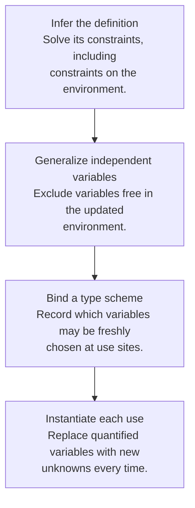

## A shared unknown is not a reusable scheme

In a monomorphic system, a variable bound to a function has one shared type throughout its scope. If the first use forces the input type to `int`, a later use cannot independently choose `bool`. Let-polymorphism replaces suitable free type variables with universally quantified variables in a **type scheme**.

For the identity function, the scheme is `∀α. α → α`. Each use receives fresh unknowns while preserving the relationship between input and output within that use.

```ocaml
let identity x = x
let example = (identity 7, identity true)
(* int * bool *)
```

The two uses instantiate separate copies of the scheme. They do not share one global α that must equal both int and bool.

## Generalization respects the environment

The safe rule for the pure setting is:

```text
Gen(Γ, T) = ∀(FTV(T) minus FTV(Γ)). T
```

`FTV` means free type variables. Generalize only the variables in the inferred type that are not fixed by the surrounding type environment. Apply accumulated substitutions to both Γ and T before making this decision.



## Why captured variables cannot be generalized away

Inside `proc c (let f = proc x c in ...)`, suppose `c : β`. The function f has type `α → β`. Generalize α if independent, but keep β tied to c. Giving f the scheme `∀α β. α → β` would falsely promise that f can return any result type the caller chooses. In reality it always returns the same captured c.

The correct scheme is `∀α. α → β`, with β still shared with the environment. If one use requires β to be bool and another requires it to be a function, unification rejects the conflict.

## Let-bound and parameter-bound functions differ

An ordinary procedure parameter receives a monotype in Hindley–Milner-style inference. It is not generalized simply because it happens to be used as a function. For example, `fun f -> (f 7, f true)` is rejected by standard OCaml typing, while separate uses of a let-bound identity function can be accepted.

Lecture 18 p. 13 shows an inconsistent symbol in its `Proc` rule: it displays `x ↦ σ` while the conclusion uses `t1`. Read the parameter binding as the single assumed parameter type `t1`, consistent with the surrounding rules; it is not permission to invent unrestricted higher-rank polymorphism.

## Check the definition even if it is unused

Naively substituting a let definition into each use can skip an unused definition entirely. That would accept an eager program whose unused definition fails when evaluated. It can also duplicate type-checking work exponentially. Type schemes avoid repeated inference while still requiring the definition itself to be checked.

Mutation adds further restrictions. OCaml uses a value restriction to control polymorphism around potentially shared mutable values. The pure generalization rule above is not a universal prescription for every language with references.

## The homework connection

[HW4](hw4.html) does not explicitly state whether let-polymorphism is required. Its public result datatype contains type variables but no type-scheme constructor; an implementation can still represent schemes internally if required. First build and test a clear monomorphic baseline, then add generalization/instantiation only under a declared policy consistent with the instructor’s requirements. The public handout alone is not evidence that hidden tests require either choice.

## Check your understanding

For `f : α → β` in an environment where β is free but α is not, which variable can be generalized?

<details><summary>Reveal the reasoning</summary><p>Only α. β represents an unresolved but shared fact about the surrounding environment. Instantiation must preserve that shared β while creating a fresh replacement for α.</p></details>

**Read alongside:** [lecture 18, pp. 4–13](https://prl.korea.ac.kr/courses/cose212/2026/slides/lec18.pdf#page=4), [English book, §8.7](https://prl.korea.ac.kr/courses/cose212/2026/pl-book-eng.pdf#page=271).
