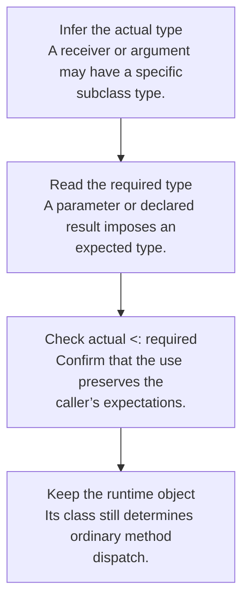

## Subtyping is safe substitutability

Write **S <: T** when a value of type S may be used wherever a T is expected. In the lecture’s nominal class system, declared inheritance introduces class subtype relationships. Reflexivity says every type is a subtype of itself; transitivity chains relationships.

If `ColorPoint` extends `Point`, a ColorPoint can be passed to a function expecting a Point. The reverse is not generally safe: a plain Point may lack the color-specific behavior that the function needs.

## Subsumption connects subtyping to expressions

If Γ proves that e has type S and S <: T, **subsumption** allows e to be used at type T. This changes the static view of the value, not its runtime class. Dynamic dispatch still uses the actual receiver object.



## Function inputs reverse the direction

For function types, the rule is:

```text
(A → B) <: (C → D)  when  C <: A  and  B <: D
```

The replacement function must accept at least all the inputs promised by the expected function type, and return results at least as specific as promised.

| Candidate replacement | Expected function | Safe? | Reason |
|---|---|---|---|
| `Point → int` | `ColorPoint → int` | Yes | It accepts every ColorPoint because it accepts all Points |
| `ColorPoint → int` | `Point → int` | No | A caller may supply an uncolored Point |
| `int → ColorPoint` | `int → Point` | Yes | Every result is still a Point |

This input reversal is **contravariance**; the same-direction result rule is **covariance**. Re-derive them from what a caller may pass and receive instead of memorizing arrows.

## Safe method overrides preserve the contract

Suppose a parent method expects `ColorPoint` and returns `Point`. The lecture allows an override that accepts `Point` and returns `ColorPoint`: it accepts a broader range of arguments and makes a stronger result guarantee. An override that narrows the accepted input can break callers compiled against the parent contract.

The lecture checks equal arity, contravariant parameters, and covariant results. It specifically exempts `initialize` from the ordinary override compatibility check because constructors are selected for `new C(...)`. This is a rule of this course language; other languages can impose stricter method-override restrictions.

## The checker has three passes

1. Build the class environment in inheritance order, carrying inherited fields and signatures and checking overrides.
2. Check method bodies with field types, parameter types, and `self`/`host` information. Ensure each body’s type is compatible with its declared return type.
3. Check the main expression under the resulting class environment.

A method call looks up the signature available from the receiver’s static type. Arguments must fit the corresponding parameter types, and the call receives the declared result type. Runtime lookup may choose an overriding body; override checks make that substitution safe.

## The homework connection

HW4 targets ML−, not the typed class language, so it needs unification rather than class subtyping. This chapter is an extension of the same static reasoning method. Do not add subtype conversions to ordinary `int`/`bool` unification: distinct base types remain distinct in the lecture’s system.

One cross-lecture distinction matters: lecture 19 types assignment as `void`, while B’s HW3 assignment rule returns the assigned value. Follow the language being discussed, not a global rule inferred from another chapter.

## Check your understanding

Why is an override that accepts only ColorPoint unsafe when the parent accepts every Point?

<details><summary>Reveal the reasoning</summary><p>A caller holding a parent-typed reference is entitled to pass an ordinary Point. Dynamic dispatch could reach the narrower override, which cannot fulfill that promise. The child method must not demand a more specialized argument.</p></details>

**Read alongside:** [lecture 19, pp. 8–23](https://prl.korea.ac.kr/courses/cose212/2026/slides/lec19.pdf#page=8).
