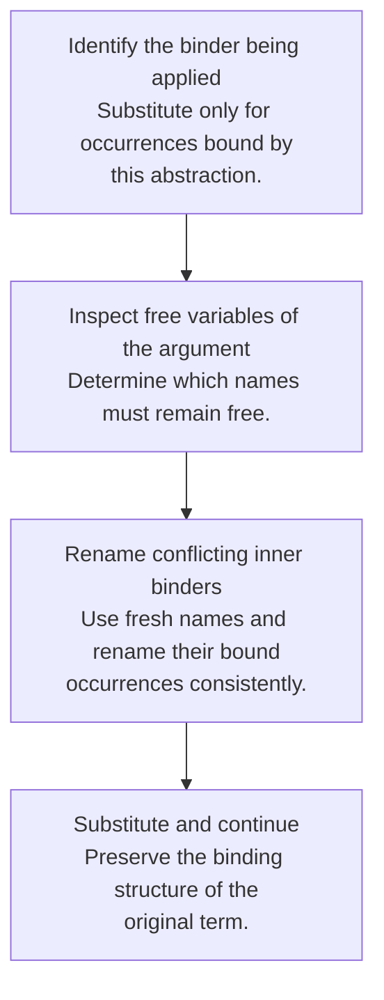
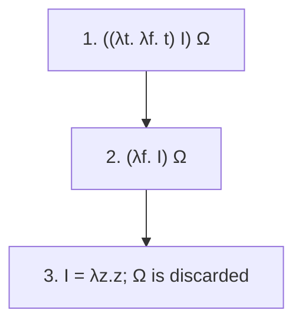

## Three forms are enough

Untyped lambda calculus has variables, abstractions, and applications:

```text
term ::= x | λx. term | term term
```

An abstraction binds a parameter. An application supplies an argument. Parentheses identify grouping: application associates left, while an abstraction’s body extends as far right as its delimiters allow. The point is not that real languages should expose only these forms, but that many richer constructs can be encoded from a small core.

## Beta reduction substitutes without capture

**Beta reduction** replaces an application `(λx. body) argument` with the body in which free occurrences of x are replaced by the argument. The replacement must avoid capturing free variables of the argument.

Consider `(λx. λy. x) y`. Replacing x naively gives `λy. y`, which changes the argument’s free y into a bound variable. First rename the inner binder to a fresh name, obtaining `(λx. λz. x) y`, then reduce to `λz. y`.



This is the substitution counterpart of the scope discipline used by closure interpreters. Environments can implement binding without physically copying syntax at each call.

## Evaluation strategy can change termination

Let Ω be `(λx. x x) (λx. x x)`, which reduces to itself. For `(λx. λz. z) Ω`:

- **Call by value** evaluates the argument first and gets stuck reducing Ω forever.
- **Call by name** substitutes the unevaluated argument and reaches `λz. z`, since x is unused.
- **Normal order** repeatedly chooses the leftmost outermost redex and, when seeking a full normal form, continues inside abstractions too.

Call by name and normal order are related but not identical descriptions: weak call-by-name evaluation stops at an abstraction, whereas normalization may reduce inside its body. Call by need further adds sharing so repeated uses need not reevaluate the same suspended argument.

## Encodings turn data into behavior

A Church boolean chooses between two alternatives:

```text
TRUE  = λt. λf. t
FALSE = λt. λf. f
```

A Church numeral describes repeated function application: two is `λf. λx. f (f x)`. Data representation becomes a protocol describing how the encoded value acts on consumers.

In an eager implementation, an encoded conditional needs delayed branches if unchosen computations must remain unevaluated. Passing two already evaluated arguments to an ordinary function does not reproduce the short-circuit behavior of a native `if`.

<details class="textbook-depth"><summary>Step by step · Reduce a boolean choice without evaluating its unused branch</summary>

With `I = λz.z` and the divergent term `Ω` defined above, normal order gives:



1. Parenthesize application to the left.
2. Substitute `I` for `t`; no free variable is captured because `I` is closed.
3. Substitute for `f`; there is no occurrence to replace, so `Ω` is discarded.
4. `I` is already a normal form. An eager application would instead try to evaluate `Ω` before this final step and diverge.

This follows the boolean translation in [§9.2](textbook-09.html#depth-9-2). The notation describes lambda reduction, not an OCaml function call. For recursion, compare the textbook's normal-order Y unfolding with the delayed Z-style test in HW2.

</details>

## Recursion as a fixed point

A fixed point of a function F is a value r satisfying `F r = r` in the relevant semantic sense. To express a recursive computation, write a functional F that takes the would-be recursive function as an argument and returns one layer of its behavior. A fixed-point combinator supplies the self-reference.

The usual untyped Y combinator is not directly suitable for eager evaluation: its self-application unfolds too soon. HW2 uses a call-by-value-friendly Z-style combinator with an extra procedure delaying recursive use. Trace when a closure is created versus when its body is called; the delay is the essential mechanism.

These untyped encodings should not be pasted unchanged into ordinary simply typed OCaml and assumed to compile. The self-application required by a classic fixed-point combinator conflicts with finite simple types. OCaml’s `let rec` supplies recursion through the language’s own rules.

## The homework connection

[HW1 P15](hw1.html#p15-free-variable-checker) is directly about binding structure. [HW2 pp. 7–9](https://prl.korea.ac.kr/courses/cose212/2026/hw/hw2.pdf#page=7) uses a fixed-point combinator as an interpreter test. If closures or call evaluation are wrong, this example exposes the problem even if direct `LETREC` tests succeed.

## Check your understanding

Why does renaming `λy. x` to `λz. x` help when substituting the free variable y for x?

<details><summary>Reveal the reasoning</summary><p>The fresh binder z cannot capture the incoming free y. The result λz. y keeps the supplied y free and preserves the original term’s binding relationships. This is a semantic requirement, not a cosmetic naming preference.</p></details>

**Read alongside:** [lecture 20, pp. 12–29](https://prl.korea.ac.kr/courses/cose212/2026/slides/lec20.pdf#page=12), [English book, chapter 9](https://prl.korea.ac.kr/courses/cose212/2026/pl-book-eng.pdf#page=277).
