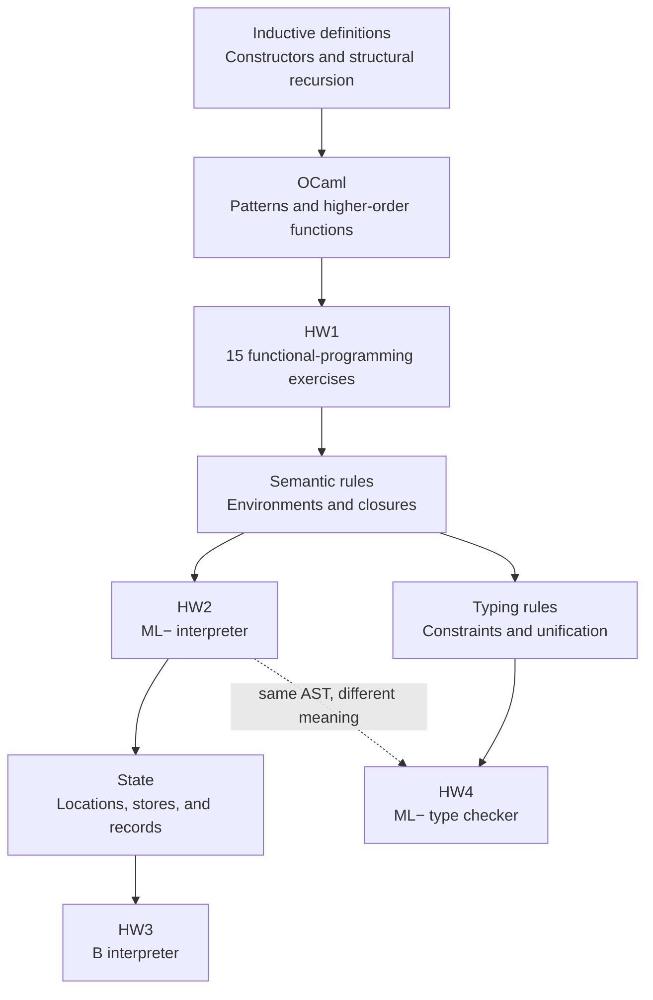

## The dependency graph

Start at the assignment, move backward to its prerequisite definitions, and then return to the implementation. The arrows below indicate prerequisites, not an official deadline schedule.

## Every HW1 problem

| Problem | Definition you need | Companion route | Official specification |
|---|---|---|---|
| P1 `prime` | Decreasing numeric search; primality domain | [P1 guide](hw1.html#p1-primality), [recursion](03-recursion.html) | [HW1 p. 1](https://prl.korea.ac.kr/courses/cose212/2026/hw/hw1.pdf#page=1) |
| P2 `range` | Base case and ordered list construction | [P2 guide](hw1.html#p2-range) | [p. 1](https://prl.korea.ac.kr/courses/cose212/2026/hw/hw1.pdf#page=1) |
| P3 `suml` | Nested structural recursion; fold identity | [P3 guide](hw1.html#p3-sum-of-lists) | [p. 1](https://prl.korea.ac.kr/courses/cose212/2026/hw/hw1.pdf#page=1) |
| P4 `drop` | Polymorphism; two stopping conditions | [P4 guide](hw1.html#p4-drop-a-prefix) | [p. 1](https://prl.korea.ac.kr/courses/cose212/2026/hw/hw1.pdf#page=1) |
| P5 `max`, `min` | Reduction over a nonempty list | [P5 guide](hw1.html#p5-maximum-and-minimum) | [p. 2](https://prl.korea.ac.kr/courses/cose212/2026/hw/hw1.pdf#page=2) |
| P6 `sigma` | Higher-order function; interval recursion | [P6 guide](hw1.html#p6-sigma) | [p. 2](https://prl.korea.ac.kr/courses/cose212/2026/hw/hw1.pdf#page=2) |
| P7 `forall` | Predicate; conjunction identity | [P7 guide](hw1.html#p7-universal-predicate) | [p. 2](https://prl.korea.ac.kr/courses/cose212/2026/hw/hw1.pdf#page=2) |
| P8 `double` | Function composition; currying | [P8 guide](hw1.html#p8-double-a-function) | [pp. 2–3](https://prl.korea.ac.kr/courses/cose212/2026/hw/hw1.pdf#page=2) |
| P9 `mem` | Tree traversal without ordering assumptions | [P9 guide](hw1.html#p9-tree-membership) | [p. 3](https://prl.korea.ac.kr/courses/cose212/2026/hw/hw1.pdf#page=3) |
| P10 `mirror` | Constructor-preserving transformation | [P10 guide](hw1.html#p10-mirror-a-tree) | [pp. 3–4](https://prl.korea.ac.kr/courses/cose212/2026/hw/hw1.pdf#page=3) |
| P11 `natadd`, `natmul` | Inductive numbers; structural recursion | [P11 guide](hw1.html#p11-peano-arithmetic) | [p. 4](https://prl.korea.ac.kr/courses/cose212/2026/hw/hw1.pdf#page=4) |
| P12 `eval` | Mutually recursive syntax and semantics | [P12 guide](hw1.html#p12-formulas-and-arithmetic) | [pp. 4–5](https://prl.korea.ac.kr/courses/cose212/2026/hw/hw1.pdf#page=4) |
| P13 `diff` | AST transformation; generalized product rule | [P13 guide](hw1.html#p13-symbolic-differentiation) | [p. 5](https://prl.korea.ac.kr/courses/cose212/2026/hw/hw1.pdf#page=5) |
| P14 `calculator` | Interpretation with a binding for X | [P14 guide](hw1.html#p14-sigma-calculator) | [pp. 5–6](https://prl.korea.ac.kr/courses/cose212/2026/hw/hw1.pdf#page=5) |
| P15 `check` | Free variables; lexical scope | [P15 guide](hw1.html#p15-free-variable-checker) | [p. 6](https://prl.korea.ac.kr/courses/cose212/2026/hw/hw1.pdf#page=6) |

## The three larger assignments

| Assignment feature | Definition → representation | Learn it here | Primary rule source |
|---|---|---|---|
| HW2 variables and `LET` | Runtime environment → name/value list | [Expressions](04-expressions.html) | [HW2 pp. 2–3](https://prl.korea.ac.kr/courses/cose212/2026/hw/hw2.pdf#page=2) |
| HW2 `PROC` and `CALL` | Closure → parameter, body, captured environment | [Closures](05-closures.html) | [HW2 p. 3](https://prl.korea.ac.kr/courses/cose212/2026/hw/hw2.pdf#page=3) |
| HW2 `LETREC`, `LETMREC` | Recreate self and peer bindings at call time | [Recursive scope](06-scope-recursion.html) | [HW2 pp. 3–5](https://prl.korea.ac.kr/courses/cose212/2026/hw/hw2.pdf#page=3) |
| HW2 list operations | Tagged list values; partial head/tail | [HW2 guide](hw2.html) | [HW2 p. 3](https://prl.korea.ac.kr/courses/cose212/2026/hw/hw2.pdf#page=3) |
| HW3 mutation and loops | Store → location/value map; return updated memory | [State](07-state.html) | [HW3 pp. 2–3](https://prl.korea.ac.kr/courses/cose212/2026/hw/hw3.pdf#page=2) |
| HW3 calls | Fresh locations versus shared locations | [Parameter passing](07-state.html#call-by-value-and-call-by-reference) | [HW3 p. 4](https://prl.korea.ac.kr/courses/cose212/2026/hw/hw3.pdf#page=4) |
| HW3 records | Field name → location; possible shared cells | [Records](08-records.html) | [HW3 pp. 2–3](https://prl.korea.ac.kr/courses/cose212/2026/hw/hw3.pdf#page=2) |
| HW4 `typeof` | Type environment → constraints → substitution | [Inference](12-inference.html) | [HW4 p. 2](https://prl.korea.ac.kr/courses/cose212/2026/hw/hw4.pdf#page=2), [lecture 17 p. 26](https://prl.korea.ac.kr/courses/cose212/2026/slides/lec17.pdf#page=26) |

## Recognize a misconception from a failing test

| Symptom | Likely mistaken model | Revisit |
|---|---|---|
| A function sees the caller’s newer x | Body uses caller environment | [Lexical scope](05-closures.html) |
| A mutation disappears after a sequence | An earlier memory is reused | [Store threading](07-state.html#thread-the-latest-memory) |
| Call by value changes a scalar caller variable | Parameter reused the caller’s location | [Calls](07-state.html#call-by-value-and-call-by-reference) |
| Updating one record changes another | Shared field locations; possibly correct behavior | [Aliasing](08-records.html#copying-a-record-value-can-preserve-sharing) |
| `x x` gives an endlessly expanding type | Missing occurs check | [Unification](12-inference.html#the-occurs-check-prevents-infinite-simple-types) |
| A free variable is accepted because its name occurs elsewhere | A global set replaced a lexical path | [Scope contexts](06-scope-recursion.html#scope-is-a-path-not-a-global-collection) |

## Before considering an assignment finished

For every constructor, identify its source rule, input context, recursive premises, output, side conditions, and one negative test. The [HW2](hw2.html), [HW3](hw3.html), and [HW4](hw4.html) guides give constructor-family checklists for this review. A successful sample execution is evidence for one case, not a proof that all constructors implement the intended language.
