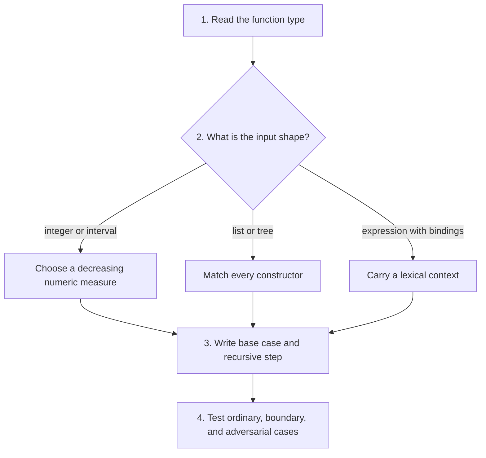
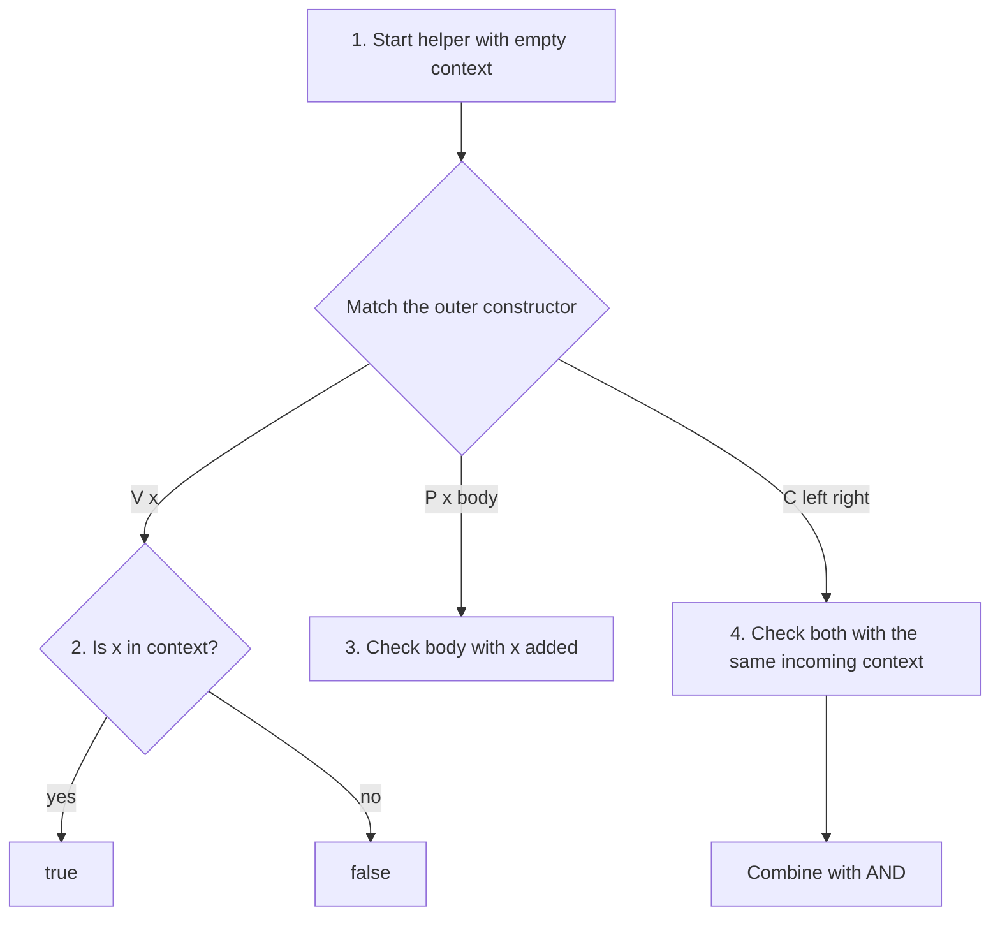

## A plan for all 15 problems

The professor's [HW1 starter folder](https://github.com/kupl-courses/COSE212-2026fall/tree/b0c917f0e648907ef0460522ff8f3e686b64d2fb/hw1) contains one `.ml` file per problem. Each problem below links to its exact file and public function type. These are TODO templates, not official completed solutions. In particular, `mem.ml` and `mirror.ml` define **different** types with the same name `btree`; work in the appropriate file.

Read each numbered **Thinking steps** list first, then follow the matching diagram and use the explanation below it to check your assumptions. In a decision diagram, follow the applicable branch; do not execute mutually exclusive branches in sequence.

The [official handout](https://prl.korea.ac.kr/courses/cose212/2026/hw/hw1.pdf) is six PDF pages. Read the supplied type before coding. First decide what information each helper needs, then choose base cases and recursive steps. The examples below are small independent checks and derivation strategies; preserve the provided template interfaces.



## P1 · Primality

**Connection:** decreasing search, [recursion](03-recursion.html). **Source:** [p. 1](https://prl.korea.ac.kr/courses/cose212/2026/hw/hw1.pdf#page=1).

For mathematical primality, numbers below 2 are not prime. For n ≥ 2, look for a divisor starting at 2. If a divisor is found, return false. If no divisor at most √n exists, n is prime because any composite has a factor no larger than its square root. To avoid overflow from `d * d`, a positive-integer stopping test can compare `d > n / d`.

**Invariant:** all candidates below d have been tested and do not divide n. **Checks:** 0 and 1 are false; 2 is true; 25 is false; 29 is true. Guard n < 2 before using positive-number division reasoning. The handout does not detail a negative-input policy; the mathematical extension is false.

## P2 · Range

**Connection:** list construction and interval recursion. **Source:** [p. 1](https://prl.korea.ac.kr/courses/cose212/2026/hw/hw1.pdf#page=1).

When the lower bound exceeds the upper, the answer is empty. Otherwise, the first output element is the lower bound and the remaining problem starts one higher. Preserve increasing order. **Checks:** `range 2 4` gives `[2;3;4]`; equal endpoints give one element; reversed endpoints give `[]`. A robust finite-integer implementation handles the equal-endpoint case before incrementing, avoiding overflow when the upper bound is `max_int`.

## P3 · Sum of lists

**Connection:** two structural traversals. **Source:** [p. 1](https://prl.korea.ac.kr/courses/cose212/2026/hw/hw1.pdf#page=1).

Define the meaning of an inner list sum first: empty contributes 0, and a cons contributes its head plus the tail sum. The outer list uses the same pattern, adding each inner result. Flattening is unnecessary. **Checks:** `[]` and `[[];[]]` both give 0; `[[2;-5];[4]]` gives 1. Empty inner lists must not stop the outer traversal.

## P4 · Drop a prefix

**Connection:** polymorphic lists and two stopping conditions. **Source:** [p. 1](https://prl.korea.ac.kr/courses/cose212/2026/hw/hw1.pdf#page=1).

When the remaining count is zero, return the current suffix. When the list is empty, return empty even if the count is still positive. Otherwise discard one head and decrease the count. The elements need no inspection, which explains `'a list` in the type. **Checks:** dropping 0 preserves the list; dropping beyond its length gives `[]`; strings work like integers. The PDF does not specify negative counts; document a chosen policy or confirm it against course guidance rather than inventing a grading rule.

## P5 · Maximum and minimum

**Connection:** reduction with a valid initial candidate. **Source:** [p. 2](https://prl.korea.ac.kr/courses/cose212/2026/hw/hw1.pdf#page=2).

For a nonempty list, initialize the current best from the first element, then compare every remaining element. Starting at zero fails for all-negative maximum inputs and all-positive minimum inputs. **Checks:** a singleton returns its element; maximum of `[-8;-3;-10]` is -3; minimum of `[6;2;9]` is 2. There is no integer result that is the maximum of `[]`; the empty-list behavior is unspecified in the handout and template.

## P6 · Sigma

**Connection:** a higher-order function separates traversal from calculation. **Source:** [p. 2](https://prl.korea.ac.kr/courses/cose212/2026/hw/hw1.pdf#page=2).

The interval logic visits each integer and the supplied function decides its contribution. For a nonempty interval, combine `f a` with the sum over the remaining interval. The natural empty-sum extension is 0. **Check:** summing `fun x -> 2*x` from 1 through 3 gives 12; equal endpoints give exactly one application. Do not stop before including the upper bound.

## P7 · Universal predicate

**Connection:** a predicate returns bool; universal quantification combines with conjunction. **Source:** [p. 2](https://prl.korea.ac.kr/courses/cose212/2026/hw/hw1.pdf#page=2).

The empty list satisfies “every element passes” because it has no counterexample. For a cons, both the head predicate and the recursive tail condition must hold. Short-circuit on the first false result. **Checks:** all-positive `[2;5]` passes a positivity predicate, `[2;-1]` fails, and `[]` returns true. Returning false for the empty list makes every finite all-true list eventually fail.

## P8 · Double a function

**Connection:** function composition and currying. **Source:** [pp. 2–3](https://prl.korea.ac.kr/courses/cose212/2026/hw/hw1.pdf#page=2).

Let D be the transformation that sends a function f to the composition f ∘ f. Thus `(D f) x` is `f (f x)`. No numeric multiplication is involved in the definition. If f adds 3, applying D f to 1 gives 7. When D is itself passed as an argument, it acts on functions: `D D` applies D twice, turning f into four compositions of f. Write intermediate types and expansions before evaluating nested uses.

## P9 · Tree membership

**Connection:** an inductive tree and Boolean combination. **Source:** [p. 3](https://prl.korea.ac.kr/courses/cose212/2026/hw/hw1.pdf#page=3).

An empty tree contains no target. At a node, compare the stored integer and search both children as necessary. There is no binary-search-tree ordering promise. **Checks:** empty tree, match at root, match only in the right subtree, and a missing value. Construct a tree where a smaller number appears on the right to expose an unjustified ordering assumption.

## P10 · Mirror a tree

**Connection:** a structure-preserving AST transformation. **Source:** [pp. 3–4](https://prl.korea.ac.kr/courses/cose212/2026/hw/hw1.pdf#page=3).

This problem uses a different tree datatype from P9. A leaf keeps its value. A left-only constructor becomes right-only with a recursively mirrored child; right-only becomes left-only. A two-child node swaps its recursively mirrored children. **Property check:** mirroring twice gives the original tree. A root-only swap passes shallow examples but fails this property on nested asymmetrical trees.

## P11 · Peano arithmetic

**Connection:** naturals defined by ZERO and SUCC. **Source:** [p. 4](https://prl.korea.ac.kr/courses/cose212/2026/hw/hw1.pdf#page=4).

Choose one operand for structural recursion. Addition satisfies `add ZERO b = b` and `add (SUCC a) b = SUCC (add a b)`. Multiplication satisfies `mul ZERO b = ZERO` and `mul (SUCC a) b = add b (mul a b)`. These equations directly specify the constructor cases. **Checks:** zero on either side, one on either side, and commutativity on small inputs. Integer conversion is unnecessary for defining the operations.

## P12 · Formulas and arithmetic

**Connection:** syntax-directed interpretation with two result domains. **Source:** [pp. 4–5](https://prl.korea.ac.kr/courses/cose212/2026/hw/hw1.pdf#page=4).

Use a Boolean formula evaluator and an integer arithmetic evaluator. `Equal` asks the arithmetic evaluator for two numbers, then compares them. Implication is false only when its premise is true and its conclusion is false, so its truth function is `(not a) || b`. **Checks:** all four implication input pairs, nested negation, and equality between differently structured arithmetic expressions producing the same value.

## P13 · Symbolic differentiation

**Connection:** recursive syntax transformation and the product rule. **Source:** [p. 5](https://prl.korea.ac.kr/courses/cose212/2026/hw/hw1.pdf#page=5).

Distinguish the expression being traversed from the variable you differentiate with respect to. Constants differentiate to zero; a matching variable to one; a different variable to zero. A sum differentiates each summand. For a product of n factors, build a sum of n terms: in term i, differentiate factor i and leave all other factors unchanged.

```text
D(f1 × f2 × f3)
  = D(f1) × f2 × f3
  + f1 × D(f2) × f3
  + f1 × f2 × D(f3)
```

Differentiating every factor and multiplying the derivatives is wrong. For powers in the polynomial case, handle exponent zero before forming exponent minus one. The handout uses an integer exponent representation but does not spell out its admissible domain or all empty-list conventions; preserve the provided language’s intended algebra and document assumptions. It explicitly allows nonunique result representations, so simplification is separate from correctness. **Checks:** a constant, a variable unrelated to the chosen one, a zero power, and a three-factor product. Numeric evaluation of original and derivative expressions at sample points can support testing, but is not a proof of symbolic equivalence.

## P14 · Sigma calculator

**Connection:** an evaluator carrying a binding. **Source:** [pp. 5–6](https://prl.korea.ac.kr/courses/cose212/2026/hw/hw1.pdf#page=5).

The public function takes only an expression, but a private evaluator needs the current value of X while evaluating the body of a summation. Evaluate bounds in the surrounding context; for each integer in the interval, evaluate the body with X bound to that integer and add the results. A nested SIGMA naturally introduces its own body binding while its bounds can use the outer context. That scoping interpretation and behavior for an unbound X, reversed bounds, and zero division are not fully detailed in the brief handout: keep your policy explicit.

**Original check:** summing X + 2 from 1 through 3 gives 12. A nested example distinguishes using the current binding from keeping one global mutable X that leaks between subexpressions.

## P15 · Free-variable checker

**Connection:** lexical scope and environments. **Source:** [p. 6](https://prl.korea.ac.kr/courses/cose212/2026/hw/hw1.pdf#page=6).

Traverse with the names bound along the current path. A variable is valid if its name is in that context. A procedure adds its parameter while checking its body. An application checks both children under the same incoming context; declarations inside one child do not leak into its sibling. Start with no bound names.



**Checks:** a single free variable fails; a procedure returning its own parameter passes; repeated parameter names are allowed; an application whose left child binds a name and whose right child uses that name freely must fail. A global bag of all binder names cannot implement this rule.

## Review before moving to HW2

You should be able to explain which problems need only the input structure and which need additional context. P12 evaluates syntax; P14 introduces a runtime-like binding; P15 tracks lexical scope without evaluating anything. Together they prepare the environment-based interpreter in [HW2](hw2.html).
