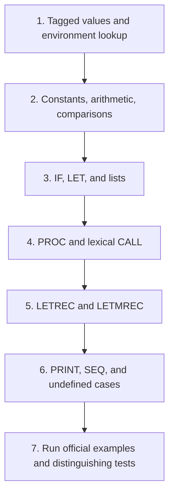
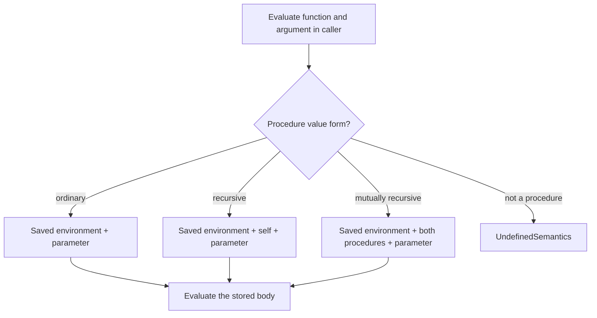

## The contract

Implement `runml : program -> value` for the ML− language in the [official handout](https://prl.korea.ac.kr/courses/cose212/2026/hw/hw2.pdf). Raise `UndefinedSemantics` whenever no dynamic rule applies. The official AST and value constructors appear on PDF pp. 4–5; the semantic rules are on pp. 2–4.

The public entry point can start a recursive helper under an empty environment. That helper has the conceptual form `eval : env -> exp -> value`. The interface’s simplicity does not remove the need for environments internally.

## Build in layers

Do not postpone all error cases until the end: each layer should reject wrong value shapes as soon as its rule requires a particular shape.

## Map every constructor family

| Constructors | Reasoning rule | Boundary or negative test |
|---|---|---|
| `UNIT`, `TRUE`, `FALSE`, `CONST` | Return the matching tagged value | A literal does not inspect the environment |
| `VAR` | Find the nearest binding | An unbound name raises `UndefinedSemantics` |
| `ADD`, `SUB`, `MUL`, `DIV` | Evaluate operands and require integers | A Boolean operand is invalid; divisor zero is invalid |
| `EQUAL` | Compare two integers or two booleans | Unit, lists, functions, and mixed pairs have no rule |
| `LESS` | Require two integers; return Bool | Boolean comparison is invalid |
| `NOT` | Require a Boolean | An integer operand is invalid |
| `NIL` | Return the empty language list | Distinguish the list value from Unit |
| `CONS` | Head may be any value; tail must be a list | A scalar tail is invalid |
| `APPEND` | Both operands must be list values | A scalar operand is invalid |
| `HEAD`, `TAIL` | Require a nonempty list | Empty list and non-list operands are invalid |
| `ISNIL` | Require a list and test emptiness | A non-list operand is invalid |
| `IF` | Require Bool; evaluate only the chosen branch | A failing unchosen branch is not executed |
| `LET` | Evaluate definition, extend for body | Definition sees the old environment |
| `PROC`, `CALL` | Create a closure; apply it lexically | Caller shadowing must not change captured names |
| `LETREC`, `LETMREC` | Store recursive definitions; restore self/peer bindings on calls | A peer function must be reachable recursively |
| `PRINT`, `SEQ` | Perform effects in the specified order | Print returns Unit; sequence returns its second value |

ML−’s dynamic list domain allows sequences of arbitrary values. A homogeneous static list type in HW4 can conservatively reject heterogeneous lists; do not accidentally impose a type-checker restriction inside the HW2 evaluator unless its dynamic rules require it.

## Closures and recursion

The three procedure value forms are not interchangeable. For `Procedure`, save parameter, body, and creation environment. For `RecProcedure`, also save the function’s name. For `MRecProcedure`, save both definitions and their shared creation environment.

At a call, evaluate the function expression and argument in the caller. Then branch on the procedure value form and construct the body environment from the saved lexical environment. Reintroduce all recursive names required by that form, then the appropriate argument binding according to the rule’s binding convention.

Avoid assuming that a host OCaml `let rec` automatically gives object-language names their meaning. The object-language recursion lives in your value representation and environment construction.

## Make evaluation order visible

OCaml does not promise the left-to-right argument evaluation order that you might assume from another language. Use sequential `let` bindings to express required ordering. For example, evaluate the first sequence expression, discard only its value, and then evaluate the second. Printing makes an otherwise invisible ordering mistake observable.

The handout’s print inference rule omits the operand-evaluation premise, but the prose says to print the operand’s value. Handle this as a schematic rule, not a request to skip evaluation. Exact formatting for every non-integer printed value is not specified in the short rule; consult any later course guidance before treating your printer format as authoritative.

## Tests that distinguish wrong models

| Test idea | What it diagnoses |
|---|---|
| Create f with x = 10; shadow x with 90; call f | Capturing the definition environment |
| Pass the caller’s shadowed x as an argument to f | Evaluating the argument in the caller |
| A recursive function reaching a base case | Reintroducing the self-binding |
| Alternating calls between two procedures | Reintroducing both peer bindings |
| `IF(TRUE, CONST 7, DIV(CONST 1, CONST 0))` | Evaluating only the selected branch |
| `EQUAL(NIL, NIL)` | Respecting ML− equality restrictions |
| Head of an empty list | Converting partial-operation failure to the required exception |
| Two prints in a sequence | Preserving effect order and Unit results |

The first official example should produce `Int 5`; the recursive doubling example `Int 12`; the AST in the mutual-recursion example `Bool true`; the reversal example a reversed list. These are useful regression checks after each refactor, but do not substitute for constructor coverage.

## A source discrepancy worth resolving on paper

On HW2 PDF p. 6, the prose says `even 13`, but the supplied AST calls `odd 13` and expects true. Those are different programs. Follow the AST when verifying the stated expected result: odd(13) is true, even(13) is false. On p. 3, the mutual-call rule’s concluding result is missing from the printed formula; the body premise supplies the intended result.

## When you are ready for HW3

Explain precisely why `eval` currently returns only a value and what must change when a subexpression mutates memory. The answer leads to [the store-threading interface](07-state.html) and [HW3](hw3.html).

**Prerequisites:** [expressions](04-expressions.html), [closures](05-closures.html), [recursive scope](06-scope-recursion.html). **Source:** [HW2 pp. 2–5](https://prl.korea.ac.kr/courses/cose212/2026/hw/hw2.pdf#page=2).
