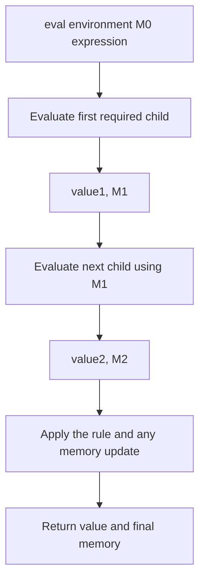
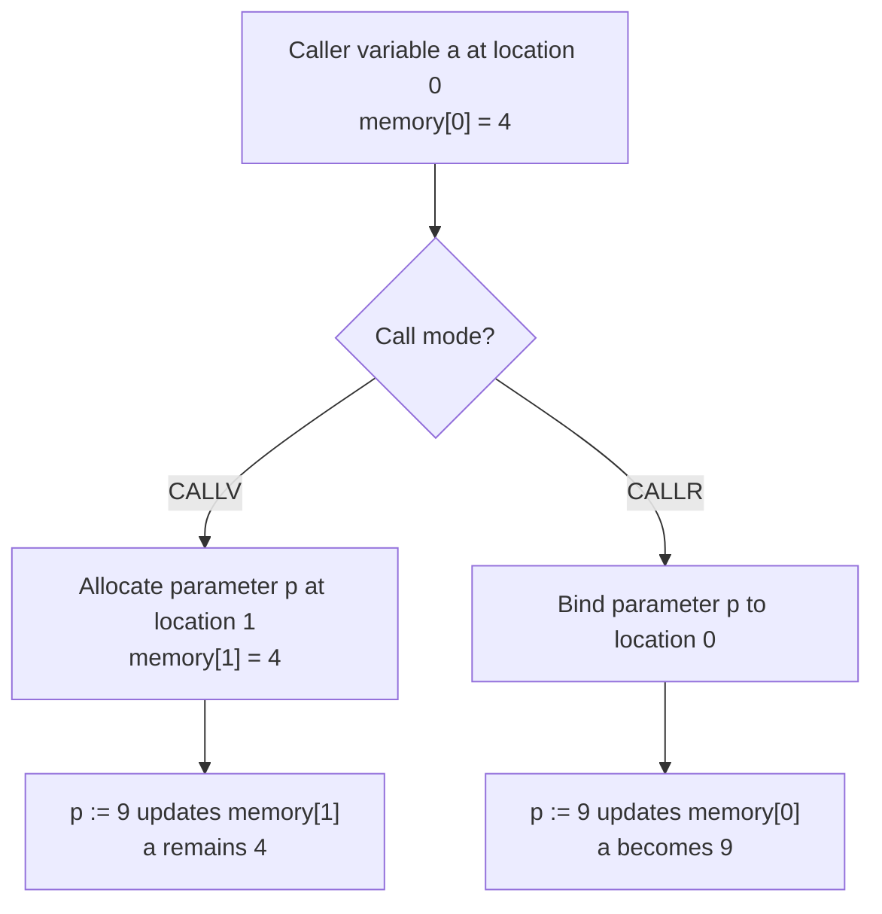

## The contract

**Official starter:** [`hw3/b.ml`](https://github.com/kupl-courses/COSE212-2026fall/blob/b0c917f0e648907ef0460522ff8f3e686b64d2fb/hw3/b.ml). Start from its `LocBind`/`ProcBind` environment, memory and record helpers, `new_location`, `eval_aop`, and `runb`. The recursive helper's exact order is `eval environment memory expression`; its result is a value-memory pair. The evaluator still contains a TODO.

The two supplied environment lookups search their own binding kind: variable lookup skips `ProcBind`, and procedure lookup skips `LocBind`. Preserve that template behavior instead of replacing both with one generic first-name lookup. Some starter helpers raise `Failure`, and the supplied WRITE branch formats any value; the handout's integer-only WRITE rule and undefined-case contract still need to be respected in the completed interpreter. Starter code is not evidence that every required check is already implemented.

Implement `runb : exp -> value` for B, the imperative language in the [official handout](https://prl.korea.ac.kr/courses/cose212/2026/hw/hw3.pdf). The public result is just a value, but the internal evaluator needs to return both the value and memory. Start from empty environment and memory, and let `runb` project the final value.

B’s environment contains **location bindings or procedure bindings**. Its store contains integers, booleans, Unit, or records. Procedures are not first-class stored values in this assignment. Reusing HW2’s value datatype unchanged would therefore implement a different language.

## What transfers from Chapters 6 and 7

| Textbook idea | B representation or rule | Consequence for implementation |
|---|---|---|
| Implicit variable cell | `LocBind(name, location)` plus memory | `VAR` reads through two lookups; `LETV` allocates after its initializer |
| Lexical procedure context | `ProcBind(name, (formals, body, env))` | `LETF` binds a named procedure; B has no first-class `PROC` expression |
| Single-argument value/reference calls | `CALLV` expression list / `CALLR` identifier list | Check arity and preserve each actual's order or location |
| Record field cells | `Record` holds a field-location map | Copying a record value shares fields; the empty record is specially `Unit` |
| Pointer/GC extension in Chapter 7 | No corresponding B constructors | Do not add address-of, dereference, or collection as homework cases |

The shared textbook download uses its own constructors such as `CONST` and `SET`; B requires `NUM` and `ASSIGN`, plus the other supplied forms. Translate the rule, not just its name. Compare [Chapter 7's implementation scope](textbook-07.html#7-4-implementation) with [HW3's AST, pp.4–5](https://prl.korea.ac.kr/courses/cose212/2026/hw/hw3.pdf#page=4).

## Design the helpers first

| Helper responsibility | Invariant |
|---|---|
| Lookup a variable location | Find the nearest matching LocBind, skipping ProcBind as the starter does |
| Lookup a procedure | Find the matching ProcBind, skipping LocBind; obtain formals, body, and captured environment |
| Read memory | A referenced location must be allocated |
| Update memory | The latest value wins without discarding unrelated cells |
| Allocate | Return a fresh location; repeated allocations are distinct |
| Evaluate argument lists | Carry memory left to right while preserving argument order |

Representing memory as an association list is sufficient for learning. Prepending a new `(location, value)` entry models an update if lookup always chooses the newest entry. Freshness must inspect all allocated location keys; do not infer a free location from an assumption about list ordering after updates.

## Constructor-by-constructor route

| Family | What the rule changes | Essential test |
|---|---|---|
| Constants, `VAR` | Constants preserve memory; a variable reads through its location | Lookup after an assignment returns the new value |
| Arithmetic, `LESS`, `NOT` | Thread stores and require the appropriate scalar types | A left operand’s mutation is visible on the right |
| `EQUAL` | Return true for equal integers, booleans, or two Units; false otherwise | Record pairs and unlike value kinds yield false |
| `ASSIGN` | Evaluate RHS, then update the target cell; return RHS value | Assignment embedded in arithmetic works as specified |
| `SEQ` | Discard first value, preserve first effects | Second expression sees the updated store |
| `IF` | Preserve condition effects; execute one branch | Untaken branch has no effects |
| `WHILE` | Evaluate condition, possibly body, repeat with new memory | Zero iterations and effectful final condition |
| `LETV` | Evaluate definition, allocate, extend scope, evaluate body | Shadowing creates a new variable cell |
| `LETF` | Bind procedure with its definition environment | Free variables follow lexical scope |
| `CALLV`, `CALLR` | Allocate fresh parameter cells or alias caller cells | Same procedure distinguishes the two call modes |
| `RECORD`, `FIELD`, `ASSIGNF` | Allocate field cells, read them, update them | Alias-sensitive field mutation |
| `WRITE` | Require an integer, output it, and return it | WRITE is not Unit-valued in B |

Notice that B’s equality and output rules differ from ML−’s. A helper shared between assignments must not silently erase those differences.

## Call by value versus reference

For `CALLV`, evaluate actual arguments in the **caller** environment, threading memory in order. Check the arity. Bind each formal to a fresh location initialized with the corresponding value. Evaluate the body in the procedure’s **captured** environment, extended with parameter bindings and the recursive procedure binding required by the rule.

For `CALLR`, the actuals are identifiers, not arbitrary expressions. Look up their locations in the caller and bind the formals to those same locations. Two formals can therefore alias if the same variable is passed twice. Do not allocate new parameter cells in this case.

## Records and aliasing

The empty-record rule evaluates `{}` to Unit. For a nonempty record, evaluate initializers in order and create a field-location map with distinct fresh locations. Field lookup uses the memory returned by evaluating the receiver. Field assignment evaluates receiver, then RHS with the updated memory, then writes through the selected field location and returns the assigned value.

A record passed by value can share field cells with its caller, because the copied record contains locations. Distinguish that from passing a scalar field value such as `r.x`: the scalar is copied into a fresh parameter cell, so assigning the parameter does not update `r.x`. This explains the official swap example: its call-by-value use of two field values leaves the original first field unchanged.

## Loops are recursive state transitions

A while loop is conceptually a recursive evaluator branch. First evaluate the condition to `(Bool b, M1)`. If false, return `(Unit, M1)`. If true, evaluate the body with M1, ignore only the body value, and repeat the loop using the body’s resulting memory.

The loop’s condition is re-evaluated on every iteration. Keeping an old Boolean result or old store either gives the wrong answer or creates an artificial infinite loop. Avoid using a host global mutable store solely to hide threading mistakes; a visible `(value, memory)` return makes the semantics inspectable.

Step by step · A false condition can still change memory

Start with `x = 0`. Consider a B condition represented by `SEQ(ASSIGN("x", ADD(VAR "x", NUM 1)), FALSE)` and a body `ASSIGN("x", NUM 99)`.

1. Evaluate the condition's assignment; the cell for x becomes `1`.
2. Evaluate `FALSE` in that updated memory. The condition result is `(Bool false, M1)`.
3. Skip the body completely; `99` is never stored.
4. Return `(Unit, M1)` from the loop. A following `VAR "x"` returns `Num 1`, not `Num 0`.

This is the `WHILEF` rule on [HW3 p.3](https://prl.korea.ac.kr/courses/cose212/2026/hw/hw3.pdf#page=3). It distinguishes preserving effects from merely checking the final Boolean value.

## Undefined cases and review tests

Check missing bindings of the requested kind, missing fields, wrong arity, non-Boolean guards, non-integer arithmetic or WRITE arguments, and division by zero. A same-named binding of the other kind is skipped by the supplied lookup helper, not immediately treated as an error. Use the required `UndefinedSemantics`, not leaked `Not_found`, `Match_failure`, or host division exceptions. If a specification leaves a collision or formatting policy unstated, document the issue separately from defined behavior.

Run the official examples: factorial produces `120`, the reference call updates both caller variables so their sum is `6`, and the scalar field swap by value leaves the first field at `10`. Add a call with repeated reference arguments, nested shadowing, and a record copied into a second variable. Inspect the store after each step on paper before comparing your implementation’s result.

**Prerequisites:** [state](07-state.html), [records](08-records.html), [closures](05-closures.html). **Source rules:** [HW3 pp. 2–4](https://prl.korea.ac.kr/courses/cose212/2026/hw/hw3.pdf#page=2).
