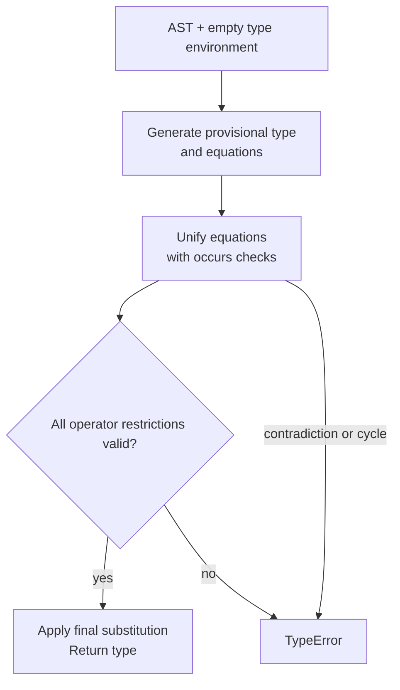

## The contract and the missing details

Implement `typeof : exp -> typ`, returning a type for an accepted ML− program and raising `TypeError` for a rejected one. The [two-page handout](https://prl.korea.ac.kr/courses/cose212/2026/hw/hw4.pdf) provides the expression and type datatypes, but not a complete set of extended typing rules. The language matches HW2; the reference to “ML− from HW3” is inconsistent with the published assignment sequence.

The guide below derives a **monomorphic constraint-based baseline** from lectures 13–17. It explicitly identifies equality, partial-operation safety, and polymorphism decisions rather than claiming that unpublished grading requirements are known.

## Design the pipeline

Keep these responsibilities separate: generate fresh unknowns, look up type bindings, generate constraints, apply substitutions, perform occurs checks, unify equations, and validate any additional restrictions. The final substitution must be applied to the result type.

## Constraint rules for the whole AST

Here `t(e)` means the provisional type of e, and α/β are fresh variables. These are companion design rules for the standard baseline, not a newly supplied official rubric.

| Constructors | Constraints | Result |
|---|---|---|
| `UNIT` | None | `TyUnit` |
| `TRUE`, `FALSE` | None | `TyBool` |
| `CONST` | None | `TyInt` |
| `VAR x` | x must be bound in Γ | Γ(x) |
| `ADD`, `SUB`, `MUL`, `DIV` | Both operands are int | int |
| `LESS` | Both operands are int | bool |
| `NOT` | Operand is bool | bool |
| `EQUAL` | Same operand type, restricted to int or bool | bool |
| `NIL` | Fresh α for each occurrence | list α |
| `CONS(h,t)` | t(h) = α; t(t) = list α | list α |
| `APPEND(a,b)` | Both operands are list α | list α |
| `HEAD e` | t(e) = list α | α |
| `TAIL e` | t(e) = list α | list α |
| `ISNIL e` | t(e) = list α | bool |
| `IF(c,a,b)` | c : bool; t(a) = t(b) | Common branch type |
| `LET(x,a,b)` | Infer a; extend Γ with its type while inferring b | t(b) |
| `PROC(x,b)` | Infer b under x : fresh α | α → t(b) |
| `CALL(f,a)` | t(f) = t(a) → fresh β | β |
| `LETREC` | Assume f : α → β, check body under x : α and f; equate body type with β | Type of the surrounding expression |
| `LETMREC` | Assume both function arrows before checking either body | Type of the surrounding expression |
| `PRINT e` | Infer e even if its result is discarded; printing policy follows ML− | unit |
| `SEQ(a,b)` | Infer both; do not require a to be unit merely because OCaml often expects it | t(b) |

The dynamic list domain is broader than homogeneous list typing. Rejecting a dynamically evaluable heterogeneous list is a normal conservative restriction, not evidence that the type checker must execute the program to discover its elements.

## Equality needs more than ordinary unification

HW2 specifies equality only for two integers or two booleans. If you merely require equal operand types, `[] = []` or a function compared with itself could type-check even though the ML− evaluator has no applicable equality rule.

Record an admissibility obligation for every equality operand type. After unification, accept it only when its type is known to be `TyInt` or `TyBool`. An unresolved variable is not proof that all its eventual instantiations are allowed. One conservative policy is to reject an unresolved equality restriction rather than exporting an unrestricted type variable.

For `proc x (x = x)`, this conservative policy rejects the expression unless another constraint fixes x to an admissible base type. Supporting both admissible types generically requires a representation for restricted polymorphism or another carefully justified mechanism, which the supplied `typ` datatype does not express. Arbitrarily defaulting x to int changes inference behavior; do not call it an official requirement.

## Soundness and partial operations

Conventional simple typing proves the absence of certain **type-shape errors**. It does not prove that every divisor is nonzero or every list is nonempty. Thus a basic constraint system can assign int to `DIV(CONST 1, CONST 0)` and an element type to `HEAD NIL`, while the HW2 interpreter raises `UndefinedSemantics`.

If “sound with respect to dynamic semantics” is intended to mean *no UndefinedSemantics under any execution*, the basic rules need a stronger safety analysis, refinements, or conservative rejection of operations whose preconditions cannot be established. The two-page handout does not resolve this distinction. Record the property your implementation actually establishes and use instructor guidance for submission requirements; do not claim a stronger theorem because ordinary unification passed.

## Monomorphic let versus polymorphic let

The baseline gives a let-bound name one shared type. If the course expects let-polymorphism, implement type schemes internally, generalize only free variables absent from the updated environment, and instantiate quantified variables freshly at each lookup. Procedure parameters remain monomorphic. Recursive bindings also need a defined generalization policy; unrestricted polymorphic recursion is not obtained by inserting fresh variables casually.

The handout’s `TyVar` constructor represents unknown types, not automatically universally quantified schemes. See [the polymorphism chapter](13-polymorphism.html) for the distinction.

## A small but discriminating test suite

| Test | Expected under the declared baseline |
|---|---|
| Integer arithmetic | int |
| Procedure adding one to its argument | int → int |
| Identity procedure | α → α, up to fresh variable renaming |
| Call an integer as a function | TypeError |
| Conditional with integer guard | TypeError |
| Conditional with int/bool branch mismatch | TypeError |
| Homogeneous list construction | Corresponding list type |
| Mixed int/bool list | TypeError |
| `proc x (x x)` | TypeError from occurs check |
| Chained equations α = β, β = int | Both unknowns resolve to int |
| Equality of lists or procedures | TypeError |
| Recursive bodies returning inconsistent types | TypeError |
| Division by zero or head of empty list | Exposes the difference between type-shape checking and stronger safety |

Compare returned types structurally up to renaming fresh variables, not by expecting a particular counter-generated name. Two valid inference runs may use `t1` and `t17` for the same unknown structure.

**Prerequisites:** [typing rules](11-types.html), [constraint solving](12-inference.html), [polymorphism](13-polymorphism.html). **Sources:** [HW4 p. 2](https://prl.korea.ac.kr/courses/cose212/2026/hw/hw4.pdf#page=2), [lecture 17 pp. 21–26](https://prl.korea.ac.kr/courses/cose212/2026/slides/lec17.pdf#page=21), [HW2 equality rules, pp. 2–3](https://prl.korea.ac.kr/courses/cose212/2026/hw/hw2.pdf#page=2).
