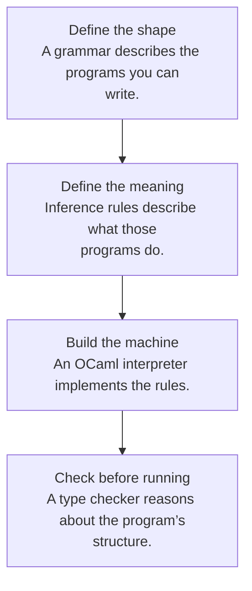

## New reading tools

[Lectures integrated into the textbook](textbook.html#lecture-to-chapter-map) · [Syntax and notation reference](syntax.html). Read definitions, lecture examples, Mermaid thinking flows, and chapter code walkthroughs along one textbook path.

<strong>15</strong>Concept chapters

<strong>4</strong>Homework guides

<strong>27</strong>Downloaded PDFs

## Read the textbook in its own order

**[Start the textbook reader →](textbook.html)**

Follow the English PDF's **nine chapters and all 48 numbered sections** with highlighted definitions, direct source-page links, Mermaid thinking diagrams, and worked solutions. The [twelve §2.4 exercises](textbook-02-problems.html) and the later chapters' implementation tasks have their own solution guides and runnable OCaml files.

Use the textbook reader as the main path. The shorter concept chapters and homework guides below provide extra explanations and links to the separate course assignments.

## The question behind the course

**What does a program mean, and how can we know that our implementation respects that meaning?** OCaml is both a language you learn and the tool you use to answer this question. The small languages you implement—Let, Proc, ML−, and B—are separate objects of study. Keeping these two levels apart removes much of the initial confusion.

This notebook follows the [2026 COSE212 course](https://prl.korea.ac.kr/courses/cose212/2026/) taught by Hakjoo Oh. It supplies original explanations, diagrams, worked examples, and homework routes. Read it beside the official slides and book; the original specifications decide assignment behavior.

> **Follow a definition:** click a highlighted term to open its explanation, homework connection, and exact textbook or slide page. Every Mermaid diagram can be opened at full size, and its editable graph source is available underneath.

## Start where you are

<a href="01-induction.html"><small>I · Foundations</small><strong>Learn the thinking tools</strong>Induction, pattern matching, recursion, and higher-order functions.</a><a href="04-expressions.html"><small>II · Language machines</small><strong>Build the meaning</strong>Environments, closures, stores, exceptions, and objects.</a><a href="11-types.html"><small>III · Types & foundations</small><strong>Reason about programs</strong>Typing rules, constraints, unification, polymorphism, and lambda calculus.</a><a href="homework-map.html"><small>Practice atlas</small><strong>Connect a rule to a problem</strong>All 15 HW1 problems plus the ML−, B, and type-checker assignments.</a>

## One idea, four assignments

Every assignment asks you to walk a tree. What changes is the information carried along the walk.

| Assignment | What you traverse | What you carry | What you return |
|---|---|---|---|
| [HW1](hw1.html) | Numbers, lists, trees, and expressions | A smaller input; sometimes a bound-variable set | A computed value or transformed tree |
| [HW2](hw2.html) | The ML− abstract syntax tree | A runtime environment | A language value |
| [HW3](hw3.html) | The B abstract syntax tree | An environment and current memory | A value and updated memory |
| [HW4](hw4.html) | The ML− abstract syntax tree | A type environment and fresh variables | A type, constrained by equations |

**The recurring method:** identify the outer constructor, read its rule, solve its premises recursively, and combine the results. When a rule introduces a binding or changes memory, write that change explicitly before descending.

## A suggested eight-session route

These are study sessions, not the official calendar or deadlines. The links below are the 15 short concept guides, not the nine numbered textbook chapters. For the PDF order, use the [textbook contents](textbook.html). Split a session when needed.

| Session | Read | Draw or explain | Practice |
|---|---|---|---|
| 1 | [Induction](01-induction.html) and [OCaml basics](02-ocaml.html) | A data constructor and its matching branch | HW1 P1–P5, P9–P11 |
| 2 | [Recursion](03-recursion.html) | A recursion tree and an accumulator invariant | HW1 P6–P8, P12–P15 |
| 3 | [Expressions](04-expressions.html) and [closures](05-closures.html) | A `let` environment and a captured closure | HW2 constants, bindings, procedures |
| 4 | [Scope and recursion](06-scope-recursion.html) | The environments of mutually recursive calls | Finish the HW2 reasoning and tests |
| 5 | [State](07-state.html) and [records](08-records.html) | Two names pointing to one memory cell | HW3 stores, records, and calls |
| 6 | [Exceptions](09-exceptions.html) and [objects](10-objects.html) | A handler stack and method lookup chain | Original self-check exercises |
| 7 | [Types](11-types.html) and [inference](12-inference.html) | A typing derivation and unification worklist | HW4 constraint generation |
| 8 | [Polymorphism](13-polymorphism.html), [subtyping](14-subtyping.html), and [lambda calculus](15-lambda.html) | Generalization, subtyping, and substitution | HW4 design review and course review |

## How to use a chapter

1. Read the definition and say it aloud without notation.
2. Follow the diagram and work the example on paper before revealing a check answer.
3. Translate each mathematical object into an OCaml representation.
4. Open the homework link and identify the same structure inside the assignment.
5. Test one ordinary case, one boundary case, and one case that would expose the wrong mental model.

> A useful debugging question is: **“Which premise of which rule did this line of code implement?”** If you cannot answer, return to the rule before adding another special case.

## About the sources

The inventory was checked on **20 September 2026**. All 27 available PDFs—both books, lectures 0–20, and HW1–HW4—are downloaded locally. Two additional linked PDFs return 404; the [source library](sources.html) records them and the course’s visible inconsistencies. Citations use **PDF page numbers**, which may differ from slide footer numbers. In particular, lecture 8 contains 39 PDF pages even though some footers still say “/ 29.”

The book includes guided approaches and independent examples. It is not a collection of claimed official solutions or an account of unpublished grading requirements.
