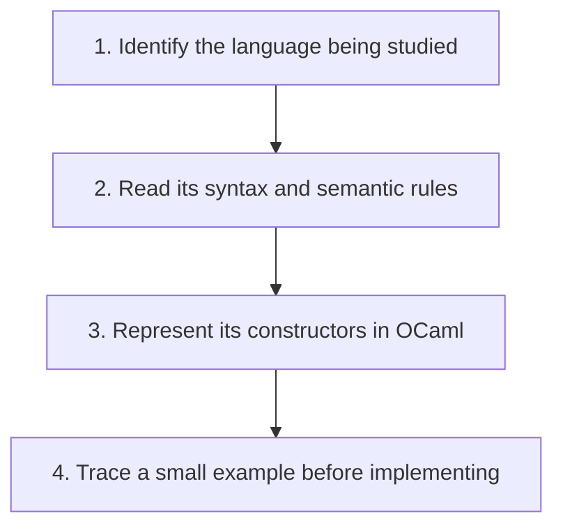

## The whole picture

Learn language concepts by defining a small language and implementing its interpreter. OCaml is the implementation tool; the interpreted language is a separate object of study.

**Reading connection:** [Textbook chapter 1](textbook-01.html).

**Original lecture:** [PDF p. 6](https://prl.korea.ac.kr/courses/cose212/2026/slides/lec0.pdf#page=6) · [PDF p. 7](https://prl.korea.ac.kr/courses/cose212/2026/slides/lec0.pdf#page=7) · [PDF p. 8](https://prl.korea.ac.kr/courses/cose212/2026/slides/lec0.pdf#page=8) · [PDF p. 9](https://prl.korea.ac.kr/courses/cose212/2026/slides/lec0.pdf#page=9) · [PDF p. 12](https://prl.korea.ac.kr/courses/cose212/2026/slides/lec0.pdf#page=12). Page numbers here mean PDF positions.

## Focus points

1. The course connects inductive definitions, functional programming, interpreters, and static analysis.
2. Syntax describes programs; semantics describes their meaning; an implementation must preserve that meaning.
3. Use the official course page for current logistics. This sheet concentrates on the technical learning path.

## Formula and syntax

program → syntax tree → interpreter → value; program → type checker → type or rejection

Read every symbol in context: [Grammar and AST constructors](syntax.html#grammar) · [Runtime evaluation judgment](syntax.html#evaluation) · [Static typing judgment](syntax.html#typing). The formula above is a companion restatement or example, not a verbatim slide transcription.

## Problem-solving route

1. Identify the language being studied.
2. Read its syntax and semantic rules.
3. Represent its constructors in OCaml.
4. Trace a small example before implementing.

## Worked trace

A course expression such as proc x (x + 1) becomes an AST value; the OCaml evaluator then interprets that value. Writing an OCaml function and interpreting a function in the toy language are different tasks.

## Homework connection

All four assignments follow this progression.

[Open the HW1 thinking guide](hw1.html) · [Full concept-to-homework map](homework-map.html)

## Check your understanding

What is the difference between the language of the interpreter and the language it interprets?

Reveal the explanation

The interpreter is written in OCaml. Its input represents a program in the specified course language.

[All lecture cheat sheets](lectures.html) · [Syntax reference](syntax.html)
