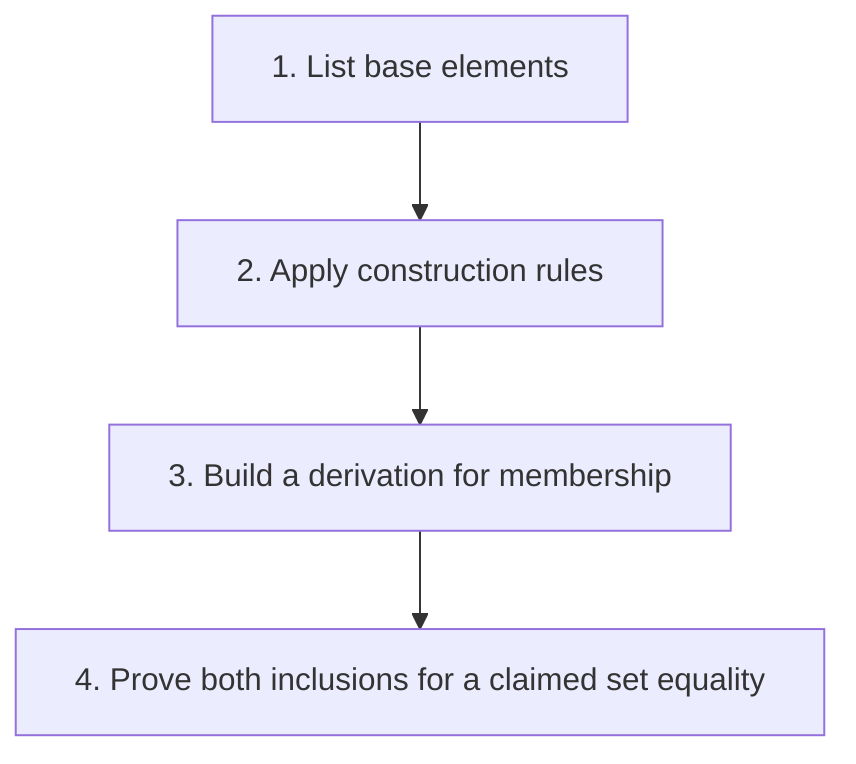

## The whole picture

Define an infinite set using finite base and construction rules, with no extra elements.

**Reading connection:** [Textbook chapter 1](textbook-01.html).

**Original lecture:** [PDF p. 2](https://prl.korea.ac.kr/courses/cose212/2026/slides/lec1.pdf#page=2) · [PDF p. 3](https://prl.korea.ac.kr/courses/cose212/2026/slides/lec1.pdf#page=3) · [PDF p. 6](https://prl.korea.ac.kr/courses/cose212/2026/slides/lec1.pdf#page=6) · [PDF p. 7](https://prl.korea.ac.kr/courses/cose212/2026/slides/lec1.pdf#page=7) · [PDF p. 9](https://prl.korea.ac.kr/courses/cose212/2026/slides/lec1.pdf#page=9). Page numbers here mean PDF positions.

## Focus points

1. Top-down, bottom-up, and inference-rule presentations describe the same generated set when their rules agree.
2. An axiom starts a derivation; a rule builds a larger derivation from premises.
3. Membership requires a finite derivation. Showing a property is preserved only proves one direction of set equality.

## Formula and syntax

0 ∈ S; n ∈ S ⇒ n + 3 ∈ S; therefore S = {3k | k ≥ 0}

Read every symbol in context: [Grammar and AST constructors](syntax.html#grammar) · [Premises and conclusions](syntax.html#rule). The formula above is a companion restatement or example, not a verbatim slide transcription.

## Problem-solving route

1. List base elements.
2. Apply construction rules.
3. Build a derivation for membership.
4. Prove both inclusions for a claimed set equality.

## Worked trace

To derive 6 ∈ S, derive 0 first, then 3, then 6. To prove S contains exactly the nonnegative multiples of 3, prove generated elements are multiples and every such multiple can be generated.

## Homework connection

HW1 P11: ZERO and SUCC are the base and constructor of Peano naturals.

[Open the HW1 thinking guide](hw1.html) · [Full concept-to-homework map](homework-map.html)

## Check your understanding

Does closure under adding 3 alone exclude 1 from S?

Reveal the explanation

No. The least-set requirement excludes elements not generated from the bases.

[All lecture cheat sheets](lectures.html) · [Syntax reference](syntax.html)
