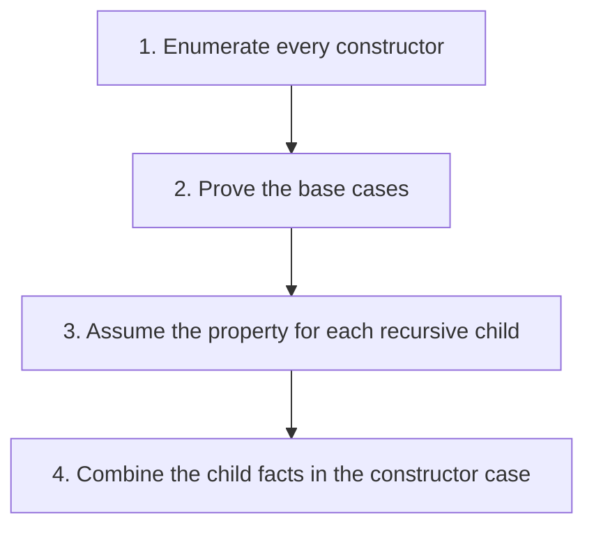

## The whole picture

The shape of a datatype determines the cases of its recursive functions and structural proofs.

**Reading connection:** [Textbook chapter 1](textbook-01.html).

**Original lecture:** [PDF p. 6](https://prl.korea.ac.kr/courses/cose212/2026/slides/lec2.pdf#page=6) · [PDF p. 8](https://prl.korea.ac.kr/courses/cose212/2026/slides/lec2.pdf#page=8) · [PDF p. 11](https://prl.korea.ac.kr/courses/cose212/2026/slides/lec2.pdf#page=11) · [PDF p. 13](https://prl.korea.ac.kr/courses/cose212/2026/slides/lec2.pdf#page=13) · [PDF p. 15](https://prl.korea.ac.kr/courses/cose212/2026/slides/lec2.pdf#page=15) · [PDF p. 19](https://prl.korea.ac.kr/courses/cose212/2026/slides/lec2.pdf#page=19). Page numbers here mean PDF positions.

## Focus points

1. Lists and trees need distinct rules for each constructor.
2. Expression grammar describes syntax; an evaluator separately assigns meanings.
3. A structural induction hypothesis applies to the immediate recursive components, not an arbitrary larger object.

## Formula and syntax

P(base); P(a) ∧ P(b) ⇒ P(Node(a,b)); hence P(t) for every generated tree t

Read every symbol in context: [Grammar and AST constructors](syntax.html#grammar) · [Premises and conclusions](syntax.html#rule) · [Patterns and recursive cases](syntax.html#match). The formula above is a companion restatement or example, not a verbatim slide transcription.

## Problem-solving route

1. Enumerate every constructor.
2. Prove the base cases.
3. Assume the property for each recursive child.
4. Combine the child facts in the constructor case.

## Worked trace

For a full binary tree with Leaf and Fork(left,right), prove leaves = forks + 1: Leaf gives 1 = 0 + 1; Fork combines the two hypotheses and adds one fork.

## Homework connection

HW1 P9–P13: match the exact tree, natural-number, formula, or expression constructors.

[Open the HW1 thinking guide](hw1.html) · [Full concept-to-homework map](homework-map.html)

## Check your understanding

Can the same tree cases be copied from mem.ml to mirror.ml?

Reveal the explanation

No. The official files use different tree datatypes; inspect each constructor list.

[All lecture cheat sheets](lectures.html) · [Syntax reference](syntax.html)
