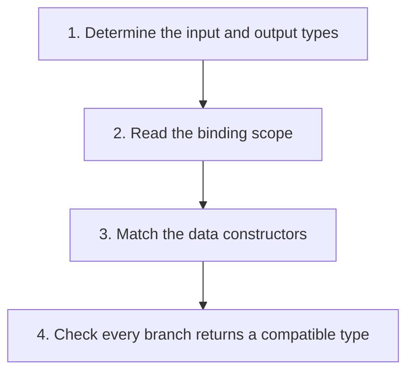

## The whole picture

Read OCaml as expressions built from bindings, functions, patterns, and typed values.

**Reading connection:** [Textbook chapter 2](textbook-02.html).

**Original lecture:** [PDF p. 19](https://prl.korea.ac.kr/courses/cose212/2026/slides/lec3.pdf#page=19) · [PDF p. 20](https://prl.korea.ac.kr/courses/cose212/2026/slides/lec3.pdf#page=20) · [PDF p. 24](https://prl.korea.ac.kr/courses/cose212/2026/slides/lec3.pdf#page=24) · [PDF p. 28](https://prl.korea.ac.kr/courses/cose212/2026/slides/lec3.pdf#page=28) · [PDF p. 37](https://prl.korea.ac.kr/courses/cose212/2026/slides/lec3.pdf#page=37) · [PDF p. 40](https://prl.korea.ac.kr/courses/cose212/2026/slides/lec3.pdf#page=40) · [PDF p. 44](https://prl.korea.ac.kr/courses/cose212/2026/slides/lec3.pdf#page=44) · [PDF p. 45](https://prl.korea.ac.kr/courses/cose212/2026/slides/lec3.pdf#page=45) · [PDF p. 47](https://prl.korea.ac.kr/courses/cose212/2026/slides/lec3.pdf#page=47). Page numbers here mean PDF positions.

## Focus points

1. let binds a value; let ... in limits the binding to a body. Ordinary bindings are not assignments.
2. Function application uses spaces; curried functions return functions when partially applied.
3. Lists are homogeneous; tuples may mix types. Pattern matching decomposes constructors.
4. Exceptions and modules are language tools, but the homework may restrict their use: HW2 forbids modules.

## Formula and syntax

fun x -&gt; e : α -&gt; β when x : α and e : β; h :: t : α list when h : α and t : α list

Read every symbol in context: [Binding: let x = e1 in e2](syntax.html#let) · [Functions and application](syntax.html#function) · [Patterns and recursive cases](syntax.html#match) · [Lists, cons, and tuples](syntax.html#list). The formula above is a companion restatement or example, not a verbatim slide transcription.

## Problem-solving route

1. Determine the input and output types.
2. Read the binding scope.
3. Match the data constructors.
4. Check every branch returns a compatible type.

## Worked trace

let add x y = x + y defines int -> int -> int. add 2 returns an int -> int function; add 2 3 evaluates to 5.

## Homework connection

All HW1 signatures; HW2–HW4 AST pattern matches.

[Open the HW1 thinking guide](hw1.html) · [Full concept-to-homework map](homework-map.html)

## Check your understanding

Why is [1; true] rejected while (1, true) is allowed?

Reveal the explanation

List elements share one type; tuple positions have independently specified types.

[All lecture cheat sheets](lectures.html) · [Syntax reference](syntax.html)
