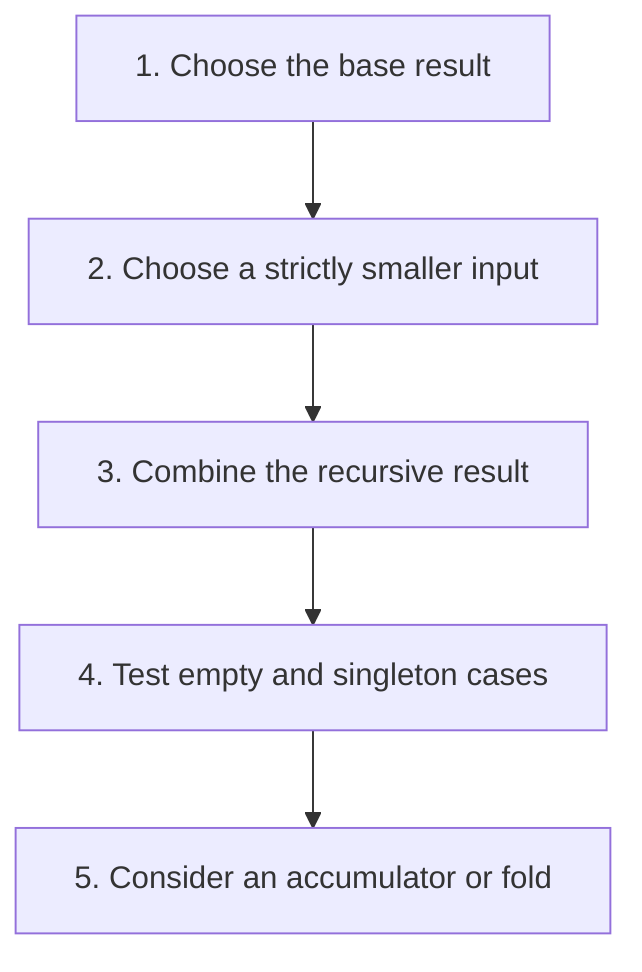

## The whole picture

Solve a smaller instance, then combine its result; abstract repeated traversal with functions.

**Reading connection:** [Textbook chapter 2](textbook-02.html).

**Original lecture:** [PDF p. 4](https://prl.korea.ac.kr/courses/cose212/2026/slides/lec4.pdf#page=4) · [PDF p. 5](https://prl.korea.ac.kr/courses/cose212/2026/slides/lec4.pdf#page=5) · [PDF p. 14](https://prl.korea.ac.kr/courses/cose212/2026/slides/lec4.pdf#page=14) · [PDF p. 16](https://prl.korea.ac.kr/courses/cose212/2026/slides/lec4.pdf#page=16) · [PDF p. 19](https://prl.korea.ac.kr/courses/cose212/2026/slides/lec4.pdf#page=19) · [PDF p. 22](https://prl.korea.ac.kr/courses/cose212/2026/slides/lec4.pdf#page=22) · [PDF p. 24](https://prl.korea.ac.kr/courses/cose212/2026/slides/lec4.pdf#page=24) · [PDF p. 25](https://prl.korea.ac.kr/courses/cose212/2026/slides/lec4.pdf#page=25). Page numbers here mean PDF positions.

## Focus points

1. A recursive call must move toward a base case.
2. Tail recursion leaves no pending computation after the recursive call; an accumulator needs an invariant.
3. map transforms elements, filter selects them, and folds combine them.
4. Fold direction changes association and argument order, especially for subtraction and list construction.

## Formula and syntax

fold_right f [a;b] z = f a (f b z); fold_left f z [a;b] = f (f z a) b

Read every symbol in context: [Patterns and recursive cases](syntax.html#match) · [Lists, cons, and tuples](syntax.html#list) · [Functions and application](syntax.html#function). The formula above is a companion restatement or example, not a verbatim slide transcription.

## Problem-solving route

1. Choose the base result.
2. Choose a strictly smaller input.
3. Combine the recursive result.
4. Test empty and singleton cases.
5. Consider an accumulator or fold.

## Worked trace

fold_right (-) [1;2] 0 = 1 - (2 - 0) = -1; fold_left (-) 0 [1;2] = (0 - 1) - 2 = -3.

## Homework connection

HW1 P2–P8 and P9–P15; textbook §2.4 especially Problems 8–10.

[Open the HW1 thinking guide](hw1.html) · [Full concept-to-homework map](homework-map.html)

## Check your understanding

Is 1 + length tail a tail call?

Reveal the explanation

No. Addition remains after length returns.

[All lecture cheat sheets](lectures.html) · [Syntax reference](syntax.html)
