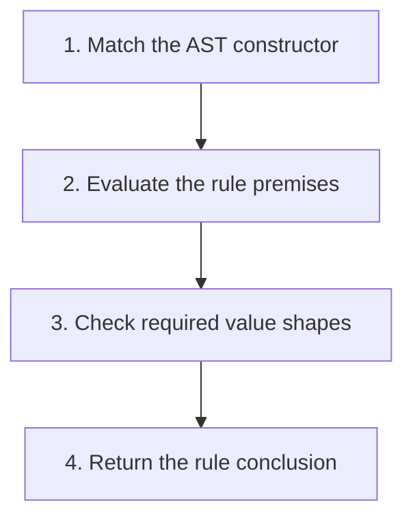

## The whole picture

Translate each evaluation rule into a matching AST case and keep the environment explicit.

**Reading connection:** [Textbook chapter 3](textbook-03.html).

**Original lecture:** [PDF p. 5](https://prl.korea.ac.kr/courses/cose212/2026/slides/lec5.pdf#page=5) · [PDF p. 8](https://prl.korea.ac.kr/courses/cose212/2026/slides/lec5.pdf#page=8) · [PDF p. 10](https://prl.korea.ac.kr/courses/cose212/2026/slides/lec5.pdf#page=10) · [PDF p. 11](https://prl.korea.ac.kr/courses/cose212/2026/slides/lec5.pdf#page=11) · [PDF p. 19](https://prl.korea.ac.kr/courses/cose212/2026/slides/lec5.pdf#page=19) · [PDF p. 22](https://prl.korea.ac.kr/courses/cose212/2026/slides/lec5.pdf#page=22) · [PDF p. 23](https://prl.korea.ac.kr/courses/cose212/2026/slides/lec5.pdf#page=23). Page numbers here mean PDF positions.

## Focus points

1. Syntax, semantic domains, and evaluation rules serve different roles.
2. The environment maps identifiers to runtime values; nearest bindings shadow older ones.
3. A let initializer uses the old environment; only its body uses the extension.
4. A conditional evaluates its guard and one selected branch.

## Formula and syntax

ρ ⊢ e1 ⇒ v1; ρ[x ↦ v1] ⊢ e2 ⇒ v2; therefore ρ ⊢ let x = e1 in e2 ⇒ v2

Read every symbol in context: [Grammar and AST constructors](syntax.html#grammar) · [Runtime evaluation judgment](syntax.html#evaluation) · [Lookup and map extension](syntax.html#extension) · [Binding: let x = e1 in e2](syntax.html#let). The formula above is a companion restatement or example, not a verbatim slide transcription.

## Problem-solving route

1. Match the AST constructor.
2. Evaluate the rule premises.
3. Check required value shapes.
4. Return the rule conclusion.

## Worked trace

let x = 2 in let x = x + 1 in x evaluates to 3. The inner initializer sees the outer x; the final x sees the inner binding.

## Homework connection

HW2: constants, arithmetic, variables, IF, and LET. HW1 P12 provides a smaller evaluator.

[Open the HW2 thinking guide](hw2.html) · [Full concept-to-homework map](homework-map.html)

## Check your understanding

Should both branches of IF be evaluated?

Reveal the explanation

No. Doing so can introduce errors or effects that the language does not require.

[All lecture cheat sheets](lectures.html) · [Syntax reference](syntax.html)
