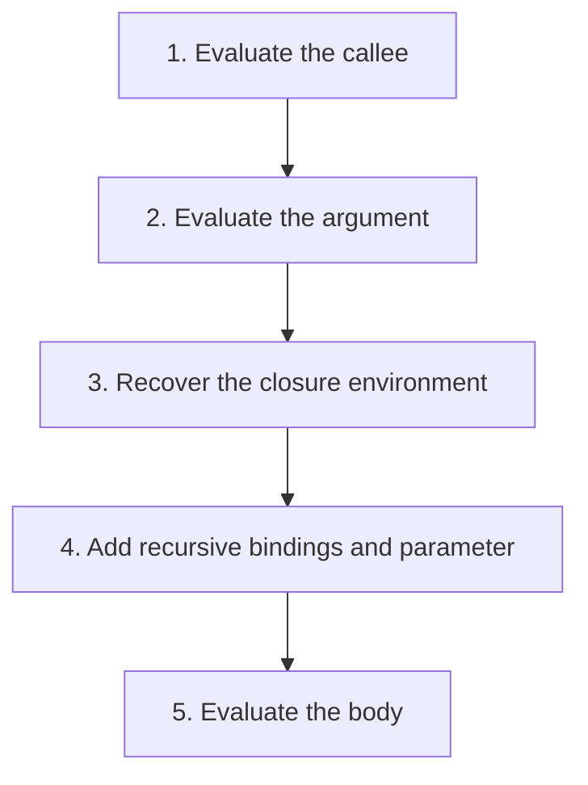

## The whole picture

A lexical procedure carries the environment where it was defined; a call extends that saved environment.

**Reading connection:** [Textbook chapter 4](textbook-04.html).

**Original lecture:** [PDF p. 4](https://prl.korea.ac.kr/courses/cose212/2026/slides/lec6.pdf#page=4) · [PDF p. 6](https://prl.korea.ac.kr/courses/cose212/2026/slides/lec6.pdf#page=6) · [PDF p. 7](https://prl.korea.ac.kr/courses/cose212/2026/slides/lec6.pdf#page=7) · [PDF p. 10](https://prl.korea.ac.kr/courses/cose212/2026/slides/lec6.pdf#page=10) · [PDF p. 13](https://prl.korea.ac.kr/courses/cose212/2026/slides/lec6.pdf#page=13) · [PDF p. 20](https://prl.korea.ac.kr/courses/cose212/2026/slides/lec6.pdf#page=20) · [PDF p. 24](https://prl.korea.ac.kr/courses/cose212/2026/slides/lec6.pdf#page=24). Page numbers here mean PDF positions.

## Focus points

1. A closure contains parameter, body, and definition environment.
2. Evaluate the callee and argument in the caller environment, but run the body in the captured environment.
3. Dynamic scope instead uses the caller environment; it is a different semantics.
4. Recursive and mutually recursive closures must restore the appropriate function bindings at invocation.

## Formula and syntax

closure = (x, body, ρdef); call body in ρdef[x ↦ varg] (plus recursive bindings when required)

Read every symbol in context: [Closure and saved environment](syntax.html#closure) · [Runtime evaluation judgment](syntax.html#evaluation) · [Lookup and map extension](syntax.html#extension) · [Functions and application](syntax.html#function). The formula above is a companion restatement or example, not a verbatim slide transcription.

## Problem-solving route

1. Evaluate the callee.
2. Evaluate the argument.
3. Recover the closure environment.
4. Add recursive bindings and parameter.
5. Evaluate the body.

## Worked trace

let x = 10 in let f = proc y (x + y) in let x = 100 in f 3 returns 13 under lexical scope and 103 under dynamic scope.

## Homework connection

HW2 PROC, CALL, LETREC, LETMREC; textbook Chapter 4 scope exercises and Chapter 5 Fun implementation.

[Open the HW2 thinking guide](hw2.html) · [Full concept-to-homework map](homework-map.html)

## Check your understanding

Which environment supplies free x in a lexical closure body?

Reveal the explanation

The definition environment saved in the closure, extended by the call's bindings.

[All lecture cheat sheets](lectures.html) · [Syntax reference](syntax.html)
