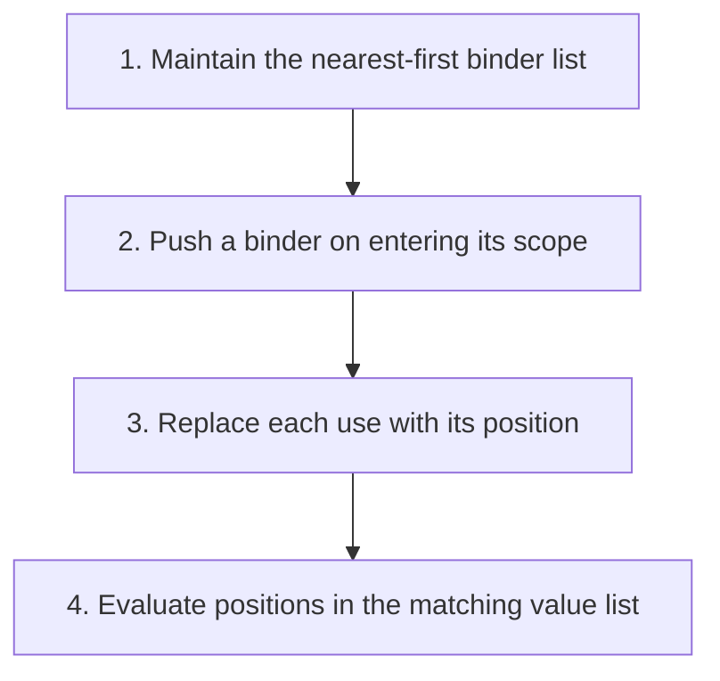

## The whole picture

Resolve a variable to its binder statically and replace names with positions.

**Reading connection:** [Textbook chapter 4](textbook-04.html).

**Original lecture:** [PDF p. 3](https://prl.korea.ac.kr/courses/cose212/2026/slides/lec7.pdf#page=3) · [PDF p. 6](https://prl.korea.ac.kr/courses/cose212/2026/slides/lec7.pdf#page=6) · [PDF p. 8](https://prl.korea.ac.kr/courses/cose212/2026/slides/lec7.pdf#page=8) · [PDF p. 10](https://prl.korea.ac.kr/courses/cose212/2026/slides/lec7.pdf#page=10) · [PDF p. 11](https://prl.korea.ac.kr/courses/cose212/2026/slides/lec7.pdf#page=11) · [PDF p. 12](https://prl.korea.ac.kr/courses/cose212/2026/slides/lec7.pdf#page=12) · [PDF p. 14](https://prl.korea.ac.kr/courses/cose212/2026/slides/lec7.pdf#page=14). Page numbers here mean PDF positions.

## Focus points

1. A declaration introduces a binder; a reference is a use of a name.
2. Search outward from the nearest binder, so shadowing changes the address.
3. Translation uses a name context; evaluation uses a value environment with the same layout.
4. An unbound name cannot be assigned a valid lexical address.

## Formula and syntax

index(x, [x0; x1; ...]) = least i such that xi = x; #0 denotes the nearest binder

Read every symbol in context: [Lexical address #i](syntax.html#address) · [Closure and saved environment](syntax.html#closure) · [Lookup and map extension](syntax.html#extension). The formula above is a companion restatement or example, not a verbatim slide transcription.

## Problem-solving route

1. Maintain the nearest-first binder list.
2. Push a binder on entering its scope.
3. Replace each use with its position.
4. Evaluate positions in the matching value list.

## Worked trace

proc x (proc y (x - y)) becomes proc (proc (#1 - #0)). At the subtraction, y is nearest and x is one level farther out.

## Homework connection

Conceptual support for HW1 P15 binding checks and HW2 lexical environments; no separate nameless-language homework is specified.

[Open the HW2 thinking guide](hw2.html) · [Full concept-to-homework map](homework-map.html)

## Check your understanding

In let x = e1 in e2, does x enter the context for e1?

Reveal the explanation

Not for an ordinary nonrecursive let. Extend the context only for e2.

[All lecture cheat sheets](lectures.html) · [Syntax reference](syntax.html)
