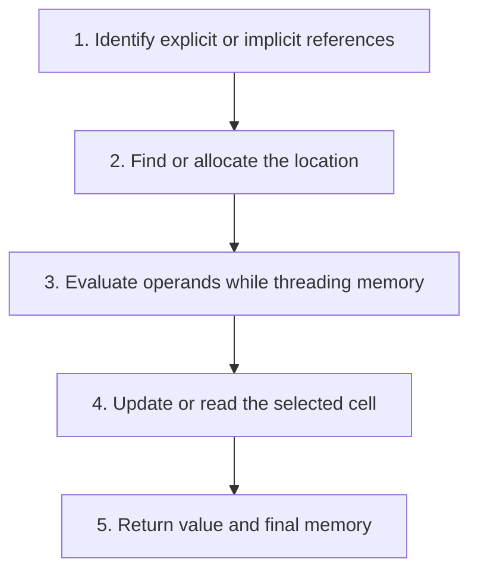

## The whole picture

Separate the binding map from mutable memory and carry the updated store through every evaluation step.

**Reading connection:** [Textbook chapter 6](textbook-06.html).

**Original lecture:** [PDF p. 9](https://prl.korea.ac.kr/courses/cose212/2026/slides/lec8.pdf#page=9) · [PDF p. 14](https://prl.korea.ac.kr/courses/cose212/2026/slides/lec8.pdf#page=14) · [PDF p. 16](https://prl.korea.ac.kr/courses/cose212/2026/slides/lec8.pdf#page=16) · [PDF p. 20](https://prl.korea.ac.kr/courses/cose212/2026/slides/lec8.pdf#page=20) · [PDF p. 25](https://prl.korea.ac.kr/courses/cose212/2026/slides/lec8.pdf#page=25) · [PDF p. 26](https://prl.korea.ac.kr/courses/cose212/2026/slides/lec8.pdf#page=26) · [PDF p. 33](https://prl.korea.ac.kr/courses/cose212/2026/slides/lec8.pdf#page=33) · [PDF p. 37](https://prl.korea.ac.kr/courses/cose212/2026/slides/lec8.pdf#page=37) · [PDF p. 38](https://prl.korea.ac.kr/courses/cose212/2026/slides/lec8.pdf#page=38). Page numbers here mean PDF positions.

## Focus points

1. Explicit references make locations values; implicit references make variables denote locations.
2. Allocation chooses a fresh location; assignment updates an existing location.
3. Call by value uses a fresh parameter cell; call by reference aliases a caller cell.
4. Lazy evaluation delays argument computation; it is distinct from passing a location.

## Formula and syntax

ρ : Var → Loc, M : Loc → Value; variable value = M(ρ(x)); eval returns (v, M′)

Read every symbol in context: [Locations and memory](syntax.html#store) · [Runtime evaluation judgment](syntax.html#evaluation) · [Reference operations and assignment](syntax.html#reference) · [Lookup and map extension](syntax.html#extension). The formula above is a companion restatement or example, not a verbatim slide transcription.

## Problem-solving route

1. Identify explicit or implicit references.
2. Find or allocate the location.
3. Evaluate operands while threading memory.
4. Update or read the selected cell.
5. Return value and final memory.

## Worked trace

If a is stored at L0 with value 3, passing a by reference to a procedure that assigns 4 changes L0. Passing by value creates a different parameter cell and leaves a at 3.

## Homework connection

HW3 variables, assignment, SEQ, CALLV, CALLR, and loops; textbook Chapter 6.

[Open the HW3 thinking guide](hw3.html) · [Full concept-to-homework map](homework-map.html)

## Check your understanding

Can the right operand start with the original memory?

Reveal the explanation

No. It must receive the memory produced by the left operand when the specified order is left to right.

[All lecture cheat sheets](lectures.html) · [Syntax reference](syntax.html)
