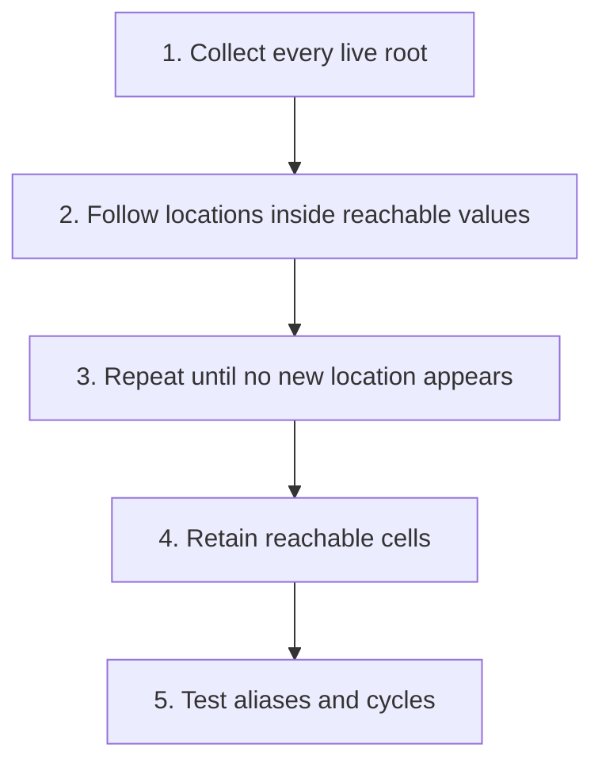

## The whole picture

Follow locations through structured values and distinguish unreachable memory from memory that merely looks unused.

**Reading connection:** [Textbook chapter 7](textbook-07.html).

**Original lecture:** [PDF p. 5](https://prl.korea.ac.kr/courses/cose212/2026/slides/lec9.pdf#page=5) · [PDF p. 6](https://prl.korea.ac.kr/courses/cose212/2026/slides/lec9.pdf#page=6) · [PDF p. 7](https://prl.korea.ac.kr/courses/cose212/2026/slides/lec9.pdf#page=7) · [PDF p. 8](https://prl.korea.ac.kr/courses/cose212/2026/slides/lec9.pdf#page=8) · [PDF p. 10](https://prl.korea.ac.kr/courses/cose212/2026/slides/lec9.pdf#page=10) · [PDF p. 14](https://prl.korea.ac.kr/courses/cose212/2026/slides/lec9.pdf#page=14) · [PDF p. 17](https://prl.korea.ac.kr/courses/cose212/2026/slides/lec9.pdf#page=17) · [PDF p. 19](https://prl.korea.ac.kr/courses/cose212/2026/slides/lec9.pdf#page=19) · [PDF p. 20](https://prl.korea.ac.kr/courses/cose212/2026/slides/lec9.pdf#page=20). Page numbers here mean PDF positions.

## Focus points

1. A record maps field names to locations, allowing field updates and shared records.
2. First-class pointers let locations themselves be stored and passed.
3. Manual freeing can create dangling references; automatic collection retains reachable cells.
4. Reachability is a conservative approximation to future use. Runtime roots may include pending computation as well as environments.

## Formula and syntax

R0 = roots; R(i+1) = Ri ∪ successors(Ri); stop at a fixed point and retain M restricted to R

Read every symbol in context: [Records and field locations](syntax.html#record) · [Locations and memory](syntax.html#store) · [Reachability and fixed points](syntax.html#reach). The formula above is a companion restatement or example, not a verbatim slide transcription.

## Problem-solving route

1. Collect every live root.
2. Follow locations inside reachable values.
3. Repeat until no new location appears.
4. Retain reachable cells.
5. Test aliases and cycles.

## Worked trace

Two variables can point to the same record field cell. Updating the field through one alias is visible through the other. A visited set prevents a cyclic pointer graph from making traversal loop forever.

## Homework connection

HW3 RECORD, FIELD, ASSIGNF; the GC exercises belong to textbook Chapter 7, not the HW3 required AST.

[Open the HW3 thinking guide](hw3.html) · [Full concept-to-homework map](homework-map.html)

## Check your understanding

Does reachable imply the cell will definitely be read again?

Reveal the explanation

No. Keeping all reachable cells is safe but can retain cells that are never used again.

[All lecture cheat sheets](lectures.html) · [Syntax reference](syntax.html)
