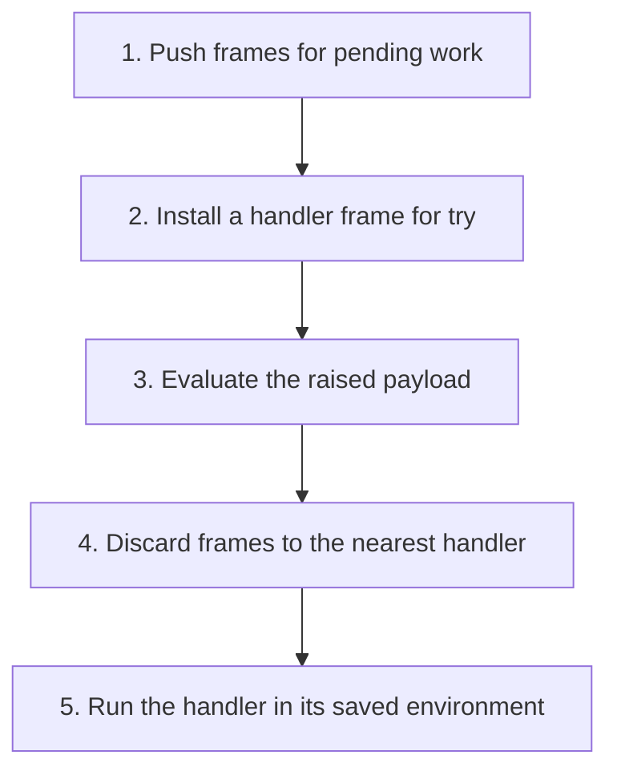

## The whole picture

Make pending computation explicit so a raised exception can discard frames up to the nearest handler.

**Reading connection:** [Companion explanation](09-exceptions.html). This topic has no standalone chapter in the supplied English textbook.

**Original lecture:** [PDF p. 7](https://prl.korea.ac.kr/courses/cose212/2026/slides/lec10.pdf#page=7) · [PDF p. 9](https://prl.korea.ac.kr/courses/cose212/2026/slides/lec10.pdf#page=9) · [PDF p. 10](https://prl.korea.ac.kr/courses/cose212/2026/slides/lec10.pdf#page=10) · [PDF p. 11](https://prl.korea.ac.kr/courses/cose212/2026/slides/lec10.pdf#page=11) · [PDF p. 18](https://prl.korea.ac.kr/courses/cose212/2026/slides/lec10.pdf#page=18) · [PDF p. 19](https://prl.korea.ac.kr/courses/cose212/2026/slides/lec10.pdf#page=19) · [PDF p. 20](https://prl.korea.ac.kr/courses/cose212/2026/slides/lec10.pdf#page=20) · [PDF p. 21](https://prl.korea.ac.kr/courses/cose212/2026/slides/lec10.pdf#page=21). Page numbers here mean PDF positions.

## Focus points

1. A continuation represents the computation that remains after the current expression.
2. Ordinary evaluation applies a continuation to a value.
3. try installs a handler with its environment; raise evaluates a payload then searches outward.
4. The handler runs outside the handled continuation segment; discarded arithmetic does not resume.

## Formula and syntax

try (1 + raise 5) catch x x ⇒ 5; the waiting addition frame is discarded

Read every symbol in context: [Continuation and exception frames](syntax.html#continuation) · [Runtime evaluation judgment](syntax.html#evaluation). The formula above is a companion restatement or example, not a verbatim slide transcription.

## Problem-solving route

1. Push frames for pending work.
2. Install a handler frame for try.
3. Evaluate the raised payload.
4. Discard frames to the nearest handler.
5. Run the handler in its saved environment.

## Worked trace

try (5 + raise 9) catch x (x + 2) returns 11, not 16. An unhandled raise has no matching handler and cannot produce an ordinary result.

## Homework connection

An extension of the HW2 interpreter model; exceptions are not required constructors in that starter. Use the companion exception trace for practice.

[Open the HW2 thinking guide](hw2.html) · [Full concept-to-homework map](homework-map.html)

## Check your understanding

Does the handler resume the abandoned addition?

Reveal the explanation

No. The continuation frames above the handler have been removed.

[All lecture cheat sheets](lectures.html) · [Syntax reference](syntax.html)
