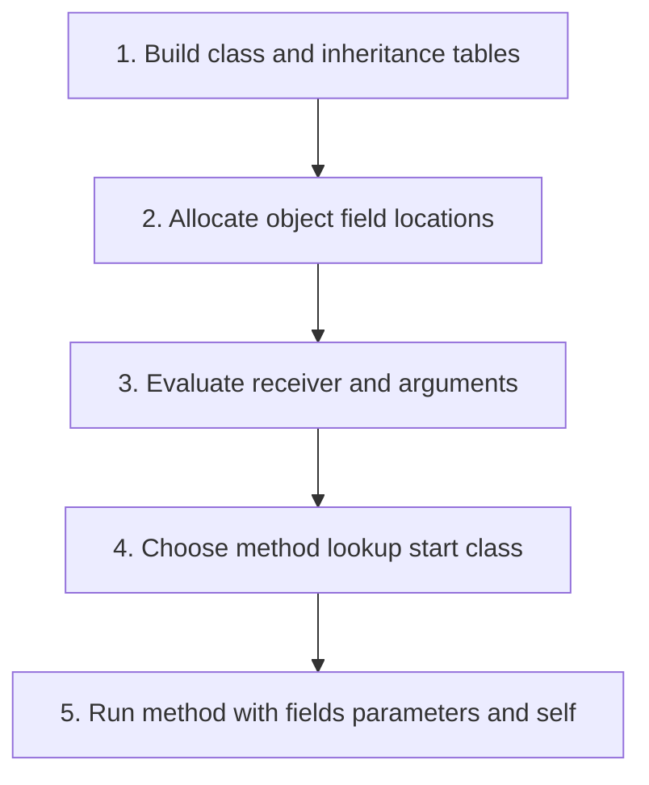

## The whole picture

An object combines mutable field locations with a class identity used for method lookup.

**Reading connection:** [Companion explanation](10-objects.html). This topic has no standalone chapter in the supplied English textbook.

**Original lecture:** [PDF p. 6](https://prl.korea.ac.kr/courses/cose212/2026/slides/lec11.pdf#page=6) · [PDF p. 10](https://prl.korea.ac.kr/courses/cose212/2026/slides/lec11.pdf#page=10) · [PDF p. 16](https://prl.korea.ac.kr/courses/cose212/2026/slides/lec11.pdf#page=16) · [PDF p. 17](https://prl.korea.ac.kr/courses/cose212/2026/slides/lec11.pdf#page=17) · [PDF p. 18](https://prl.korea.ac.kr/courses/cose212/2026/slides/lec11.pdf#page=18) · [PDF p. 20](https://prl.korea.ac.kr/courses/cose212/2026/slides/lec11.pdf#page=20) · [PDF p. 24](https://prl.korea.ac.kr/courses/cose212/2026/slides/lec11.pdf#page=24) · [PDF p. 25](https://prl.korea.ac.kr/courses/cose212/2026/slides/lec11.pdf#page=25) · [PDF p. 26](https://prl.korea.ac.kr/courses/cose212/2026/slides/lec11.pdf#page=26). Page numbers here mean PDF positions.

## Focus points

1. Build the class environment before evaluating the main expression.
2. Inherited field locations persist in each object; field shadowing requires distinct identities.
3. A normal message send dispatches from the receiver's runtime class.
4. super begins lookup at the parent of the method's host class while retaining the same receiver.

## Formula and syntax

object = (runtime class, field environment); method lookup walks the class chain

Read every symbol in context: [Class environment, self, and super](syntax.html#dispatch) · [Locations and memory](syntax.html#store) · [Lookup and map extension](syntax.html#extension). The formula above is a companion restatement or example, not a verbatim slide transcription.

## Problem-solving route

1. Build class and inheritance tables.
2. Allocate object field locations.
3. Evaluate receiver and arguments.
4. Choose method lookup start class.
5. Run method with fields parameters and self.

## Worked trace

If a child overrides m, self.m() can choose the override. A super.m() in a method starts from the host class's parent and does not allocate a new parent object.

## Homework connection

Extends HW3 environments and memory. No class-language implementation is specified in HW1–HW4.

[Open the HW3 thinking guide](hw3.html) · [Full concept-to-homework map](homework-map.html)

## Check your understanding

Is self always an object of the method's declaring class?

Reveal the explanation

No. An inherited method may run with a receiver whose runtime class is a subclass.

[All lecture cheat sheets](lectures.html) · [Syntax reference](syntax.html)
