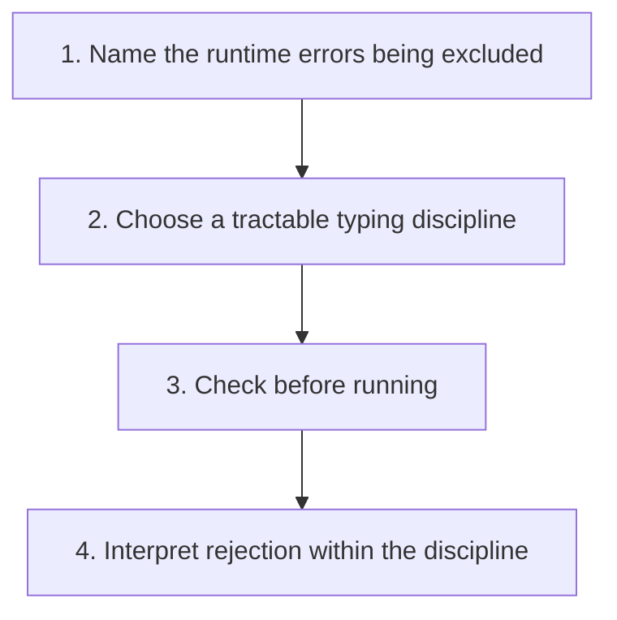

## The whole picture

Use a computable static approximation to prevent a specified class of runtime type errors.

**Reading connection:** [Textbook chapter 8](textbook-08.html).

**Original lecture:** [PDF p. 3](https://prl.korea.ac.kr/courses/cose212/2026/slides/lec12.pdf#page=3) · [PDF p. 5](https://prl.korea.ac.kr/courses/cose212/2026/slides/lec12.pdf#page=5) · [PDF p. 6](https://prl.korea.ac.kr/courses/cose212/2026/slides/lec12.pdf#page=6) · [PDF p. 7](https://prl.korea.ac.kr/courses/cose212/2026/slides/lec12.pdf#page=7) · [PDF p. 8](https://prl.korea.ac.kr/courses/cose212/2026/slides/lec12.pdf#page=8) · [PDF p. 9](https://prl.korea.ac.kr/courses/cose212/2026/slides/lec12.pdf#page=9). Page numbers here mean PDF positions.

## Focus points

1. Perfect automatic prediction of arbitrary program behavior is undecidable; useful restricted analyses remain possible.
2. Sound acceptance guarantees the intended safety property, under the language's assumptions.
3. A sound type system may reject some programs that would execute safely.
4. Type safety does not imply termination or the absence of every possible software bug.

## Formula and syntax

accepted ⇒ no specified runtime type error; safe ⇏ necessarily accepted

Read every symbol in context: [Static typing judgment](syntax.html#typing) · [Type constructors and unknowns](syntax.html#type). The formula above is a companion restatement or example, not a verbatim slide transcription.

## Problem-solving route

1. Name the runtime errors being excluded.
2. Choose a tractable typing discipline.
3. Check before running.
4. Interpret rejection within the discipline.

## Worked trace

A checker that requires both IF branches to have one type rejects if true then 1 else false even though this particular execution selects the integer branch.

## Homework connection

HW4: understand what successful typeof promises and why an untypable expression raises TypeError.

[Open the HW4 thinking guide](hw4.html) · [Full concept-to-homework map](homework-map.html)

## Check your understanding

Does a sound type checker prove a program terminates?

Reveal the explanation

No. A well-typed recursive program may diverge.

[All lecture cheat sheets](lectures.html) · [Syntax reference](syntax.html)
