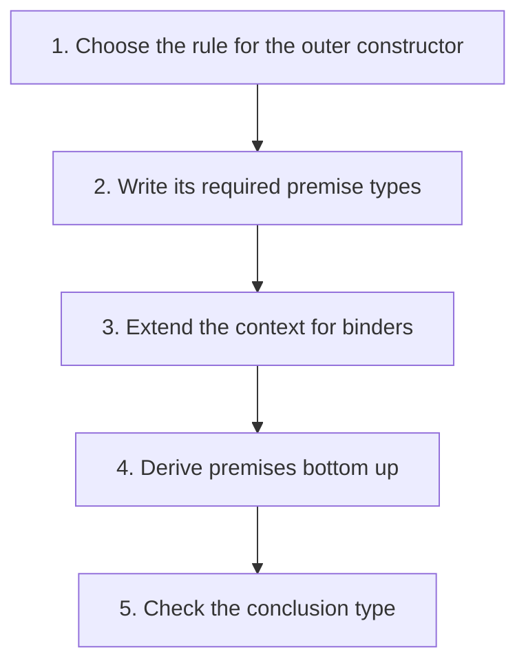

## The whole picture

Build typing derivations using a type environment instead of executing the program.

**Reading connection:** [Textbook chapter 8](textbook-08.html).

**Original lecture:** [PDF p. 4](https://prl.korea.ac.kr/courses/cose212/2026/slides/lec13.pdf#page=4) · [PDF p. 5](https://prl.korea.ac.kr/courses/cose212/2026/slides/lec13.pdf#page=5) · [PDF p. 7](https://prl.korea.ac.kr/courses/cose212/2026/slides/lec13.pdf#page=7) · [PDF p. 9](https://prl.korea.ac.kr/courses/cose212/2026/slides/lec13.pdf#page=9) · [PDF p. 12](https://prl.korea.ac.kr/courses/cose212/2026/slides/lec13.pdf#page=12) · [PDF p. 14](https://prl.korea.ac.kr/courses/cose212/2026/slides/lec13.pdf#page=14) · [PDF p. 15](https://prl.korea.ac.kr/courses/cose212/2026/slides/lec13.pdf#page=15). Page numbers here mean PDF positions.

## Focus points

1. Types are inductively built from base and function types.
2. The context Γ maps variables to types, not runtime values.
3. A procedure extends Γ with its parameter type; application matches argument and domain.
4. The declarative rules may permit multiple types for one expression.

## Formula and syntax

Γ,x:α ⊢ e:β ⇒ Γ ⊢ proc x e:α→β; Γ ⊢ f:α→β and Γ ⊢ a:α ⇒ Γ ⊢ f a:β

Read every symbol in context: [Static typing judgment](syntax.html#typing) · [Type constructors and unknowns](syntax.html#type) · [Lookup and map extension](syntax.html#extension). The formula above is a companion restatement or example, not a verbatim slide transcription.

## Problem-solving route

1. Choose the rule for the outer constructor.
2. Write its required premise types.
3. Extend the context for binders.
4. Derive premises bottom up.
5. Check the conclusion type.

## Worked trace

proc x (if x then 11 else 22) has bool → int: the guard forces x to bool and both branches have int.

## Homework connection

HW4: derive one rule per AST constructor before implementing inference.

[Open the HW4 thinking guide](hw4.html) · [Full concept-to-homework map](homework-map.html)

## Check your understanding

Why cannot Γ simply contain runtime values?

Reveal the explanation

Typing runs before execution and tracks types; values belong to the runtime environment.

[All lecture cheat sheets](lectures.html) · [Syntax reference](syntax.html)
