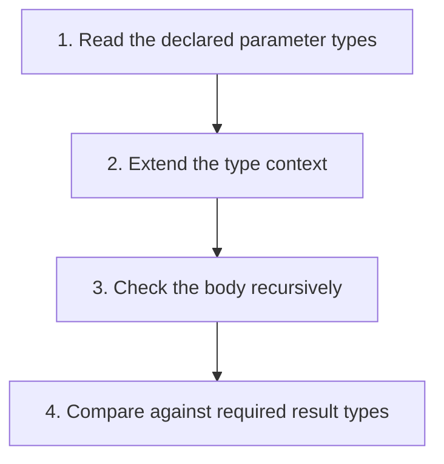

## The whole picture

Explicit procedure annotations make syntax-directed checking possible without guessing parameter types.

**Reading connection:** [Textbook chapter 8](textbook-08.html).

**Original lecture:** [PDF p. 3](https://prl.korea.ac.kr/courses/cose212/2026/slides/lec14.pdf#page=3) · [PDF p. 4](https://prl.korea.ac.kr/courses/cose212/2026/slides/lec14.pdf#page=4) · [PDF p. 5](https://prl.korea.ac.kr/courses/cose212/2026/slides/lec14.pdf#page=5) · [PDF p. 7](https://prl.korea.ac.kr/courses/cose212/2026/slides/lec14.pdf#page=7) · [PDF p. 8](https://prl.korea.ac.kr/courses/cose212/2026/slides/lec14.pdf#page=8). Page numbers here mean PDF positions.

## Focus points

1. A recursive type checker follows the AST and compares inferred child types.
2. Annotated parameters supply information missing from an unannotated procedure.
3. Recursive functions need an assumed signature while checking their own bodies.
4. The body must agree with the declared result; an annotation is a claim to verify.

## Formula and syntax

check(proc (x:α) e, Γ) = α → check(e, Γ[x ↦ α])

Read every symbol in context: [Static typing judgment](syntax.html#typing) · [Type constructors and unknowns](syntax.html#type) · [Functions and application](syntax.html#function). The formula above is a companion restatement or example, not a verbatim slide transcription.

## Problem-solving route

1. Read the declared parameter types.
2. Extend the type context.
3. Check the body recursively.
4. Compare against required result types.

## Worked trace

proc (x:int) (x + 1) checks as int → int. proc (x:bool) (x + 1) is rejected because arithmetic requires int.

## Homework connection

Preparation for HW4, whose unannotated expressions require fresh unknowns and constraints instead of asking the user for annotations.

[Open the HW4 thinking guide](hw4.html) · [Full concept-to-homework map](homework-map.html)

## Check your understanding

Can the checker trust an annotation without checking the body?

Reveal the explanation

No. Otherwise inconsistent annotations could admit unsafe operations.

[All lecture cheat sheets](lectures.html) · [Syntax reference](syntax.html)
