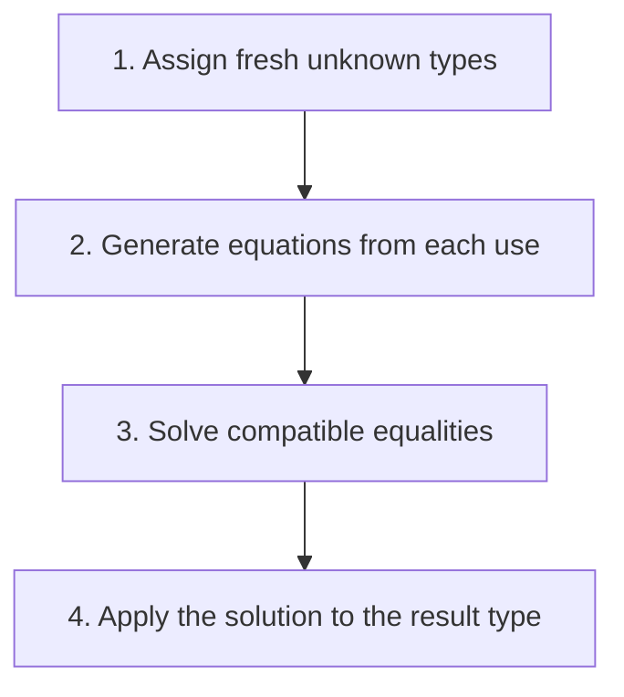

## The whole picture

Infer unknown types from how expressions are used, by turning typing rules into equations.

**Reading connection:** [Textbook chapter 8](textbook-08.html).

**Original lecture:** [PDF p. 2](https://prl.korea.ac.kr/courses/cose212/2026/slides/lec15.pdf#page=2) · [PDF p. 3](https://prl.korea.ac.kr/courses/cose212/2026/slides/lec15.pdf#page=3) · [PDF p. 4](https://prl.korea.ac.kr/courses/cose212/2026/slides/lec15.pdf#page=4) · [PDF p. 5](https://prl.korea.ac.kr/courses/cose212/2026/slides/lec15.pdf#page=5) · [PDF p. 7](https://prl.korea.ac.kr/courses/cose212/2026/slides/lec15.pdf#page=7) · [PDF p. 9](https://prl.korea.ac.kr/courses/cose212/2026/slides/lec15.pdf#page=9) · [PDF p. 10](https://prl.korea.ac.kr/courses/cose212/2026/slides/lec15.pdf#page=10). Page numbers here mean PDF positions.

## Focus points

1. Use fresh type variables for unknown parameter and expression types.
2. Arithmetic forces int; a guard forces bool; branch results must agree.
3. A call forces the callee type to argument type → result type.
4. Soundness/completeness of inference relative to a type system is different from completeness for all runtime-safe programs.

## Formula and syntax

f a : β contributes type(f) = type(a) → β

Read every symbol in context: [Static typing judgment](syntax.html#typing) · [Type constructors and unknowns](syntax.html#type) · [Type substitution versus term substitution](syntax.html#substitution). The formula above is a companion restatement or example, not a verbatim slide transcription.

## Problem-solving route

1. Assign fresh unknown types.
2. Generate equations from each use.
3. Solve compatible equalities.
4. Apply the solution to the result type.

## Worked trace

proc f (proc x (f (x + 1))) forces x:int and f:int→β, giving (int→β)→int→β.

## Homework connection

HW4: plan fresh_tyvar use and expected constraints for each constructor.

[Open the HW4 thinking guide](hw4.html) · [Full concept-to-homework map](homework-map.html)

## Check your understanding

Is a type variable a variable in the interpreted program?

Reveal the explanation

No. It is an unknown in the checker's description of types.

[All lecture cheat sheets](lectures.html) · [Syntax reference](syntax.html)
