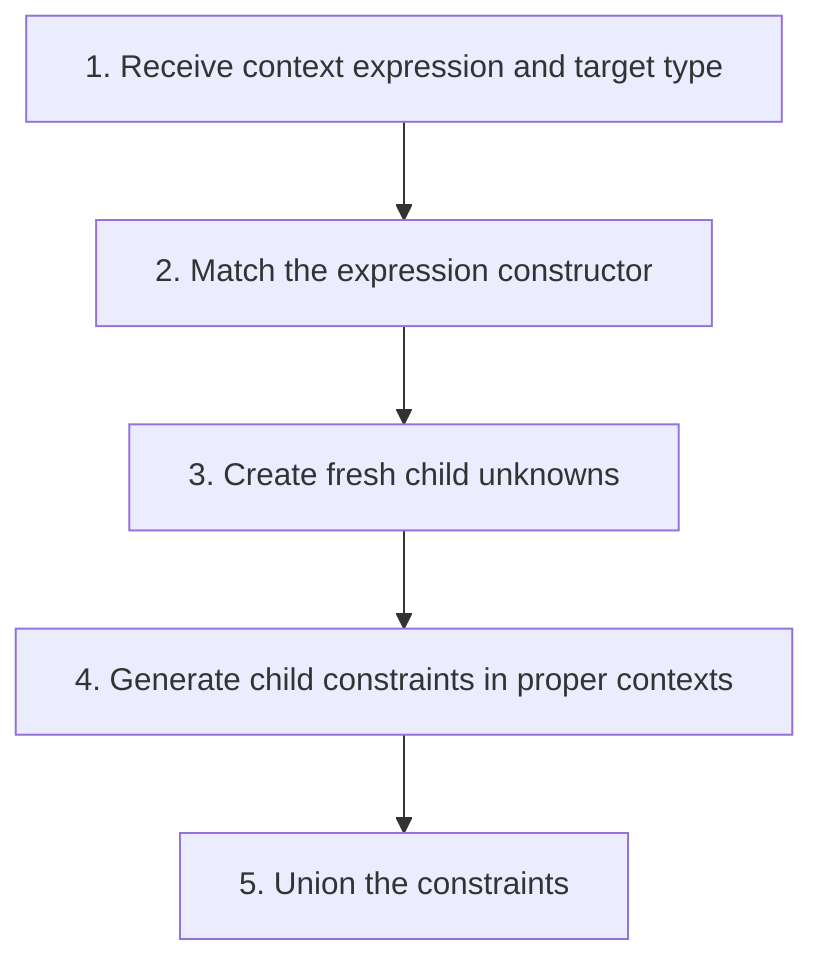

## The whole picture

Define V(Γ,e,t) to generate the equalities required for expression e to have target type t.

**Reading connection:** [Textbook chapter 8](textbook-08.html).

**Original lecture:** [PDF p. 4](https://prl.korea.ac.kr/courses/cose212/2026/slides/lec16.pdf#page=4) · [PDF p. 5](https://prl.korea.ac.kr/courses/cose212/2026/slides/lec16.pdf#page=5) · [PDF p. 6](https://prl.korea.ac.kr/courses/cose212/2026/slides/lec16.pdf#page=6) · [PDF p. 7](https://prl.korea.ac.kr/courses/cose212/2026/slides/lec16.pdf#page=7) · [PDF p. 8](https://prl.korea.ac.kr/courses/cose212/2026/slides/lec16.pdf#page=8) · [PDF p. 9](https://prl.korea.ac.kr/courses/cose212/2026/slides/lec16.pdf#page=9) · [PDF p. 10](https://prl.korea.ac.kr/courses/cose212/2026/slides/lec16.pdf#page=10). Page numbers here mean PDF positions.

## Focus points

1. The generator is recursive on syntax and produces constraints rather than runtime values.
2. Allocate fresh variables locally for unknown child types.
3. Binder occurrences share the type recorded in Γ; do not invent a new type for every use of the same monomorphic variable.
4. Generation can succeed even when the resulting equations are inconsistent.

## Formula and syntax

V(Γ, f a, t) = V(Γ,f,α→t) ∪ V(Γ,a,α), with fresh α

Read every symbol in context: [Constraint generation V](syntax.html#constraints) · [Static typing judgment](syntax.html#typing) · [Type constructors and unknowns](syntax.html#type). The formula above is a companion restatement or example, not a verbatim slide transcription.

## Problem-solving route

1. Receive context expression and target type.
2. Match the expression constructor.
3. Create fresh child unknowns.
4. Generate child constraints in proper contexts.
5. Union the constraints.

## Worked trace

For (proc x x) 1 with target β, generate the procedure's parameter/result equality and int for the argument. Solving forces β=int.

## Homework connection

HW4: implement a constraint generator before unification; add the starter's list and recursive-function cases.

[Open the HW4 thinking guide](hw4.html) · [Full concept-to-homework map](homework-map.html)

## Check your understanding

Should two independent procedure parameters receive the same fresh type variable?

Reveal the explanation

No. They become equal only if a constraint requires it.

[All lecture cheat sheets](lectures.html) · [Syntax reference](syntax.html)
