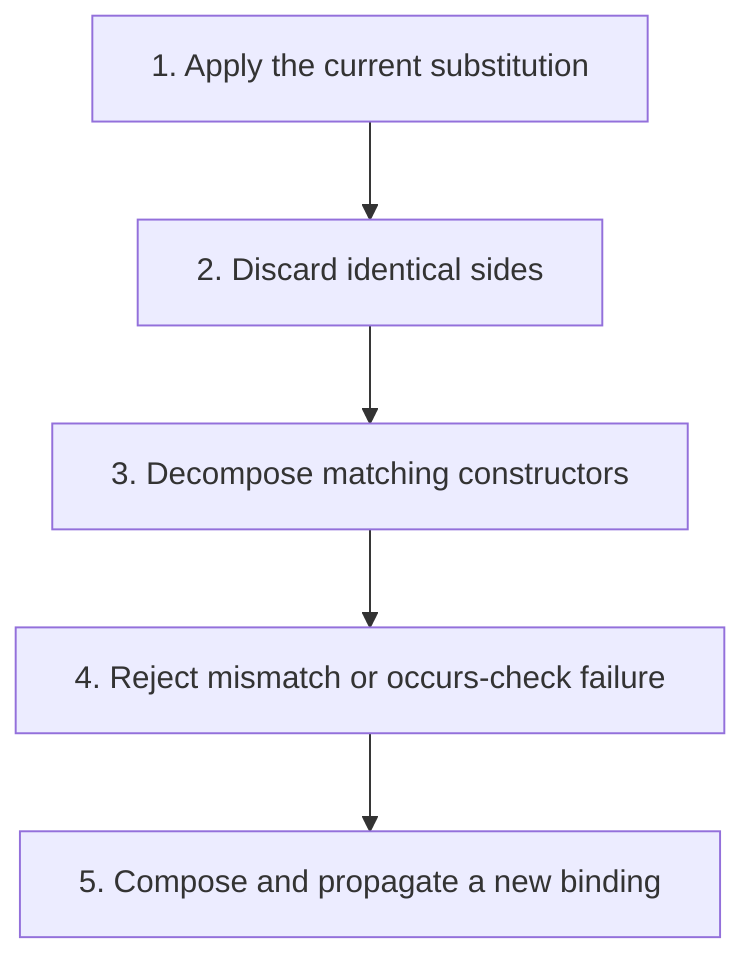

## The whole picture

Solve type equations by substitution, decomposition, mismatch rejection, and the occurs check.

**Reading connection:** [Textbook chapter 8](textbook-08.html).

**Original lecture:** [PDF p. 13](https://prl.korea.ac.kr/courses/cose212/2026/slides/lec17.pdf#page=13) · [PDF p. 15](https://prl.korea.ac.kr/courses/cose212/2026/slides/lec17.pdf#page=15) · [PDF p. 16](https://prl.korea.ac.kr/courses/cose212/2026/slides/lec17.pdf#page=16) · [PDF p. 21](https://prl.korea.ac.kr/courses/cose212/2026/slides/lec17.pdf#page=21) · [PDF p. 23](https://prl.korea.ac.kr/courses/cose212/2026/slides/lec17.pdf#page=23) · [PDF p. 25](https://prl.korea.ac.kr/courses/cose212/2026/slides/lec17.pdf#page=25) · [PDF p. 26](https://prl.korea.ac.kr/courses/cose212/2026/slides/lec17.pdf#page=26). Page numbers here mean PDF positions.

## Focus points

1. Normalize both sides using the current substitution before comparing.
2. Function equality decomposes into domain and codomain equality; lists decompose by element type.
3. Bind a variable only if it does not occur inside its proposed replacement.
4. Apply the final substitution to the provisional result type, not just to the remaining constraints.

## Formula and syntax

unify(α, int) gives [α↦int]; unify(α, α→β) fails; S(t1→t2)=S(t1)→S(t2)

Read every symbol in context: [Type substitution versus term substitution](syntax.html#substitution) · [Constraint generation V](syntax.html#constraints) · [Type constructors and unknowns](syntax.html#type). The formula above is a companion restatement or example, not a verbatim slide transcription.

## Problem-solving route

1. Apply the current substitution.
2. Discard identical sides.
3. Decompose matching constructors.
4. Reject mismatch or occurs-check failure.
5. Compose and propagate a new binding.

## Worked trace

α=β→β and β=int give α=int→int. For proc f (f f), the equation α=α→β fails the occurs check under finite simple types.

## Homework connection

HW4: substitution, unification, occurs check, final result normalization, and TypeError tests.

[Open the HW4 thinking guide](hw4.html) · [Full concept-to-homework map](homework-map.html)

## Check your understanding

Why is α=α harmless but α=α→β rejected?

Reveal the explanation

The first is identity. The second requires an infinite type in this finite-type system.

[All lecture cheat sheets](lectures.html) · [Syntax reference](syntax.html)
