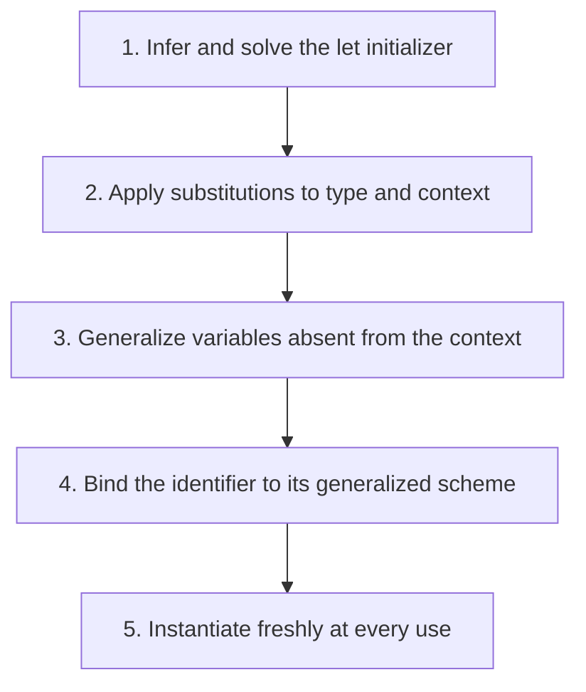

## The whole picture

Generalize independent type variables at let bindings and instantiate them freshly at each use.

**Reading connection:** [Textbook chapter 8](textbook-08.html).

**Original lecture:** [PDF p. 2](https://prl.korea.ac.kr/courses/cose212/2026/slides/lec18.pdf#page=2) · [PDF p. 6](https://prl.korea.ac.kr/courses/cose212/2026/slides/lec18.pdf#page=6) · [PDF p. 8](https://prl.korea.ac.kr/courses/cose212/2026/slides/lec18.pdf#page=8) · [PDF p. 11](https://prl.korea.ac.kr/courses/cose212/2026/slides/lec18.pdf#page=11) · [PDF p. 12](https://prl.korea.ac.kr/courses/cose212/2026/slides/lec18.pdf#page=12) · [PDF p. 13](https://prl.korea.ac.kr/courses/cose212/2026/slides/lec18.pdf#page=13) · [PDF p. 14](https://prl.korea.ac.kr/courses/cose212/2026/slides/lec18.pdf#page=14). Page numbers here mean PDF positions.

## Focus points

1. A scheme ∀α.t represents a family of instances, not a single shared unknown.
2. Never generalize variables constrained by the environment.
3. Procedure parameters remain monomorphic in the presented let-polymorphic system.
4. The pure-language rule cannot be transferred blindly to mutable references; practical OCaml uses a value restriction.

## Formula and syntax

Gen(Γ,t)=∀(FTV(t)−FTV(Γ)).t; Inst(∀α.t)=t[α↦fresh β]

Read every symbol in context: [Quantified type schemes](syntax.html#scheme) · [Type substitution versus term substitution](syntax.html#substitution) · [Static typing judgment](syntax.html#typing). The formula above is a companion restatement or example, not a verbatim slide transcription.

## Problem-solving route

1. Infer and solve the let initializer.
2. Apply substitutions to type and context.
3. Generalize variables absent from the context.
4. Bind the identifier to its generalized scheme.
5. Instantiate freshly at every use.

## Worked trace

let id = proc x x in if id true then id 11 else id 22 uses independent bool→bool and int→int instances. A monomorphic id would force bool=int and fail.

## Homework connection

HW4 handout does not settle every polymorphism policy. Implement the required policy explicitly; this lecture explains the extension rather than silently changing the assignment contract.

[Open the HW4 thinking guide](hw4.html) · [Full concept-to-homework map](homework-map.html)

## Check your understanding

Can a type variable free in Γ be quantified at this let?

Reveal the explanation

No. It represents a dependency on the surrounding context.

[All lecture cheat sheets](lectures.html) · [Syntax reference](syntax.html)
