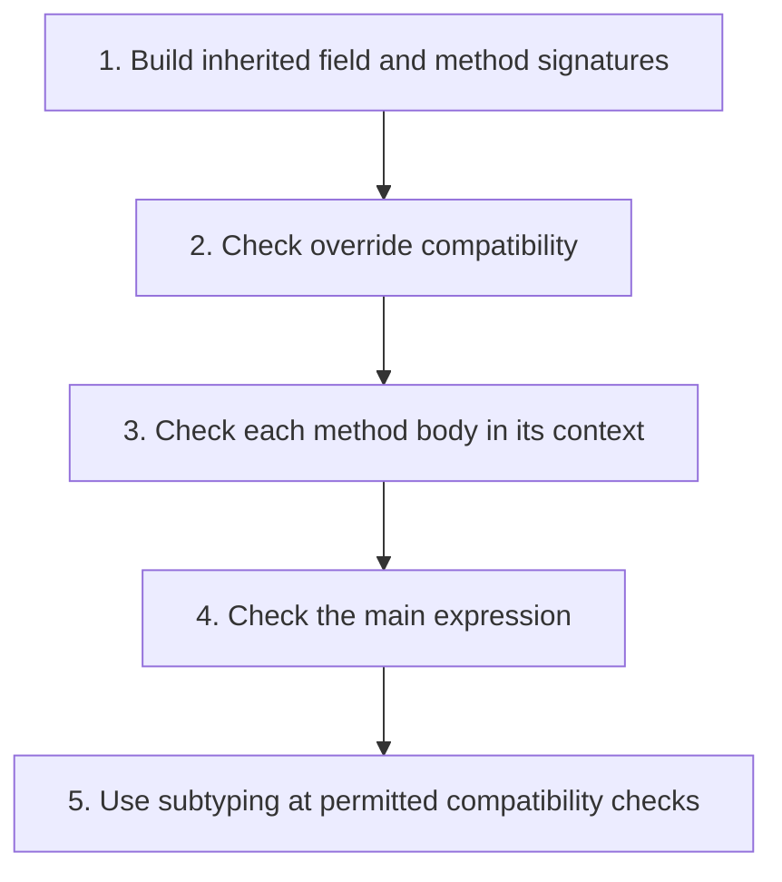

## The whole picture

Check class programs using safe substitutability, with contravariant method inputs and covariant outputs.

**Reading connection:** [Companion explanation](14-subtyping.html). This topic has no standalone chapter in the supplied English textbook.

**Original lecture:** [PDF p. 5](https://prl.korea.ac.kr/courses/cose212/2026/slides/lec19.pdf#page=5) · [PDF p. 8](https://prl.korea.ac.kr/courses/cose212/2026/slides/lec19.pdf#page=8) · [PDF p. 10](https://prl.korea.ac.kr/courses/cose212/2026/slides/lec19.pdf#page=10) · [PDF p. 11](https://prl.korea.ac.kr/courses/cose212/2026/slides/lec19.pdf#page=11) · [PDF p. 13](https://prl.korea.ac.kr/courses/cose212/2026/slides/lec19.pdf#page=13) · [PDF p. 18](https://prl.korea.ac.kr/courses/cose212/2026/slides/lec19.pdf#page=18) · [PDF p. 20](https://prl.korea.ac.kr/courses/cose212/2026/slides/lec19.pdf#page=20) · [PDF p. 22](https://prl.korea.ac.kr/courses/cose212/2026/slides/lec19.pdf#page=22). Page numbers here mean PDF positions.

## Focus points

1. Class inheritance establishes the nominal subtype relation in this lecture language.
2. Subsumption permits an expression of a subtype where a supertype is required.
3. Build class signatures and validate overrides before checking method bodies and the main expression.
4. The receiver's static type controls available members; runtime dispatch still selects the implementation.

## Formula and syntax

A2 &lt;: A1 and B1 &lt;: B2 ⇒ (A1→B1) &lt;: (A2→B2)

Read every symbol in context: [Subtyping and variance](syntax.html#subtype) · [Class environment, self, and super](syntax.html#dispatch) · [Static typing judgment](syntax.html#typing). The formula above is a companion restatement or example, not a verbatim slide transcription.

## Problem-solving route

1. Build inherited field and method signatures.
2. Check override compatibility.
3. Check each method body in its context.
4. Check the main expression.
5. Use subtyping at permitted compatibility checks.

## Worked trace

If ColorPoint <: Point, a replacement for Point→Point may accept every Point and return ColorPoint. Restricting its input to ColorPoint is unsafe for callers supplying an ordinary Point.

## Homework connection

An extension beyond HW4's simple type checker; do not replace equality unification with subtyping in HW4 without a specification change.

[Open the HW4 thinking guide](hw4.html) · [Full concept-to-homework map](homework-map.html)

## Check your understanding

May an override demand a narrower argument type?

Reveal the explanation

Not under the lecture's substitutability rule: old callers must still be accepted.

[All lecture cheat sheets](lectures.html) · [Syntax reference](syntax.html)
