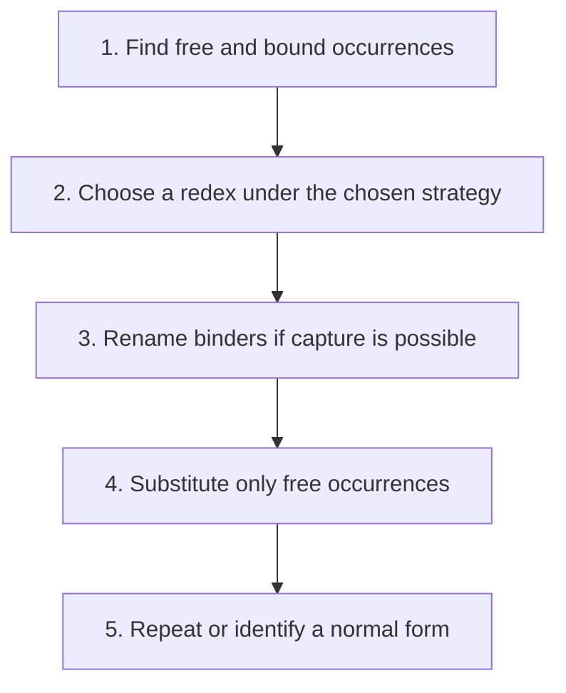

## The whole picture

Understand functions and application as a small core, then make binding and reduction strategy precise.

**Reading connection:** [Textbook chapter 9](textbook-09.html).

**Original lecture:** [PDF p. 6](https://prl.korea.ac.kr/courses/cose212/2026/slides/lec20.pdf#page=6) · [PDF p. 8](https://prl.korea.ac.kr/courses/cose212/2026/slides/lec20.pdf#page=8) · [PDF p. 12](https://prl.korea.ac.kr/courses/cose212/2026/slides/lec20.pdf#page=12) · [PDF p. 13](https://prl.korea.ac.kr/courses/cose212/2026/slides/lec20.pdf#page=13) · [PDF p. 14](https://prl.korea.ac.kr/courses/cose212/2026/slides/lec20.pdf#page=14) · [PDF p. 16](https://prl.korea.ac.kr/courses/cose212/2026/slides/lec20.pdf#page=16) · [PDF p. 17](https://prl.korea.ac.kr/courses/cose212/2026/slides/lec20.pdf#page=17) · [PDF p. 18](https://prl.korea.ac.kr/courses/cose212/2026/slides/lec20.pdf#page=18) · [PDF p. 19](https://prl.korea.ac.kr/courses/cose212/2026/slides/lec20.pdf#page=19) · [PDF p. 20](https://prl.korea.ac.kr/courses/cose212/2026/slides/lec20.pdf#page=20) · [PDF p. 22](https://prl.korea.ac.kr/courses/cose212/2026/slides/lec20.pdf#page=22) · [PDF p. 29](https://prl.korea.ac.kr/courses/cose212/2026/slides/lec20.pdf#page=29). Page numbers here mean PDF positions.

## Focus points

1. Terms consist only of variables, abstraction, and application.
2. Beta reduction substitutes an argument without capturing its free variables; alpha-renaming may be necessary.
3. Normal order reduces leftmost outermost redexes and may reduce under lambdas; call by name does not reduce under lambdas.
4. Church encodings represent booleans and natural numbers as functions; fixed points express recursion, with evaluation-strategy caveats.

## Formula and syntax

(λx.e) a →β e[x:=a], using capture-avoiding substitution

Read every symbol in context: [Lambda binding and beta reduction](syntax.html#lambda) · [Type substitution versus term substitution](syntax.html#substitution) · [Functions and application](syntax.html#function). The formula above is a companion restatement or example, not a verbatim slide transcription.

## Problem-solving route

1. Find free and bound occurrences.
2. Choose a redex under the chosen strategy.
3. Rename binders if capture is possible.
4. Substitute only free occurrences.
5. Repeat or identify a normal form.

## Worked trace

(λx.λy.x) y must become λz.y after renaming the inner y. The incorrect λy.y captures the formerly free argument variable.

## Homework connection

HW2's fixed-point discussion and textbook Chapter 9 encoding tasks; this is not OCaml surface syntax.

[Open the HW2 thinking guide](hw2.html) · [Full concept-to-homework map](homework-map.html)

## Check your understanding

Does the usual Y combinator directly terminate under eager call by value?

Reveal the explanation

No. Its self-application unfolds eagerly; use a strategy-appropriate delayed fixed-point construction.

[All lecture cheat sheets](lectures.html) · [Syntax reference](syntax.html)
