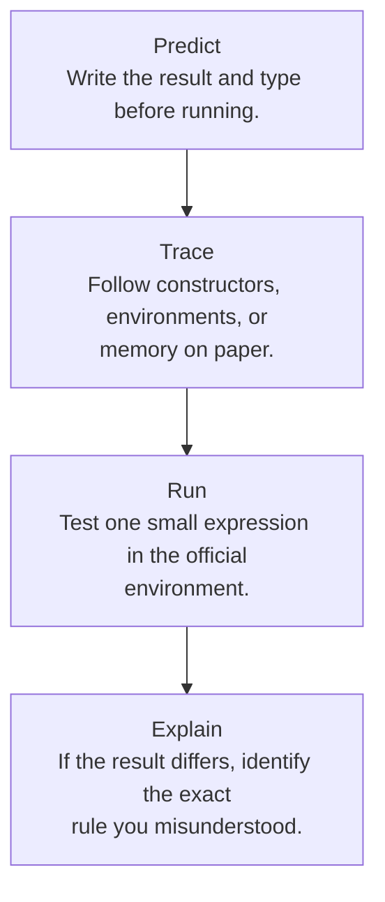

## Use the official workbench

The [course environment repository](https://github.com/kupl-courses/COSE212-2026fall) includes the homework templates and a VS Code Dev Container. At the source snapshot, its image is `ghcr.io/sambyeol/ocaml-devcontainer:4.14.1`. The container’s display name still mentions 2023; the repository and image configuration are the relevant references.

Follow its README to install Docker, Visual Studio Code, and the Dev Containers extension. Then:

```bash
git clone https://github.com/kupl-courses/COSE212-2026fall.git
cd COSE212-2026fall
code .
```

In VS Code, choose **Reopen in Container**. Run `ocaml -version` inside the container to check the environment actually in use. The website’s TryML PDF link currently returns 404, so the official local environment is the documented route available at this snapshot.

## Three ways to run OCaml

| Method | Command | What to expect |
|---|---|---|
| Interactive top level | `ocaml` | Enter expressions ending in `;;`; OCaml displays values and inferred types |
| Load a file in the top level | `#use "scratch.ml";;` | Evaluates definitions from the file in the current session |
| Compile a program | `ocamlc -o scratch scratch.ml` then `./scratch` | Creates and runs a program; print explicitly to see output |

Inside a `.ml` file, most ordinary definitions do not need `;;`. At the interactive prompt, `;;` tells the top level that the current phrase is finished. Do not copy the displayed `#` prompt into source files.

```ocaml
let square x = x * x
let () = Printf.printf "%d\n" (square 6)
```

This original example prints `36`. A definition by itself does not print its value in a compiled program.

## A productive scratch-file habit

Keep assignment templates separate from exploratory examples. HW1 reuses names such as `exp` and `btree` for incompatible types across problems. Combining every template into one top-level scope can produce misleading type errors or shadow earlier definitions. Work in separate files, or place experiments in separate modules.



## Read the template before implementing

The expected filenames are `hw1/prime.ml`, `range.ml`, `suml.ml`, `drop.ml`, `maxmin.ml`, `sigma.ml`, `forall.ml`, `double.ml`, `mem.ml`, `mirror.ml`, `nat.ml`, `eval.ml`, `diff.ml`, `calculator.ml`, and `check.ml`; later assignments use `hw2/ml_minus.ml`, `hw3/b.ml`, and `hw4/typeof.ml`.

Keep the supplied public function names and types. Helpers can carry additional information: for example, a public `check : exp -> bool` can call a private helper that also accepts the set of currently bound names. An interface that starts with an empty environment does not mean recursive calls should forget the environment.

## Companion examples

Download [the original OCaml examples](examples/notebook_examples.ml) and run them with:

```bash
ocaml notebook_examples.ml
```

They demonstrate structural recursion, lexical closures, persistent store updates, and unification with assertions. They are separate teaching examples, not replacements for the assignment templates. The repository’s validation report records the interpreter version used for testing.

## A checklist for confusing errors

- **Type mismatch:** compare the inferred type with the expected type. Did you pass a pair to a curried function, or a list where an element is expected?
- **Unbound value:** check spelling, lexical scope, and whether a function calling itself was introduced with `let rec`.
- **Non-exhaustive match:** compare your branches to every constructor in the datatype, including empty structures.
- **Stack overflow:** check that each recursive call decreases an input. Then consider whether an accumulator makes a long traversal tail recursive.
- **Wrong interpreter result:** first distinguish the host language’s behavior from your object language’s rules. B assignment returns its assigned value; OCaml reference assignment returns `unit`.

**Read alongside:** [lecture 3](https://prl.korea.ac.kr/courses/cose212/2026/slides/lec3.pdf#page=7), [official setup README](https://github.com/kupl-courses/COSE212-2026fall/blob/main/README.md).
