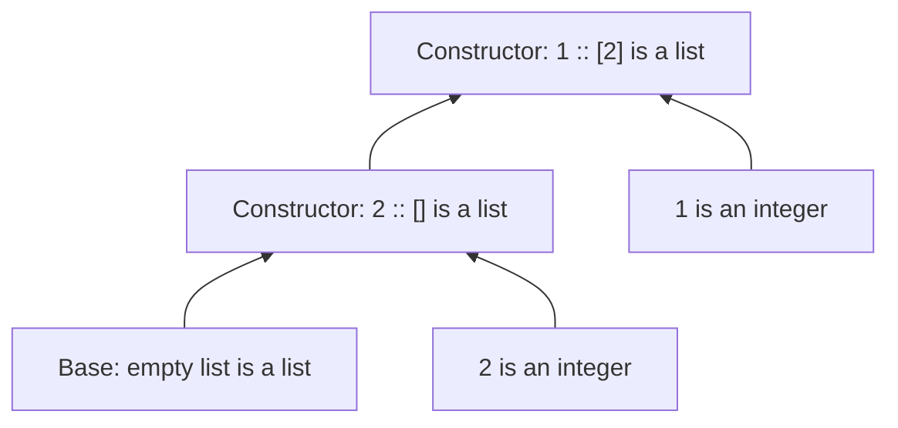

## 1.1 From a construction rule to a proof tree

**Why this matters:** an inductive definition tells you both what belongs to a set and how to justify membership. This expands the examples in [PDF pp. 11–21](https://prl.korea.ac.kr/courses/cose212/2026/pl-book-eng.pdf#page=11).

1. **Find the starting objects.** A rule with no premises supplies a base object. For a list of integers, `[]` is the base.
2. **Find the constructors.** If n is an integer and xs is an integer list, `n :: xs` is an integer list. The two premises have different jobs: choose an element and justify the smaller list.
3. **Build only finitely many times.** Starting from `[]`, prepend 2, then prepend 1. This constructs `[1;2]`.
4. **Read backward to justify membership.** To justify `[1;2]`, justify the integer 1 and the list `[2]`; continue until the empty-list rule closes the tree.

**Least set means no unexplained members.** If the only rule says “from an existing object, construct another one,” and there is no starting object, the generated set is empty. An infinite chain of unsupported premises is not a finite derivation.

| Representation | What to look for | What it helps you do |
|---|---|---|
| Constructor rule | Inputs above a line, result below | Justify one construction |
| Grammar | Alternatives such as `L ::= [] | n :: L` | List the possible outer shapes |
| Proof tree | Repeated rule instances ending at base cases | Demonstrate one object's membership |
| OCaml datatype / pattern | One constructor / branch per alternative | Compute by following those shapes |

The exact constructors matter. A tree with `Leaf of int` stores data at leaves; a tree with `Node of tree * int * tree` stores data at nodes. Write the actual datatype before designing [HW1's tree recursion](hw1.html). Do not transfer a leaf-count formula between different definitions without checking it.

## 1.2 Separate syntax, evaluation, and arithmetic

Based on [PDF pp. 22–28](https://prl.korea.ac.kr/courses/cose212/2026/pl-book-eng.pdf#page=22). The same page can contain several kinds of arrows and plus signs. Read their surrounding objects first.

| Notation | Read it as | Example |
|---|---|---|
| Grammar alternative `E → E + E` | An expression may have this shape | Build an addition node |
| Evaluation `e ⇒ n` | Expression e evaluates to integer n | `(2+3) ⇒ 5` |
| A rule's horizontal bar | If every premise holds, conclude this judgment | Combine two evaluated operands |
| Mathematical `n₁ + n₂` in a result | Addition of already obtained integers | Compute 2 + 3 = 5 |

The evaluation relation is a set of **expression/result pairs**, a subset of `Program × Integer`. It is not the grammar, and it is not a variable environment. Chapter 3 adds an environment to the judgment.

**Derive `(2 + 3) + 4 ⇒ 9` in four steps:**

1. The numeral rule gives `2 ⇒ 2`, `3 ⇒ 3`, and `4 ⇒ 4`; each has no recursive evaluation premise.
2. Match the inner expression against the addition rule: its children are 2 and 3.
3. Use the first two numeral judgments to conclude `2 + 3 ⇒ 5`.
4. Use that conclusion and `4 ⇒ 4` as the outer addition's premises. The result is the mathematical sum 5 + 4 = 9.

When implementing the rule, recursively evaluate the two AST children, check their value shapes if needed, then perform host-language addition. Returning `ADD(CONST 2, CONST 3)` constructs syntax; it does not evaluate it.

## 1.3 Choose induction hypotheses from the constructors

The proof method in [PDF pp. 28–32](https://prl.korea.ac.kr/courses/cose212/2026/pl-book-eng.pdf#page=28) follows the construction of the object, rather than the order of a few test examples.

For a binary tree `Leaf | Fork(left,right)`, prove “the number of leaves equals the number of Fork nodes plus one.” Define L and F as those two counts.

| Case | Available induction hypotheses | Obligation and calculation |
|---|---|---|
| `Leaf` | None | L = 1 and F = 0, so L = F + 1 |
| `Fork(a,b)` | L(a)=F(a)+1 **and** L(b)=F(b)+1 | L=L(a)+L(b)=F(a)+F(b)+2; F=1+F(a)+F(b), so L=F+1 |

1. State the property for an arbitrary tree.
2. Cover each constructor exactly once.
3. Assume the property only for the immediate smaller trees supplied by that constructor.
4. Substitute those hypotheses into the counting definitions and simplify.

Two recursive children give two hypotheses. Assuming the property for the whole `Fork(a,b)` would assume the conclusion. A few successful tests help find mistakes; they do not cover all finite trees.
