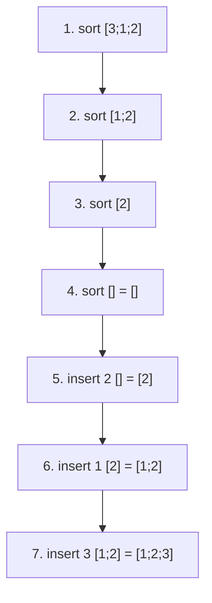

## 2.1 Read OCaml expressions, types, and patterns

Use these small steps through OCaml values, types, and patterns before attempting the recursion exercises. Source: [PDF pp. 34–70](https://prl.korea.ac.kr/courses/cose212/2026/pl-book-eng.pdf#page=34).

### Values and their types

| Expression | Type / meaning | Common mistake |
|---|---|---|
| `3 + 4` | `int`, result 7 | Using integer `+` on floats |
| `3.0 +. 4.0` | `float`, result 7.0 | Expecting automatic int-to-float conversion |
| `if true then 3 else 4` | `int`; both branches must have the same type | Returning an int in one branch and a bool in the other |
| `(3, true)` | `int * bool`, a two-component tuple | Confusing a tuple with a list |
| `[3; 4]` | `int list`, two elements of one type | Writing `[3, 4]`, which is a one-element list containing a tuple |
| `[]` | `'a list`, an empty list with an unconstrained element type | Treating it as unit `()` |
| `()` | `unit`, the one value of this type | Treating it as “no value at all” |

The top-level prompt's `;;` tells the interactive reader to finish a phrase. Ordinary definitions in a `.ml` file generally do not need it. A single `;` has a different job: it separates list elements inside brackets, or sequences expressions outside them.

### Application, arrows, and scope

1. **Parenthesize application first.** `f x + 1` means `(f x) + 1`; `f (x + 1)` passes a different argument.
2. **Group calls to the left.** `add 2 3` means `(add 2) 3`. `let add x y = x + y` abbreviates `let add = fun x -> fun y -> x + y`.
3. **Group type arrows to the right.** `int -> int -> int` means `int -> (int -> int)`. After one argument, a function remains.
4. **Keep tuple arguments distinct.** `let add_pair (x,y) = x+y` has type `int * int -> int`. Call it with `add_pair (2,3)`.
5. **Track the binding region.** In `let x = 2 in let x = x+3 in x`, the inner right-hand side sees 2; the inner body sees 5. A binding is not an assignment.

For `let id x = x`, OCaml can infer `'a -> 'a`. The same type variable occurs twice because the result has the argument's type. A let-bound identity can be used at several types; this does **not** mean an ordinary function parameter can change type halfway through its body. [Chapter 8 explains fresh instances](textbook-08.html#8-7-polymorphic-type-systems).

### Turn a datatype into exhaustive cases

```ocaml
type tree = Leaf of int | Fork of tree * tree

let rec sum_leaves t =
  match t with
  | Leaf n -> n
  | Fork (left, right) -> sum_leaves left + sum_leaves right
```

| Line or pattern | Meaning |
|---|---|
| `Leaf of int` | Leaf carries one integer; it is not an empty leaf |
| `Fork of tree * tree` | Fork carries two subtrees |
| `Leaf n` | Match this constructor and give its payload the local name n |
| `Fork (left,right)` | Bind both smaller trees before recurring |
| `_` in a pattern | Accept a value without naming it; it is not a reusable variable |

Matching tries branches from top to bottom. A catch-all first branch makes later branches useless. For a list, `[]` and `h :: t` cover every shape; h is one element and t is the remaining **list**. [The syntax reference explains `::`](syntax.html#list): it prepends one element, whereas `@` joins two lists.

**Modules and failures:** `List.map` means the `map` function in module `List`. `exception Missing` declares an exception; `raise Missing` exits the current computation until a matching `try ... with Missing -> ...` handles it. Use a failure only when the problem's contract calls for it. An autograder may require a particular exception or prohibit library helpers, as the [homework pages](homework-map.html) explain.

### Follow the queue example without assuming mutation

The module example on [PDF pp. 69–70](https://prl.korea.ac.kr/courses/cose212/2026/pl-book-eng.pdf#page=69) groups queue operations. This small version makes the result of each operation explicit:

```ocaml
module IntQueue = struct
  type t = int list
  exception Empty
  let empty : t = []
  let enq (q : t) x = q @ [x]
  let deq (q : t) = match q with
    | [] -> raise Empty
    | first :: rest -> (first, rest)
end
```

1. `let q0 = IntQueue.empty` names an empty queue.
2. `let q1 = IntQueue.enq q0 10` returns a new queue `[10]`; q0 still denotes `[]`.
3. `let q2 = IntQueue.enq q1 20` returns `[10;20]`; q1 still denotes `[10]`.
4. `let first, rest = IntQueue.deq q2` binds first to 10 and rest to `[20]`. q2 itself remains `[10;20]`.
5. `IntQueue.deq IntQueue.empty` raises `IntQueue.Empty`; it cannot return a first element that does not exist.

The dot selects a member of a module; it does not mean that the queue was modified. The `: t` annotations tie the operations to the integer-list type. This simple module exposes its list representation. A module signature can hide it, but grouping code in `struct ... end` alone does not make the type abstract. This list-based enqueue also copies the existing queue; it is a teaching example, not a constant-time queue implementation.

[Download the queue and factorial examples with checks](examples/textbook_review.ml).

## 2.2 Design a recursive function before writing its cases

Source progression: [PDF pp. 70–80](https://prl.korea.ac.kr/courses/cose212/2026/pl-book-eng.pdf#page=70). For each function, write the input contract, decreasing argument, and result of the smaller call.

### Indexing and removing one occurrence

For a zero-based `nth xs i`, the front element has index 0. With the contract `0 ≤ i < length xs`, use:

1. A nonempty list with i = 0: return the head.
2. A nonempty list with i > 0: recurse on the tail with i−1.
3. An empty list or negative i: follow the stated error policy; these inputs violate the contract.

To remove **only the first** occurrence of a value, stop when the head matches and return the tail. On `[2;1;2]`, removing 2 gives `[1;2]`. Recurring after the match, or using `filter`, can remove later occurrences too and solve a different problem.

### Insertion sort: give the helper a precondition

`insert x sorted` assumes its second argument is sorted. It places x before the first element at least as large as x; if the list ends, append x there.



The recursive call supplies exactly the helper's precondition. That is also the induction argument for sortedness. Inserting into the unsorted original tail loses this guarantee. Worst-case repeated insertion scans prefixes of lengths 0 through n−1, giving quadratic time.

### Pending work explains tail recursion

For ordinary factorial, `fact 3` waits for `fact 2` so it can multiply by 3. For an accumulator helper `loop n acc`, the multiplication happens **before** the next call; the next call's result is returned directly. Use the invariant `loop n acc = acc × n!` for nonnegative n.

Tail calls can reuse stack space; this does not make all memory usage constant. A tail-recursive list builder still allocates result cells, and changing argument order in a fold may change the answer. Keep the correctness invariant separate from the space argument.

### Check the draft's factorial boundaries

The C loop printed on [PDF p. 78](https://prl.korea.ac.kr/courses/cose212/2026/pl-book-eng.pdf#page=78) starts i at 0 and multiplies by i. For any positive n, the first multiplication makes the result zero, so the displayed loop does not compute n!. A correct loop over nonnegative n multiplies the integers **1 through n**, starting from 1. This is an error in the draft's example, not a difference between functional and imperative programming.

The later recursive variants on pp. 80–81 stop at n=1, which requires a positive-input contract. To include `0! = 1`, use a zero base case:

```ocaml
let factorial n =
  if n < 0 then invalid_arg "factorial: negative input";
  let rec loop remaining acc =
    if remaining = 0 then acc
    else loop (remaining - 1) (remaining * acc)
  in
  loop n 1
```

For n=3, `(remaining,acc)` goes `(3,1) → (2,3) → (1,6) → (0,6)`. For n=0, the first call returns 1 without multiplying. The invariant from above, `acc × remaining! = original n!`, holds at every state. Negative inputs are rejected; results must fit OCaml's integer range. The [downloadable example](examples/textbook_review.ml) checks 0, 1, 5, and the negative-input case.

## 2.3 Choose map, filter, or fold from the desired result

Source: [PDF pp. 81–88](https://prl.korea.ac.kr/courses/cose212/2026/pl-book-eng.pdf#page=81). A higher-order function receives or returns a function. The function argument specifies the changing part of a reusable traversal.

| Operation | What the helper does | Empty input | Example |
|---|---|---|---|
| `List.map f xs` | Transform each element, `'a -> 'b` | `[]` | Increment every integer |
| `List.filter p xs` | Keep elements satisfying `'a -> bool` | `[]` | Keep positive integers |
| `List.fold_left f init xs` | Update an accumulator, `'acc -> 'a -> 'acc` | `init` | Running sum or reversed list |
| `List.fold_right f xs init` | Combine an element with the folded tail, `'a -> 'acc -> 'acc` | `init` | Rebuild a list in its original order |

**Trace a pipeline:** `[-1;2;3]` → map `(fun x -> x+1)` → `[0;3;4]` → filter `(fun x -> x mod 2 = 0)` → `[0;4]` → fold_left `(+)` from 0 → 4.

1. Decide whether the output has one item per input, some of the original items, or a combined result.
2. Choose the traversal with that contract.
3. Write the helper's input and result types before its body.
4. For a fold, check the initial accumulator and the order of helper arguments.
5. Test empty input and a noncommutative helper such as subtraction; addition alone hides order mistakes.

For subtraction, `fold_left (-) 0 [1;2;3]` groups as `((0−1)−2)−3 = −6`; `fold_right (-) [1;2;3] 0` groups as `1−(2−(3−0)) = 2`. These parentheses are the computation. Now use [Problem 10's fold exercises](textbook-02-problems.html) to turn this distinction into implementations.
