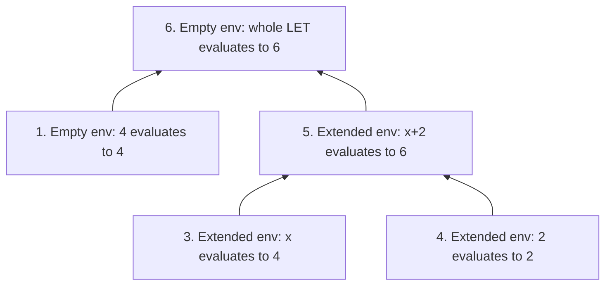

## 3.2.1 Decode the mathematical maps before tracing names

Source: [PDF pp. 102–105](https://prl.korea.ac.kr/courses/cose212/2026/pl-book-eng.pdf#page=102). An environment is a finite mapping from identifiers to values. It is neither the AST nor a global variable table that every call may overwrite.

| Symbol | Plain meaning | Concrete reading |
|---|---|---|
| `Var → Value` | A function space / mapping type | Given an identifier, look up its value |
| `A × B` | Pairs with one component from each set | `(identifier, value)` has two components |
| `A + B` in a value domain | Tagged alternatives, a disjoint sum | An integer **or** a boolean; not arithmetic addition |
| `Dom(ρ)` | Names for which ρ has a binding | Lookup outside this set is undefined |
| `ρ[x ↦ v]` | Extend or shadow x with v | Look up x here first; other names retain their old values |
| `{x ↦ v}ρ` in the PDF | The same overriding extension | The new binding has priority |

An association-list implementation uses `(x,v) :: env` and looks up the **first** matching name. Keeping an older x later in the list is consistent with shadowing; the newer occurrence wins. A mathematical mapping describes the behavior, while an association list is one implementation of it.

For `ρ = {x ↦ 4, y ↦ 8}`, trace an extension as follows:

1. Create `ρ₁ = ρ[x ↦ 9]`, giving the new x binding priority.
2. Look up x in ρ₁: the new binding answers 9.
3. Look up y in ρ₁: no new binding replaces y, so the original mapping answers 8.
4. Look up x in the original ρ: it still answers 4.

The original ρ can still be used elsewhere. Chapter 6 introduces a separate changing store; these extensions alone do not model assignment.

## 3.2.2 Expand one complete evaluation derivation

Read alongside [PDF pp. 106–113](https://prl.korea.ac.kr/courses/cose212/2026/pl-book-eng.pdf#page=106). The judgment `ρ ⊢ e ⇒ v` reads: **under environment ρ, expression e evaluates to value v**.

For `let x = 4 in x + 2`, start with the empty environment ρ₀.

| Step | Judgment / action | Rule and reason |
|---|---|---|
| 1 | `ρ₀ ⊢ 4 ⇒ 4` | A numeral evaluates to itself |
| 2 | Define `ρ₁ = ρ₀[x ↦ 4]` | LET makes the value available to its body |
| 3 | `ρ₁ ⊢ x ⇒ 4` | Variable lookup uses ρ₁ |
| 4 | `ρ₁ ⊢ 2 ⇒ 2` | Numeral rule again |
| 5 | `ρ₁ ⊢ x+2 ⇒ 6` | Addition combines steps 3 and 4 |
| 6 | `ρ₀ ⊢ let x=4 in x+2 ⇒ 6` | LET combines its initializer and body results |

The diagram shows **premise-to-conclusion dependencies**. To execute it, obtain the initializer first, create ρ₁, then evaluate the body. In OCaml the corresponding structure is `let v = eval init env in eval body ((x,v)::env)`. The initial environment is used for `init`; the extended one is used only for `body`.

**Try a change:** replacing 4 with an unbound variable prevents step 1 from succeeding. Replacing the body with `true + 2` fails the addition rule's operand requirement. Both are runtime failures in this untyped chapter, for different reasons.
