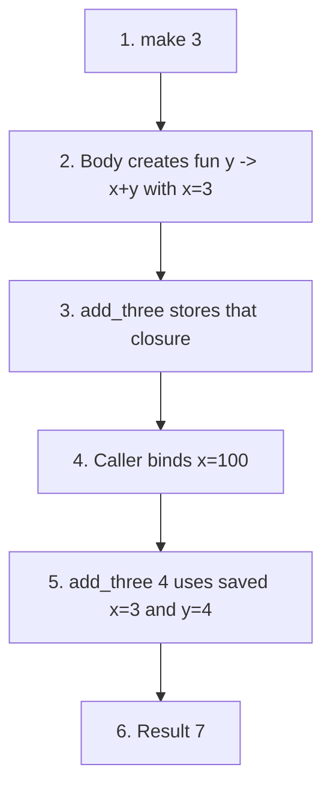

## 4.2 Compute free variables by respecting each binding region

The definitions on [PDF pp. 123–127](https://prl.korea.ac.kr/courses/cose212/2026/pl-book-eng.pdf#page=123) explain what a closure must remember. A free occurrence gets its meaning from outside the expression being analyzed.

For `let x = x + 1 in fun y -> x + y + z`, compute from the inside out:

1. `FV(x+1) = {x}`. This occurrence is in the initializer, outside the new x's binding region.
2. `FV(x+y+z) = {x,y,z}`.
3. `FV(fun y -> x+y+z) = {x,z}` after removing the parameter y.
4. For the let body, remove its bound x: `{x,z} − {x} = {z}`.
5. Union with the initializer's free variables: `{x} ∪ {z} = {x,z}`.

The rule is `FV(let x=e₁ in e₂) = FV(e₁) ∪ (FV(e₂) − {x})`. Removing x from the whole union would wrongly bind the initializer's x. Also distinguish the free variables of the **whole let expression** from those of the **returned function**: its x will be supplied by the environment created when the let runs.

## 4.2.1 Follow a function that returns another function

Source: the closure and higher-order examples on [PDF pp. 128–133](https://prl.korea.ac.kr/courses/cose212/2026/pl-book-eng.pdf#page=128). This OCaml-shaped expression has the same lexical-scope lesson as the course's PROC/CALL language:

```ocaml
let make = fun x -> fun y -> x + y in
let add_three = make 3 in
let x = 100 in
add_three 4
```

| Step | What is evaluated | Value / environment to retain |
|---|---|---|
| 1 | Define `make` | Closure containing parameter x, body `fun y -> x+y`, and its definition environment |
| 2 | Call `make 3` | Run that body with x bound to 3 |
| 3 | Evaluate the inner `fun y` | Return a new closure whose saved environment includes x=3 |
| 4 | Bind caller's x to 100 | Changes the caller's environment; it does not rewrite the saved closure |
| 5 | Call `add_three 4` | Extend its saved environment with y=4; evaluate 3+4 |
| 6 | Return | Integer 7 |



The call of `make` has finished, but the returned function still needs x. This is why a procedure value must include an environment, not just parameter and body. Under the chapter's dynamic-scope alternative, the final lookup would use the caller's x and produce 104; that is a different rule, not a closure optimization.

## 4.2.3 Explain the extra self-binding in recursion

Source: [PDF pp. 137–145](https://prl.korea.ac.kr/courses/cose212/2026/pl-book-eng.pdf#page=137). The obstacle is circular: the function's body needs the function name, but an ordinary closure is created before its new let binding exists.

1. In an ordinary `let f = fun n -> ... f ... in ...`, f in the initializer is not introduced by that let. Without an earlier f, the captured environment has no meaning for the recursive occurrence.
2. `letrec` records the function name, parameter, body, and outer environment in a recursive closure.
3. Calling that closure builds a body environment containing the function itself and the actual argument.
4. A recursive call finds the self-binding and repeats the same procedure.

For factorial at 2, the successive parameter bindings are n=2, n=1, and n=0. Under each one, f still denotes the same recursive definition. The base case returns 1, then the pending multiplications produce 1 and 2.

Keep the two contracts separate: **lexical scope** supplies the outer free variables from the saved environment; **recursive binding** makes the selected definition available to itself. Using a caller's unrelated binding of f would break the latter under static scope.
