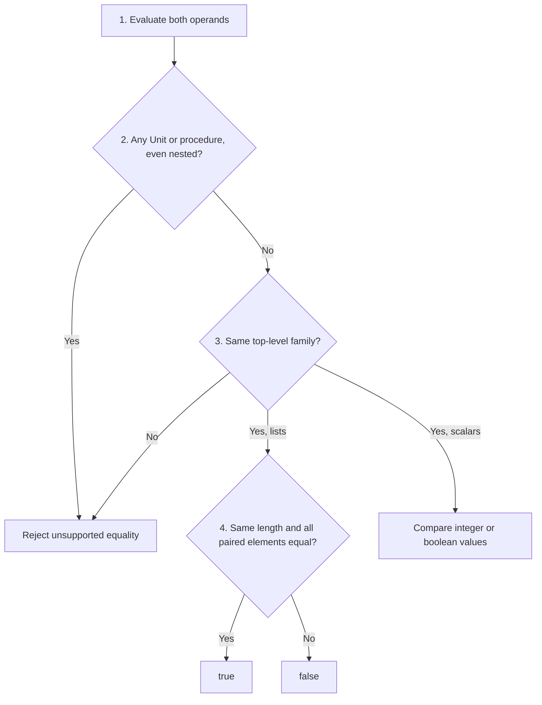

## 5.1 Connect surface syntax, AST constructors, and runtime values

Source: [PDF pp. 147–150](https://prl.korea.ac.kr/courses/cose212/2026/pl-book-eng.pdf#page=147). The interpreter is an OCaml program that processes a different language, Fun. Its uppercase AST constructors are data, not OCaml functions that automatically execute the represented operation.

| Layer | Example | What it says |
|---|---|---|
| Surface Fun expression | `head (1 :: [])` | A programmer requests the first element |
| AST supplied to the evaluator | `HEAD (CONS (CONST 1, NIL))` | A head node containing a cons node and its children |
| Intermediate runtime list | `List [Int 1]` | The result of evaluating the cons node |
| Final runtime value | `Int 1` | The result of applying the head rule |

1. Inspect `HEAD`; it needs its operand evaluated first.
2. Inspect `CONS`; evaluate `CONST 1` and `NIL` in order.
3. Check that the second result is a list, then form `List [Int 1]`.
4. Check that the list is nonempty, then return its first value.

`UNIT` evaluates to `Unit`, while `NIL` evaluates to `List []`. Both are legitimate results with different shapes. `HEAD NIL` fails; `ISNIL NIL` returns true. Making that distinction explicit is more useful than memorizing constructor names alone.

## 5.2 Give every operation a precise value contract

Source: [PDF pp. 150–155](https://prl.korea.ac.kr/courses/cose212/2026/pl-book-eng.pdf#page=150), especially [the list-equality rules and qualification on p. 152](https://prl.korea.ac.kr/courses/cose212/2026/pl-book-eng.pdf#page=152).

| Operation | Required input | Result / boundary |
|---|---|---|
| `CONS` | A value and a list | A list with the value prepended |
| `APPEND` | Two lists | All elements of the first followed by the second |
| `HEAD`, `TAIL` | A nonempty list | First value / remaining list; empty input fails |
| `NOT` | A boolean | Its opposite |
| `EQUAL` | Two integers, two booleans, or two comparable lists | A boolean; function comparison is excluded |
| `PRINT` | An evaluated value | Emits output, then returns Unit |
| `SEQ` | Two expressions evaluated in order | Discards the first result and returns the second |

**Equality in the PDF includes lists.** Two lists compare equal when their lengths agree and all corresponding elements compare equal. The rule is broader than scalar-only equality in some of the course's other languages; check which language a problem specifies.

The PDF leaves the treatment of nested list elements open. The worked evaluator makes its policy explicit: recursively compare integer, boolean, and list values; reject Unit and procedures anywhere in either operand. Top-level operands must be from the same family. Inside lists, different allowed shapes compare unequal. This is a documented completion of the underspecified case, not an additional rule quoted from the PDF.

For `[[1];[2;3]] = [[1];[2;4]]`, the first pair of inner lists is equal; the second pair reaches 3 versus 4, so the result is false. `[] = []` is true. A list containing a procedure is rejected even if an earlier unequal element could have short-circuited the comparison. Validation makes this error policy predictable.

**Checker boundary:** [the Chapter 8 downloadable checker](textbook-08.html#8-8-implementation) still implements a deliberately narrower scalar-equality restriction. It can reject a list comparison that this evaluator runs successfully. Do not treat its rejection as the PDF's definition of equality.
