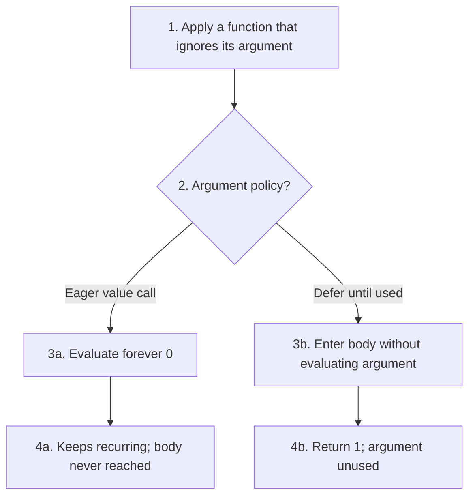

## 6.1.2 Write the value and the memory after every step

Source: [PDF pp. 165–173](https://prl.korea.ac.kr/courses/cose212/2026/pl-book-eng.pdf#page=165). The stateful judgment returns `(value, memory)`. The environment ρ tells you what a name denotes; memory σ tells you what an allocated location currently contains.

Consider the course-language sequence `let r = ref 1 in (r := 7; !r)`. Let ℓ₀ be a fresh location.

| Step | Expression / action | Environment information | Memory afterward | Produced value |
|---|---|---|---|---|
| 1 | Evaluate initializer 1 | No r yet | Empty | 1 |
| 2 | Allocate `ref 1` | No r yet | ℓ₀ ↦ 1 | Location ℓ₀ |
| 3 | Bind r | r ↦ ℓ₀ | ℓ₀ ↦ 1 | Continue into body |
| 4 | Evaluate assignment operands | r still denotes ℓ₀ | ℓ₀ ↦ 1 | Location ℓ₀ and integer 7 |
| 5 | Update the cell | r still denotes ℓ₀ | ℓ₀ ↦ 7 | 7 under this chapter's assignment rule |
| 6 | Evaluate `!r` using step 5's memory | r ↦ ℓ₀ | ℓ₀ ↦ 7 | 7 |

**Host-language distinction:** actual OCaml's `r := 7` returns `()`. The course evaluator's assignment rule returns the assigned value. OCaml implements the rule; it does not decide the object language's return convention.


Allocation must choose a location outside the domain of the memory **after the initializer runs**. The initializer may allocate cells too. Similarly, evaluate a later operand in the preceding operand's output memory; reusing the original memory loses effects.

## 6.2.2 Distinguish a copied value from an aliased cell

Source: [PDF pp. 175–182](https://prl.korea.ac.kr/courses/cose212/2026/pl-book-eng.pdf#page=175). Under implicit references, every variable lookup goes through a location: `ρ(x)=ℓ` then `σ(ℓ)=v`.

For `let x = 1 in let y = x in (y := 7; x)`:

1. Allocate ℓx containing 1 and bind x to ℓx.
2. Evaluate x to the **value** 1.
3. Allocate a fresh ℓy containing that value and bind y to ℓy.
4. Assignment to y updates ℓy to 7.
5. Lookup of x still reads 1 from ℓx.

Copying a scalar value into a new variable cell does not alias the two cells. Later, a copied record or pointer value can itself contain shared locations; [Chapter 7 follows those extra arrows](textbook-07.html#7-1-records).

**Closures save bindings, not a frozen memory snapshot.** A counter closure remembers the location of its count variable. If that cell changes from 0 to 1 to 2 across calls, the same saved binding finds the current contents in each call's incoming store. Two independently created counters instead allocate two locations and evolve separately.

## 6.2.3 Trace parameter passing with locations

Source: [PDF pp. 183–187](https://prl.korea.ac.kr/courses/cose212/2026/pl-book-eng.pdf#page=183). Suppose x's cell ℓx contains 1 and the procedure body assigns 9 to its parameter p.

| Step | Call by value in the implicit-reference language | Call by reference |
|---|---|---|
| Obtain actual argument | Evaluate x and obtain 1 | Find x's existing location ℓx |
| Bind parameter p | Allocate fresh ℓp holding 1 | Bind p directly to ℓx |
| Assign `p := 9` | Update ℓp | Update ℓx |
| Read x afterward | 1 | 9 |

1. Write down the caller's name-to-location map.
2. Check whether the call rule transports a **value** or reuses a **location**.
3. Extend the callee's lexical environment accordingly.
4. Apply the body updates to the selected location.
5. Read the caller's variable in the returned memory.

The displayed call-by-reference rule expects a variable actual argument so there is an existing variable location to reuse. Do not silently invent a location for an arbitrary expression such as `x+1` without defining an extension. Passing an OCaml reference value by value can also share a cell, but that mechanism is not the same as this formal rule for aliasing the parameter's variable cell.

### Argument timing: eager and lazy evaluation

The end of this source section, [PDF pp. 187–188](https://prl.korea.ac.kr/courses/cose212/2026/pl-book-eng.pdf#page=187), introduces a further question: **when must an argument's computation run?** This is separate from which variable cell a parameter uses.

Use the source's idea of a nonterminating `forever` function and a function that ignores its parameter:

```text
letrec forever(x) = forever x in
(fun ignored -> 1) (forever 0)
```

1. Under eager call by value, evaluate the argument `forever 0` before entering the function body.
2. That call keeps recurring. The outer body is never reached, so the whole program does not terminate.
3. Under deferred argument evaluation, enter the outer body while retaining the argument as a suspended computation.
4. The body returns 1 without requesting its parameter, so the suspended `forever 0` is never run.



“Deferred” alone does not say whether repeated uses recompute the argument. Call by name can reevaluate it; call by need saves the computed result for reuse. Both avoid an unused argument in this example. Effects make this distinction observable, so a full lazy language needs more rules than merely postponing a call.

The downloadable state evaluator implements the chapter's **eager value calls and location-sharing reference calls**. `CALLREF` passes an existing variable location; it does not suspend an arbitrary expression. A lazy interpreter is outside those implementation tasks. [Chapter 9's normal-order example](textbook-09.html#9-1-lambda-calculus) revisits avoiding an unused argument, using substitution rather than a store of suspensions.

## 6.3 Allocate after an initializer that allocates

The freshness condition on [PDF pp. 167–168](https://prl.korea.ac.kr/courses/cose212/2026/pl-book-eng.pdf#page=167) is `ℓ ∉ Dom(σ₁)`: use the store **returned by evaluating the initializer**. The implementation tasks on [pp. 188–192](https://prl.korea.ac.kr/courses/cose212/2026/pl-book-eng.pdf#page=188) need this order even when allocation is nested.

Consider `ref (ref 0)` in the explicit-reference language, beginning with empty memory. In the downloadable interpreter its AST is `NEWREF (NEWREF (CONST 0))`.

| Step | Action | Result value | Memory |
|---|---|---|---|
| 1 | Evaluate the inner initializer 0 | `Int 0` | Empty |
| 2 | Allocate the inner cell at ℓ0 | `Loc 0` | ℓ0 ↦ Int 0 |
| 3 | Use step 2's result to initialize a fresh outer cell ℓ1 | `Loc 1` | ℓ0 ↦ Int 0, ℓ1 ↦ Loc 0 |
| 4 | Dereference the outer result once | `Loc 0` | Unchanged |
| 5 | Dereference that result again | `Int 0` | Unchanged |


If the outer allocation picks a location from the original empty store, it may reuse ℓ0 and overwrite the inner cell. The same bug appears if it allocates into the original store and drops the initializer's new cells. Correct code first gets `(v, updated_memory)` from the recursive evaluator, then calls `alloc v updated_memory`.

For this two-cell result, assert that the locations differ, that the outer contents point to the inner cell, and that two dereferences yield 0. The [state example file](examples/textbook_state.ml) includes these checks. Location names are arbitrary: the invariant is the distinct cells and their edges, not the particular numbers 0 and 1.
