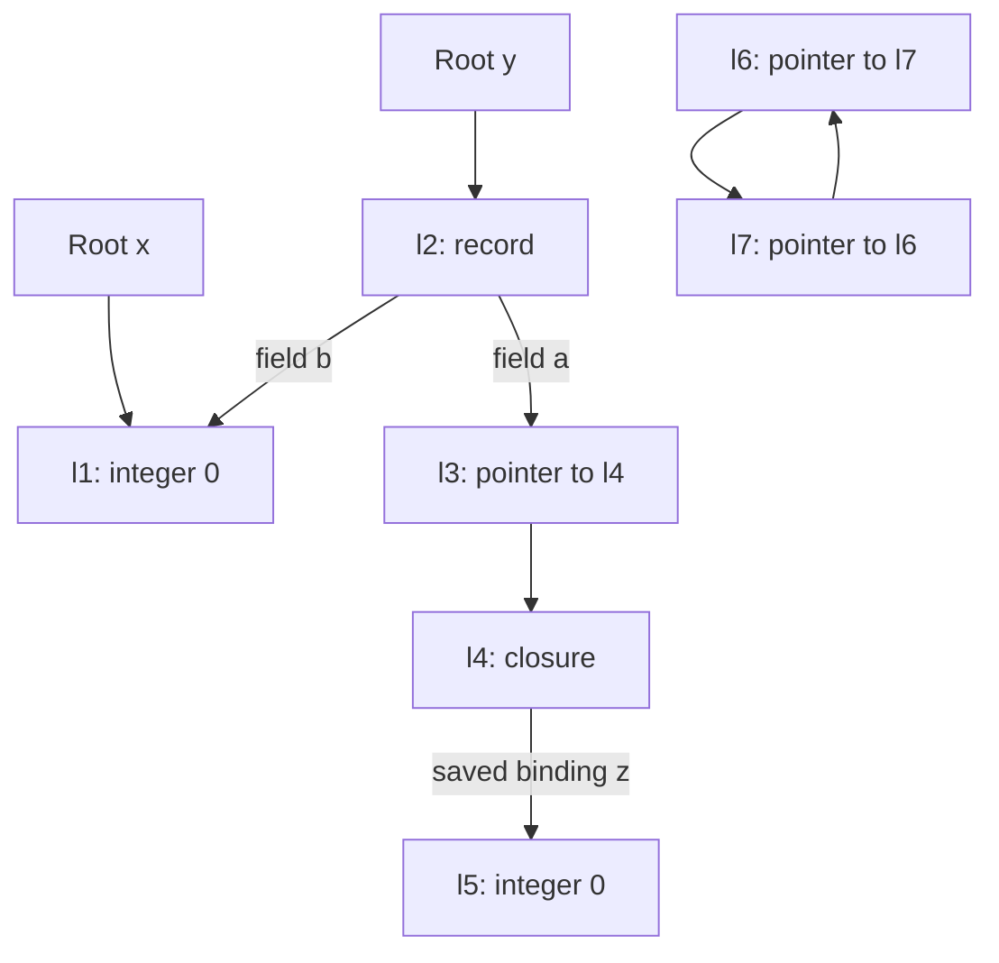

## 7.2 Draw both locations of a pointer variable

Source: [PDF pp. 201–207](https://prl.korea.ac.kr/courses/cose212/2026/pl-book-eng.pdf#page=201). In this implicit-reference language, a variable lives in a cell. If its value is a pointer, that cell contains the address of another cell.

For `let x = 1 in let p = &x in (*p := 7; x)`, use different names ℓx and ℓp:

| Question | Lookup | Answer |
|---|---|---|
| Where is x's variable cell? | `ρ(x)` | ℓx |
| Where is p's variable cell? | `ρ(p)` | ℓp |
| What value does p contain? | `σ(ℓp)` | Pointer ℓx |
| What does `*p` read? | `σ(σ(ρ(p)))` in this example | Contents of ℓx |
| What does `&p` return? | `ρ(p)` | ℓp, not ℓx |

1. Evaluate p by looking up ℓp, then reading its contents ℓx.
2. Evaluate the right side of the pointer assignment to 7.
3. Update ℓx, the pointed-to cell; leave ℓp containing ℓx.
4. Read x through ℓx and obtain 7.

Changing `*p` changes the pointee. Assigning a different pointer to p would change ℓp instead. Mark each arrow before predicting which other expressions observe a mutation.

## 7.3.2 Mark a heap containing records, pointers, closures, and a cycle

This redraws the reasoning in [PDF pp. 216–217](https://prl.korea.ac.kr/courses/cose212/2026/pl-book-eng.pdf#page=216). The root environment gives x→ℓ1 and y→ℓ2. Each arrow below represents a location contained in a root or a stored value.

| Round | Why a location is added | Marked set |
|---|---|---|
| 0 | Start from the two environment roots | {ℓ1,ℓ2} |
| 1 | The record in ℓ2 contains field locations ℓ3 and ℓ1 | {ℓ1,ℓ2,ℓ3} |
| 2 | The pointer in ℓ3 contains ℓ4 | {ℓ1,ℓ2,ℓ3,ℓ4} |
| 3 | The closure in ℓ4 captures z→ℓ5 | {ℓ1,ℓ2,ℓ3,ℓ4,ℓ5} |
| 4 | ℓ5 contains an integer, so there is no further edge | No change: fixed point reached |

1. Initialize the marked set and worklist from all roots permitted at this collection point.
2. Visit an unmarked location, mark it, then add the locations contained in its value.
3. Repeat until the worklist contributes no new locations.
4. Sweep ℓ6 and ℓ7. Their mutual references do not create a path **from a root**.
5. Preserve the surviving cells' contents and edges. This mark-and-sweep example removes entries; it does not rewrite the record's field b or relocate cells.

**Why use reachability?** Being reachable is sufficient reason to retain a cell, even if execution never actually reads it again. Predicting all future uses exactly would require solving questions about arbitrary program execution, including termination. Tracing a finite graph is computable and conservatively keeps extra cells. It is safe only if the roots include everything pending execution can still access; keep the chapter's no-remaining-continuation restriction when rooting from only the current environment.
